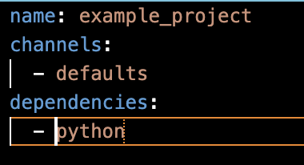
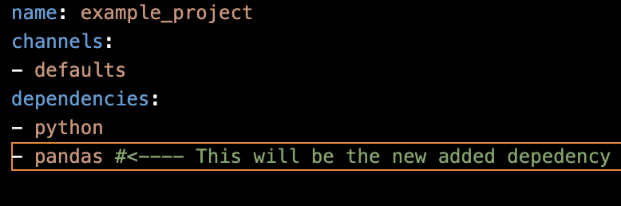
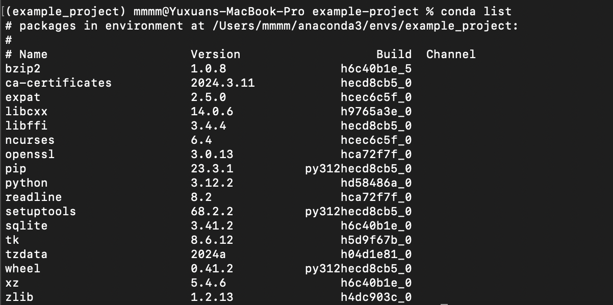

# Creating Pojects 
Conda provides a convenient way to manage dependencies and environments for your projects. A project in Conda is a directory that contains your project code along with a configuration file (environment.yml) specifying the dependencies required to run the project.

## Creating the Project's file 

Start by creating a directory for the project. It can named it whatever you like, for example:

Create an environment.yml File: Inside the project directory, create an environment.yml file. This file will specify the dependencies for the project. Here's an basic example:

 #Add more dependencies as needed

## Creating our enviroment 

Create Conda Environment: Once you've defined their dependencies, you can create a Conda environment using the conda env create command:

After creating the environment, activate it using the conda activate command:

## Creating our Python application

Once the project environment is activated, the user can work on the project as usual, using the installed dependencies. The user can install additional packages, update existing ones, or remove packages as needed. Conda will manage the environment to ensure consistency and reproducibility across different systems.

Update Conda Environment: After adding the new dependencies to environment.yml, the user need to update the Conda environment. Activatethe project environment using conda activate if it's not already activated, and then run:

Once the update is complete, the user can verify that the new dependencies have been installed by checking the environment:

After updating the dependencies, it's a good practice to test the project to ensure that everything is working as expected with the new dependencies.

If the user is working in a version-controlled environment, don't forget to commit the  changes to environment.yml to keep track of the updates

Creating projects with Conda is a straightforward process that enables the user to manage dependencies and environments effectively. By defining project dependencies in an environment.yml file, the user can ensure that your project is reproducible and easily shareable with others. Conda's environment management capabilities simplify the process of setting up and managing project environments, making it an ideal choice for Python developers.

### Updating our project with new dependencies

Edit environment.yml: Open the environment.yml file in project directory and add the new dependencies under the dependencies section. For example:

## Reference

1. Conda Official Documentation. Available at: [Conda Documentation](https://docs.conda.io/projects/conda/en/latest/index.html)