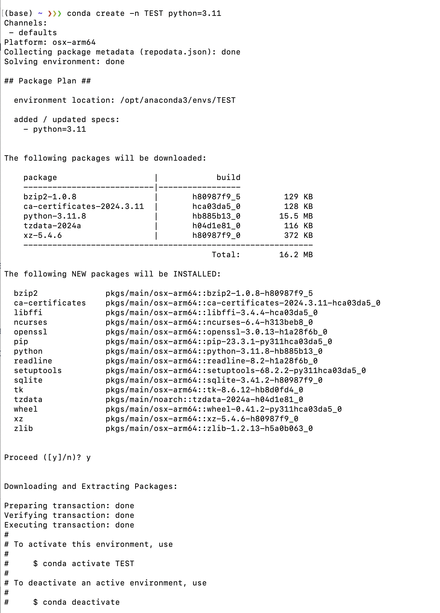

## Creating Environments (Python)

Environments in Conda are like separated files in different directories. For example, if you have a Conda environment specifically for Machine Learning projects, when you switch to another software engineering project, you probably want to not use the Machine Learning packages so that they don't interfere with what you're trying to do. 

To do this, open up your shell and type in `conda create -n <name> python=<version>`, where `<name>` is the name of the environment you are creating, and `<version>` is the Python version you want. If you are creating an environment that is not Python, you can also drop the parameter, so that you create an environment with just `conda create -n <name>`. 

In my case, I will create a Python environment with Python 3.11, called "TEST", as shown in the picture below. 

What I called here is `conda create -n TEST python=3.11`, and pressed enter. Then, it will ask if you will confirm or not, just type "Y" to confirm and enter. 

Then, you should be able to switch to your new environment that you just created! 

## Switching Environments (Python)

After you have followed the steps above to create multiple environments, you can switch between them easily. 

What you have to do is just call `conda activate <name>`. Where `<name>` is the name of the environment you have created before. 

After you activated, notice that the left most part, it says "(TEST)", which reflects the environment name that I have activated right now. 

If I do anything related to "Python", I will be using the Python under the environment named "TEST". For example, I will invoke `pip list`, which just shows all of the Python packages I have installed on my environment right now. 

As you can tell from the picture above, "TEST" is indeed a fresh installation of Python with no packages installed at all. 

The following is another environment I have, called "ReiBot", and is switched into using `conda activate ReiBot`. 

After then, I called `pip list` again, which shows me different list of packages when compared to the environment named "TEST". 

If you want to be more in-depth (working with IDEs), you should be able to find the directory of your Conda environments easily, they should all be stored under the main Conda directory, as shown in the picture below (taken in PyCharm). 

## Removing Environments (Python)

After you're done with a specific environment and the project, you can release the environment by calling `conda remove --name <NAME> --all`. 

In my case, I just called `conda remove --name TEST --all`, and proceeded with "Y" and enter. 

This allows me to remove the environment "TEST". 

After everything is done, you should not be able to find the environment named "TEST" anymore. Which means that we have successfully deleted the environment. 

## External Sources

The following are a list of references that you can check out if you are planning to learn more about Conda! 

# External Learning Resources for Conda

1. [**Conda Official Documentation**](https://docs.conda.io/en/latest/): This is the primary source of information about Conda, covering installation, commands, package management, and environment management. 

2. [**Conda Cheat Sheet**](https://docs.conda.io/projects/conda/en/latest/user-guide/cheatsheet.html): A quick reference guide provided by the official Conda documentation, summarizing the most common Conda commands and their usage. 
