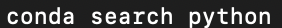
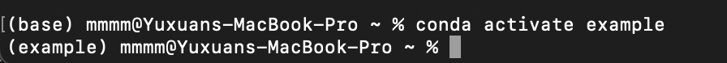
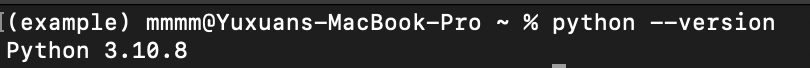
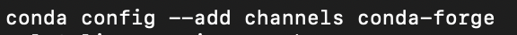
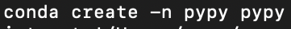
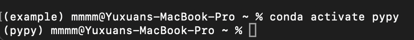
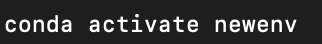
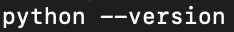
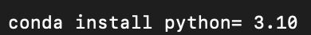

## Managing Python using Conda 
Conda is a versatile package and environment management system designed to simplify the process of managing Python environments and dependencies. With Conda, you can create isolated environments with specific Python versions and packages, facilitating project reproducibility and compatibility. 

### Viewing a list of available Python Versions
Conda provides users with the ability to view a list of available Python versions that can be installed within Conda environments. This feature is useful for selecting the appropriate Python version for specific project requirements or ensuring compatibility with existing codebases. Different codebases might conduct different version of python. By checking out the list of python version, conda gives you a easier and convenient way to manage your codesbases. Here's how to you view the list of available Python versions with Conda by typing `conda search python`:

Running this command will display a list of available Python versions along with their respective package versions. The output will include information such as the Python version number, package build number, and channel from which the package is available.

## Installing a different version of Python:
Conda can create a new python environment without overwriting the current one, which gives the you a convenient way to use different python environment with different projects you are working on the same time in the same machine. 

    With previous step of finding all the python version available, the first step of creating a new environment would be determine the python version you would wish to work on: 

In this given example, `example` would be the name of the new environment and `python=3.10.8` would be the version of the python you would wish to work on the new environment.

Activate the environment you created:

This command activates the example environment, ensuring that subsequent Python commands use the Python version installed within this environment. 

Verify that the new environment is your current environment. 
Note: In MacOS terminal, the user can check the front of the command line to check the enviroment. 

To verify the current environment’s version of the python, run this in the terminal:

The output in the terminal would be the current version of the python in your current environment. 

## Installing Pypy

To install PyPy, a fast, compliant alternative implementation of the Python language. It is a drop-in replacement for the stock Python interpreter, CPython. Whereas CPython compiles Python to intermediate bytecode that is then interpreted by a virtual machine, PyPy uses just-in-time (JIT) compilation to translate Python code into machine-native assembly language. To install you can follow these steps:

Add conda-forge Channel by typing `conda config --add channels conda-force`:

This command adds the conda-forge channel to the list of channels that Conda searches for packages.

Set Channel Priority by typing `conda config --set channel_priority strict`:

This command sets the channel priority to strict, ensuring that Conda prioritizes packages from the channels in the order they are listed. This helps avoid unexpected package conflicts.

Create pypy Environment and activate pypy:

It creates a new Conda environment named `pypy` and installs PyPy into it. The pypy package provided by the conda-forge channel will be installed into this environment. Then it activates the newly created pypy environment, allowing you to use PyPy for Python development within this environment.

### Using a different version of python 
To use a different version of Python in the current environment, you'll typically create a new environment with the desired Python version and activate it. Here's how you can do it using Conda:

Create a New Environment: Use the conda create command to create a new environment with the desired Python version. For example, to create an environment named myenv with Python version 3.9, you can run:

Replace myenv with preferred environment name and 3.9 with the desired Python version.

Activate the New Environment and Verify the Python version.: Once the environment is created, activate it using the conda activate command. To verify that you are now using the desired Python version, you can run.

### Updating Python:

This command will updating the latest version of python. 

If you want to install a minor change, not the newest one, or there is a specific version of python you want use:

