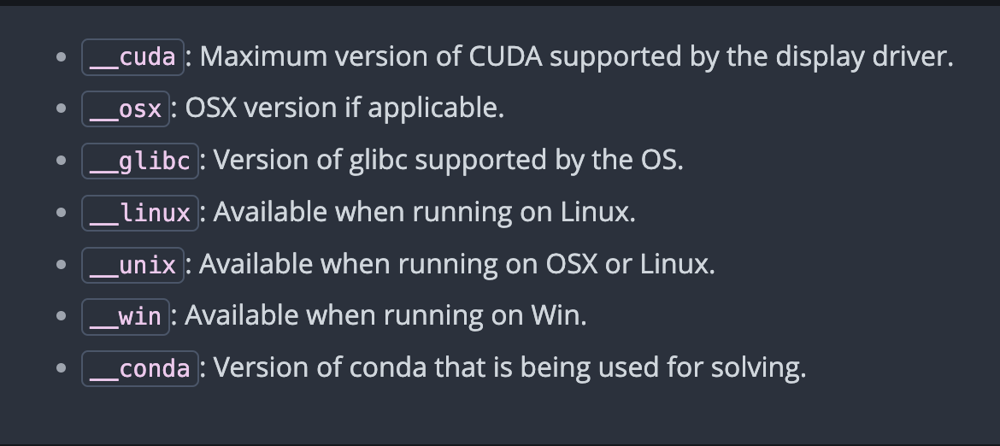

# Managing Virtual Packages 

"Virtual" packages are injected into the conda solver to allow real packages to depend on features present on the system that cannot be managed directly by conda, like system driver versions or CPU features. Virtual packages are not real packages and not displayed by conda list. Instead conda runs a small bit of code to detect the presence or absence of the system feature that corresponds to the package. The currently supported list of virtual packages includes:

## Listed detected Virtual Packages 
To view the list of detected virtual packages using the terminal, type `conda info` in the terminal:

Output would be a list of info, virtual packages would be under virtual packages section: 

## Overriding detected packages
To override virtual package detection for troubleshooting purposes, you can use environment variables. Supported variables include:

CONDA_OVERRIDE_CUDA: Set this variable to the CUDA version number you want to override the detection with. If you want to indicate that no CUDA is detected, set it to an empty string ("").

CONDA_OVERRIDE_OSX: Set this variable to the OSX version number you want to override the detection with. If you want to indicate that no OSX is detected, set it to an empty string ("").

CONDA_OVERRIDE_GLIBC: Set this variable to the GLIBC version number you want to override the detection with. This only applies on Linux. If you want to indicate that no GLIBC is detected, set it to an empty string ("").

## Reference

1. Conda Official Documentation. Available at: [Conda Documentation](https://docs.conda.io/projects/conda/en/latest/index.html)