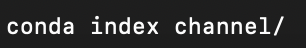
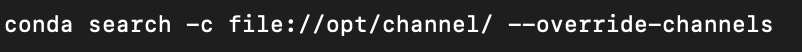

## What is Conda and why do you need it? 

Have you ever experienced the frustration when you have multiple Python package conflicts and needs to resolve multiple package dependency issues before you can actually work on a new project? If that's the case, **Conda** is here to save your day!  

Conda is an open-source package management and environment management system that can be used to simplify a lot of the operations regarding environment management. 

This tutorial will focus on using Conda to setup multiple Python environments that can be used for different projects. So that you'll never have to worry about setting up an environment and running into issues again!

## Difference between Anaconda and Miniconda?

As of the time writing, Conda's official website is this: [https://docs.conda.io/en/latest/#](https://docs.conda.io/en/latest/#)

It provides a simple installation method and some general documentation for the usage of Conda. 

However, a quick Google search might tell you that, there's actually two different versions of Conda, one being **Anaconda** and another being **Miniconda**. 

The major difference between **Miniconda** and **Anaconda** is that: 

- Anaconda supports Graphical User Interface (GUI), so you can actually click on things to make it work. 
- Miniconda does not support GUI and is used mainly on the "shell" (e.g. zsh, bash, sh, powershell, etc.) of your system. If you do not know what a "shell" is, this tutorial might be a little bit advanced. 

With all that being said, this tutorial focuses on using Miniconda to setup Conda and multiple Python environments, so you might need to look for another tutorial if you plan to use Anaconda.

## Why do you want to use Conda instead of other environment management solutions? 

Other environment management solutions for Python specifically, includes `pipenv` and `virtualenv`, also support similar functionalities to Conda. 

Each of these solutions all have their own unique strengths and weaknesses, the following is a table that gives an overview to their own capabilities and flaws: 

| Feature | Conda | Pipenv | Virtualenv |
|---------|-------|--------|------------|
| **Cross-Language Support** | Supports multiple languages | Python only | Python only |
| **Environment Management** | Comprehensive environment management | Automates virtual environment management | Isolates Python environments |
| **Package Management** | Manages Python and non-Python packages | Manages Python packages, with `Pipfile.lock` for deterministic builds | Only isolates environments, does not manage packages |
| **Repository** | Large repository (Anaconda Repository) | Uses PyPI | Uses PyPI |
| **Platform Support** | Cross-platform (Windows, macOS, Linux) | Cross-platform | Cross-platform |
| **Simplicity and Intuitiveness** | Can be complex due to additional features | Simpler syntax and intuitive usage | Minimalistic and lightweight |
| **Performance** | Can be slower, especially for large distributions | Can have performance issues with large dependencies | Fast and efficient |
| **Scope** | Suitable for complex, multi-language projects | Ideal for Python-specific development | Focused on Python-only projects |
| **Ease of Setup** | Requires more setup compared to pip | Simplifies setup with automation | Quick and easy setup |

## How do you use Conda?

To actually use Conda, we need to follow the following general steps

### Installation (Miniconda)

With a little bit of navigation, we see that there are download links here: [https://docs.conda.io/projects/miniconda/en/latest/](https://docs.conda.io/projects/miniconda/en/latest/)

So the first step here will just be to download the installer for your system, and then executing it. 

For systems that doesn't have a GUI, you can also use the other installation methods like an installation script provided on the website. 

In the picture shown above, download the one that fits your system, in my case, it is the one that says `Miniconda3 macOS Apple M1 64-bit pkg`

Then just download and click through the install process until you have completed. 

The setup guide for **MacOS** is [here](#setup-macos), for **Windows** is [here](#setup-windows)

### Setup [MacOS]

Regarding the setup process for Miniconda, multiple different situations can arise. 

Now, you want to start up the shell of your system and verify if Conda is successfully installed. In my case, MacOS has the default shell being `zsh`, so you can just open up `zsh` by pressing "Command + Space" and typing `terminal`, the first one should be your `shell`. 

Then, after `zsh` appears as a window, type in `conda`, then press enter. 

If you press enter and a bunch of information showed up, then it is likely that conda has successfully installed, and you can proceed directly to the next part [Creating Environments (Python)](#creating-environments-python)

However, if you called conda and nothing seems to have showed up, then it is likely that the installation did not successfully go through. To resolve this issue, depending on your system, there might be different solutions. 

One of the common fixes for this is to call `conda init [shell_type]`. For example, if you are on MacOS, you can follow this guide stated [here](https://docs.conda.io/projects/conda/en/latest/user-guide/install/macos.html)

With all that being said, we can finally start to unleash the power of Conda. [Hyperlink here](#creating-environments-python)

### Setup [Windows]

> Guide Reference: https://gist.github.com/martinsotir/2bd2e16332dff71e0fa5be3ed3468a6c

Usually in Windows, after you download and installed Miniconda for Windows, it doesn't automatically register in the regular powershell, you will have to carry out a few steps. 

Therefore, you want to first open up `powershell` and do a quick check. 

To do this, you can press the "windows" key, and then search for `powershell`, then press enter to open it, as shown in the picture below.  

Then, type in `conda`, and press enter, if the following shows up, then you have your installation complete, and you can proceed to the next part [Creating Environments (Python)](#creating-environments-python)

If that did not show up, then we will have to proceed into fixing this. 

First, you want to open up an administrator powershell, and type in `set-executionpolicy unrestricted`, then click enter. 

To start up an administrator powershell, simply tap your Windows key, and then type in `Powershell`, then right click and select `Run as administrator`, as shown below. 

After pressing enter with `set-executionpolicy unrestricted`, you will need to press `A` and then enter, as shown below. 

Then, you need to press the windows key, and search for `miniconda`, and click on the first one that appears, as shown below. 

In this prompt, type in `conda init powershell`, and press enter. It should show something similar to the following (I already have conda installed, so it should show something a bit different to what I had)

After all of these, you should be able to just start up a new `powershell` session, and it should have miniconda installed! With this, you can start to unleash the power of Conda and proceed to the next section!  
## Managing Python using Conda 
Conda is a versatile package and environment management system designed to simplify the process of managing Python environments and dependencies. With Conda, you can create isolated environments with specific Python versions and packages, facilitating project reproducibility and compatibility. 

### Viewing a list of available Python Versions
Conda provides users with the ability to view a list of available Python versions that can be installed within Conda environments. This feature is useful for selecting the appropriate Python version for specific project requirements or ensuring compatibility with existing codebases. Different codebases might conduct different version of python. By checking out the list of python version, conda gives you a easier and convenient way to manage your codesbases. Here's how to you view the list of available Python versions with Conda by typing `conda search python`:

Running this command will display a list of available Python versions along with their respective package versions. The output will include information such as the Python version number, package build number, and channel from which the package is available.

## Installing a different version of Python:
Conda can create a new python environment without overwriting the current one, which gives the you a convenient way to use different python environment with different projects you are working on the same time in the same machine. 

    With previous step of finding all the python version available, the first step of creating a new environment would be determine the python version you would wish to work on: 

In this given example, `example` would be the name of the new environment and `python=3.10.8` would be the version of the python you would wish to work on the new environment.

Activate the environment you created:

This command activates the example environment, ensuring that subsequent Python commands use the Python version installed within this environment. 

Verify that the new environment is your current environment. 
Note: In MacOS terminal, the user can check the front of the command line to check the enviroment. 

To verify the current environment’s version of the python, run this in the terminal:

The output in the terminal would be the current version of the python in your current environment. 

## Installing Pypy

To install PyPy, a fast, compliant alternative implementation of the Python language. It is a drop-in replacement for the stock Python interpreter, CPython. Whereas CPython compiles Python to intermediate bytecode that is then interpreted by a virtual machine, PyPy uses just-in-time (JIT) compilation to translate Python code into machine-native assembly language. To install you can follow these steps:

Add conda-forge Channel by typing `conda config --add channels conda-force`:

This command adds the conda-forge channel to the list of channels that Conda searches for packages.

Set Channel Priority by typing `conda config --set channel_priority strict`:

This command sets the channel priority to strict, ensuring that Conda prioritizes packages from the channels in the order they are listed. This helps avoid unexpected package conflicts.

Create pypy Environment and activate pypy:

It creates a new Conda environment named `pypy` and installs PyPy into it. The pypy package provided by the conda-forge channel will be installed into this environment. Then it activates the newly created pypy environment, allowing you to use PyPy for Python development within this environment.

### Using a different version of python 
To use a different version of Python in the current environment, you'll typically create a new environment with the desired Python version and activate it. Here's how you can do it using Conda:

Create a New Environment: Use the conda create command to create a new environment with the desired Python version. For example, to create an environment named myenv with Python version 3.9, you can run:

Replace myenv with preferred environment name and 3.9 with the desired Python version.

Activate the New Environment and Verify the Python version.: Once the environment is created, activate it using the conda activate command. To verify that you are now using the desired Python version, you can run.

### Updating Python:

This command will updating the latest version of python. 

If you want to install a minor change, not the newest one, or there is a specific version of python you want use:

## Managing Vitual Packages 

"Virtual" packages are injected into the conda solver to allow real packages to depend on features present on the system that cannot be managed directly by conda, like system driver versions or CPU features. Virtual packages are not real packages and not displayed by conda list. Instead conda runs a small bit of code to detect the presence or absence of the system feature that corresponds to the package. The currently supported list of virtual packages includes:

### Listed detected Visual Packages 
To view the list of detected virtual packages using the terminal, type `conda info` in the terminal:

Output would be a list of info, virtual packages would be under virtual packages section: 

### Overriding detected packages
To override virtual package detection for troubleshooting purposes, you can use environment variables. Supported variables include:

CONDA_OVERRIDE_CUDA: Set this variable to the CUDA version number you want to override the detection with. If you want to indicate that no CUDA is detected, set it to an empty string ("").

CONDA_OVERRIDE_OSX: Set this variable to the OSX version number you want to override the detection with. If you want to indicate that no OSX is detected, set it to an empty string ("").

CONDA_OVERRIDE_GLIBC: Set this variable to the GLIBC version number you want to override the detection with. This only applies on Linux. If you want to indicate that no GLIBC is detected, set it to an empty string ("").

## Creating Custom Channels

Before proceeding, ensure that you have conda-build installed. If not, the user can install it with the following command:

Next, organize all the packages the user wish to include in subdirectories based on the platforms intend to serve. Here's an example structure:

Run conda index command on the root directory : 

The conda index command generates a repodata.json file in each repository directory, which contains metadata for the packages in the channel.

To test custom channel, the user can serve it using a web server or via a file:// URL to the channel directory. The user can then test by sending a search command to the custom channel. For example, if the user  want to search for files in the custom channel location /opt/channel/linux-64/, the user can use the following command:

## Creating Environments (Python)

Environments in Conda are like separated files in different directories. For example, if you have a Conda environment specifically for Machine Learning projects, when you switch to another software engineering project, you probably want to not use the Machine Learning packages so that they don't interfere with what you're trying to do. 

To do this, open up your shell and type in `conda create -n <name> python=<version>`, where `<name>` is the name of the environment you are creating, and `<version>` is the Python version you want. If you are creating an environment that is not Python, you can also drop the parameter, so that you create an environment with just `conda create -n <name>`. 

In my case, I will create a Python environment with Python 3.11, called "TEST", as shown in the picture below. 

What I called here is `conda create -n TEST python=3.11`, and pressed enter. Then, it will ask if you will confirm or not, just type "Y" to confirm and enter. 

Then, you should be able to switch to your new environment that you just created! 

### Switching Environments (Python)

After you have followed the steps above to create multiple environments, you can switch between them easily. 

What you have to do is just call `conda activate <name>`. Where `<name>` is the name of the environment you have created before. 

After you activated, notice that the left most part, it says "(TEST)", which reflects the environment name that I have activated right now. 

If I do anything related to "Python", I will be using the Python under the environment named "TEST". For example, I will invoke `pip list`, which just shows all of the Python packages I have installed on my environment right now. 

As you can tell from the picture above, "TEST" is indeed a fresh installation of Python with no packages installed at all. 

The following is another environment I have, called "ReiBot", and is switched into using `conda activate ReiBot`. 

After then, I called `pip list` again, which shows me different list of packages when compared to the environment named "TEST". 

If you want to be more in-depth (working with IDEs), you should be able to find the directory of your Conda environments easily, they should all be stored under the main Conda directory, as shown in the picture below (taken in PyCharm). 

### Removing Environments (Python)

After you're done with a specific environment and the project, you can release the environment by calling `conda remove --name <NAME> --all`. 

In my case, I just called `conda remove --name TEST --all`, and proceeded with "Y" and enter. 

This allows me to remove the environment "TEST". 

After everything is done, you should not be able to find the environment named "TEST" anymore. Which means that we have successfully deleted the environment. 

## Creating Pojects 
Conda provides a convenient way to manage dependencies and environments for your projects. A project in Conda is a directory that contains your project code along with a configuration file (environment.yml) specifying the dependencies required to run the project.

### Creating the Project's file 

Start by creating a directory for the project. It can named it whatever you like, for example:

Create an environment.yml File: Inside the project directory, create an environment.yml file. This file will specify the dependencies for the project. Here's an basic example:

 #Add more dependencies as needed

### Creating our enviroment 

Create Conda Environment: Once you've defined their dependencies, you can create a Conda environment using the conda env create command:

After creating the environment, activate it using the conda activate command:

### Creating our Python application

Once the project environment is activated, the user can work on the project as usual, using the installed dependencies. The user can install additional packages, update existing ones, or remove packages as needed. Conda will manage the environment to ensure consistency and reproducibility across different systems.

Update Conda Environment: After adding the new dependencies to environment.yml, the user need to update the Conda environment. Activatethe project environment using conda activate if it's not already activated, and then run:

Once the update is complete, the user can verify that the new dependencies have been installed by checking the environment:

After updating the dependencies, it's a good practice to test the project to ensure that everything is working as expected with the new dependencies.

If the user is working in a version-controlled environment, don't forget to commit the  changes to environment.yml to keep track of the updates

Creating projects with Conda is a straightforward process that enables the user to manage dependencies and environments effectively. By defining project dependencies in an environment.yml file, the user can ensure that your project is reproducible and easily shareable with others. Conda's environment management capabilities simplify the process of setting up and managing project environments, making it an ideal choice for Python developers.

### Updating our project with new dependencies

Edit environment.yml: Open the environment.yml file in project directory and add the new dependencies under the dependencies section. For example:

## Viewing command-line help

Conda provides comprehensive command-line help to guide users through various tasks and operations. Here's how you can access and utilize command-line help in Conda:

### Viewing General Help

To access general help and get an overview of available commands and options, the user can use the conda --help command. This command displays a summary of Conda's main commands and provides guidance on usage.

conda --h will do the same effect as conda --help which will return a list of conda help list.

To get help of a specific command, try running conda xxx(the command the user wish to work on) -h. For example: conda create -h, which will output the help menu of the specific command of conda create:

## External Sources

The following are a list of references that you can check out if you are planning to learn more about Conda! 

# External Learning Resources for Conda

1. [**Conda Official Documentation**](https://docs.conda.io/en/latest/): This is the primary source of information about Conda, covering installation, commands, package management, and environment management. 

2. [**Conda Cheat Sheet**](https://docs.conda.io/projects/conda/en/latest/user-guide/cheatsheet.html): A quick reference guide provided by the official Conda documentation, summarizing the most common Conda commands and their usage. 
