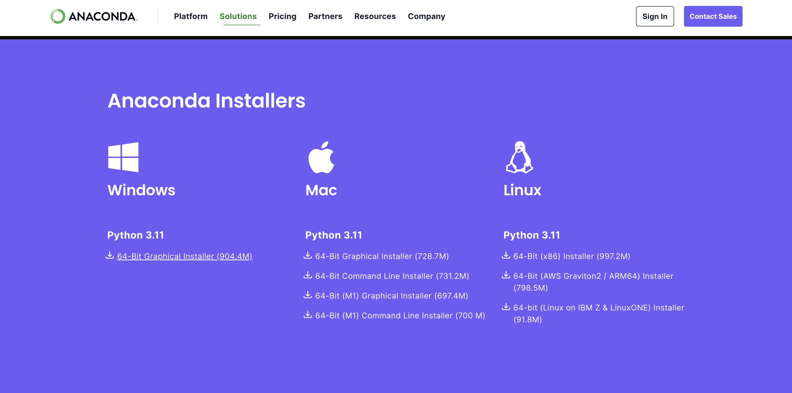
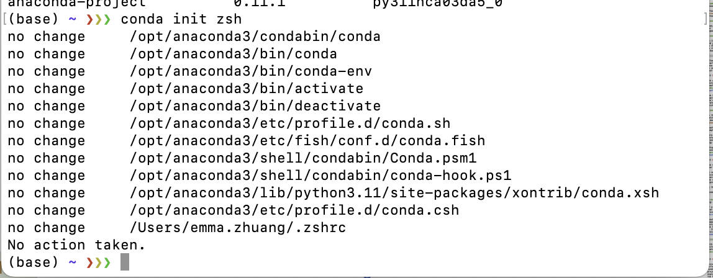

## What is Conda and why do you need it? 

Have you ever experienced the frustration when you have multiple Python package conflicts and needs to resolve multiple package dependency issues before you can actually work on a new project? If that's the case, **Conda** is here to save your day!  

Conda is an open-source package management and environment management system that can be used to simplify a lot of the operations regarding environment management. 

This tutorial will focus on using Conda to setup multiple Python environments that can be used for different projects. So that you'll never have to worry about setting up an environment and running into issues again!

## Difference between Anaconda and Miniconda?

As of the time writing, Conda's official website is this: [https://docs.conda.io/en/latest/#](https://docs.conda.io/en/latest/#)

It provides a simple installation method and some general documentation for the usage of Conda. 

However, a quick Google search might tell you that, there's actually two different versions of Conda, one being **Anaconda** and another being **Miniconda**. 

The major difference between **Miniconda** and **Anaconda** is that: 

- Anaconda supports Graphical User Interface (GUI), so you can actually click on things to make it work. 
- Miniconda does not support GUI and is used mainly on the "shell" (e.g. zsh, bash, sh, powershell, etc.) of your system. If you do not know what a "shell" is, this tutorial might be a little bit advanced. 

With all that being said, this tutorial focuses on using Miniconda to setup Conda and multiple Python environments, so you might need to look for another tutorial if you plan to use Anaconda.

## Why do you want to use Conda instead of other environment management solutions? 

Other environment management solutions for Python specifically, includes `pipenv` and `virtualenv`, also support similar functionalities to Conda. 

Each of these solutions all have their own unique strengths and weaknesses, the following is a table that gives an overview to their own capabilities and flaws: 

| Feature | Conda | Pipenv | Virtualenv |
|---------|-------|--------|------------|
| **Cross-Language Support** | Supports multiple languages | Python only | Python only |
| **Environment Management** | Comprehensive environment management | Automates virtual environment management | Isolates Python environments |
| **Package Management** | Manages Python and non-Python packages | Manages Python packages, with `Pipfile.lock` for deterministic builds | Only isolates environments, does not manage packages |
| **Repository** | Large repository (Anaconda Repository) | Uses PyPI | Uses PyPI |
| **Platform Support** | Cross-platform (Windows, macOS, Linux) | Cross-platform | Cross-platform |
| **Simplicity and Intuitiveness** | Can be complex due to additional features | Simpler syntax and intuitive usage | Minimalistic and lightweight |
| **Performance** | Can be slower, especially for large distributions | Can have performance issues with large dependencies | Fast and efficient |
| **Scope** | Suitable for complex, multi-language projects | Ideal for Python-specific development | Focused on Python-only projects |
| **Ease of Setup** | Requires more setup compared to pip | Simplifies setup with automation | Quick and easy setup |

## How do you use Conda?

To actually use Conda, we need to follow the following general steps

### Installation (Miniconda)

With a little bit of navigation, we see that there are download links here: [https://docs.conda.io/projects/miniconda/en/latest/](https://docs.conda.io/projects/miniconda/en/latest/)

So the first step here will just be to download the installer for your system, and then executing it. 

For systems that doesn't have a GUI, you can also use the other installation methods like an installation script provided on the website. 

In the picture shown above, download the one that fits your system, in my case, it is the one that says `Miniconda3 macOS Apple M1 64-bit pkg`

Then just download and click through the install process until you have completed. 

The setup guide for **MacOS** is [here](#setup-macos), for **Windows** is [here](#setup-windows)

### Setup [MacOS]

Regarding the setup process for Miniconda, multiple different situations can arise. 

Now, you want to start up the shell of your system and verify if Conda is successfully installed. In my case, MacOS has the default shell being `zsh`, so you can just open up `zsh` by pressing "Command + Space" and typing `terminal`, the first one should be your `shell`. 

Then, after `zsh` appears as a window, type in `conda`, then press enter. 

If you press enter and a bunch of information showed up, then it is likely that conda has successfully installed, and you can proceed directly to the next part [Creating Environments (Python)](#creating-environments-python)

However, if you called conda and nothing seems to have showed up, then it is likely that the installation did not successfully go through. To resolve this issue, depending on your system, there might be different solutions. 

One of the common fixes for this is to call `conda init [shell_type]`. For example, if you are on MacOS, you can follow this guide stated [here](https://docs.conda.io/projects/conda/en/latest/user-guide/install/macos.html)

With all that being said, we can finally start to unleash the power of Conda. [Hyperlink here](#creating-environments-python)

### Setup [Windows]

> Guide Reference: https://gist.github.com/martinsotir/2bd2e16332dff71e0fa5be3ed3468a6c

Usually in Windows, after you download and installed Miniconda for Windows, it doesn't automatically register in the regular powershell, you will have to carry out a few steps. 

Therefore, you want to first open up `powershell` and do a quick check. 

To do this, you can press the "windows" key, and then search for `powershell`, then press enter to open it, as shown in the picture below.  

Then, type in `conda`, and press enter, if the following shows up, then you have your installation complete, and you can proceed to the next part [Creating Environments (Python)](#creating-environments-python)

If that did not show up, then we will have to proceed into fixing this. 

First, you want to open up an administrator powershell, and type in `set-executionpolicy unrestricted`, then click enter. 

To start up an administrator powershell, simply tap your Windows key, and then type in `Powershell`, then right click and select `Run as administrator`, as shown below. 

After pressing enter with `set-executionpolicy unrestricted`, you will need to press `A` and then enter, as shown below. 

Then, you need to press the windows key, and search for `miniconda`, and click on the first one that appears, as shown below. 

In this prompt, type in `conda init powershell`, and press enter. It should show something similar to the following (I already have conda installed, so it should show something a bit different to what I had)

After all of these, you should be able to just start up a new `powershell` session, and it should have miniconda installed! With this, you can start to unleash the power of Conda and proceed to the next section!  

### Installation (Anaconda)

You can find the Anaconda installer and detailed installation instructions on their official download page: [https://www.anaconda.com/products/individual](https://www.anaconda.com/download#downloads)

The initial step involves downloading the appropriate installer for your operating system. If you're working on a system without a GUI, you might prefer to use command-line installation methods, which are also detailed on the Anaconda website.

In the screenshot above, select the installer that matches your system. For instance, if you are using a macOS with an M1 chip, you might choose the `Anaconda macOS Apple M1 64-bit pkg`.

Download the installer and follow the prompts to complete the installation process.

Setup guides for different operating systems can be found through the following links: for **MacOS** [here](#setup-macos), and for **Windows** [here](#setup-windows).

### Setup [MacOS]

The setup process for Anaconda can vary based on your operating system and shell configuration.

To verify if Anaconda has been installed successfully, open your system's shell. For macOS users, the default shell is typically `zsh`. You can open `zsh` by pressing "Command + Space", typing `terminal`, and selecting the first result.

In the terminal window, type `conda` and press enter.

If a list of command options appears, it indicates that Anaconda is installed correctly, and you can proceed to [Creating Environments (Python)](#creating-environments-python).

Should you encounter any issues where Anaconda commands are not recognized, one common fix is to initialize Anaconda for your shell. This process can be completed by running `conda init [shell_type]`. If you're using macOS, guidance for this step is provided [here](https://docs.conda.io/projects/conda/en/latest/user-guide/install/macos.html).

With Anaconda successfully installed and initialized, you're ready to explore its robust features. [Start creating Python environments with Anaconda](#creating-environments-python).

### Creating Environments (Python)

Environments in Conda are like separated files in different directories. For example, if you have a Conda environment specifically for Machine Learning projects, when you switch to another software engineering project, you probably want to not use the Machine Learning packages so that they don't interfere with what you're trying to do. 

To do this, open up your shell and type in `conda create -n <name> python=<version>`, where `<name>` is the name of the environment you are creating, and `<version>` is the Python version you want. If you are creating an environment that is not Python, you can also drop the parameter, so that you create an environment with just `conda create -n <name>`. 

In my case, I will create a Python environment with Python 3.11, called "TEST", as shown in the picture below. 

What I called here is `conda create -n TEST python=3.11`, and pressed enter. Then, it will ask if you will confirm or not, just type "Y" to confirm and enter. 

Then, you should be able to switch to your new environment that you just created! 

### Switching Environments (Python)

After you have followed the steps above to create multiple environments, you can switch between them easily. 

What you have to do is just call `conda activate <name>`. Where `<name>` is the name of the environment you have created before. 

After you activated, notice that the left most part, it says "(TEST)", which reflects the environment name that I have activated right now. 

If I do anything related to "Python", I will be using the Python under the environment named "TEST". For example, I will invoke `pip list`, which just shows all of the Python packages I have installed on my environment right now. 

As you can tell from the picture above, "TEST" is indeed a fresh installation of Python with no packages installed at all. 

The following is another environment I have, called "ReiBot", and is switched into using `conda activate ReiBot`. 

After then, I called `pip list` again, which shows me different list of packages when compared to the environment named "TEST". 

If you want to be more in-depth (working with IDEs), you should be able to find the directory of your Conda environments easily, they should all be stored under the main Conda directory, as shown in the picture below (taken in PyCharm). 

### Removing Environments (Python)

After you're done with a specific environment and the project, you can release the environment by calling `conda remove --name <NAME> --all`. 

In my case, I just called `conda remove --name TEST --all`, and proceeded with "Y" and enter. 

This allows me to remove the environment "TEST". 

After everything is done, you should not be able to find the environment named "TEST" anymore. Which means that we have successfully deleted the environment. 

## External Sources

The following are a list of references that you can check out if you are planning to learn more about Conda! 

# External Learning Resources for Conda

1. [**Conda Official Documentation**](https://docs.conda.io/en/latest/): This is the primary source of information about Conda, covering installation, commands, package management, and environment management. 

2. [**Conda Cheat Sheet**](https://docs.conda.io/projects/conda/en/latest/user-guide/cheatsheet.html): A quick reference guide provided by the official Conda documentation, summarizing the most common Conda commands and their usage. 
