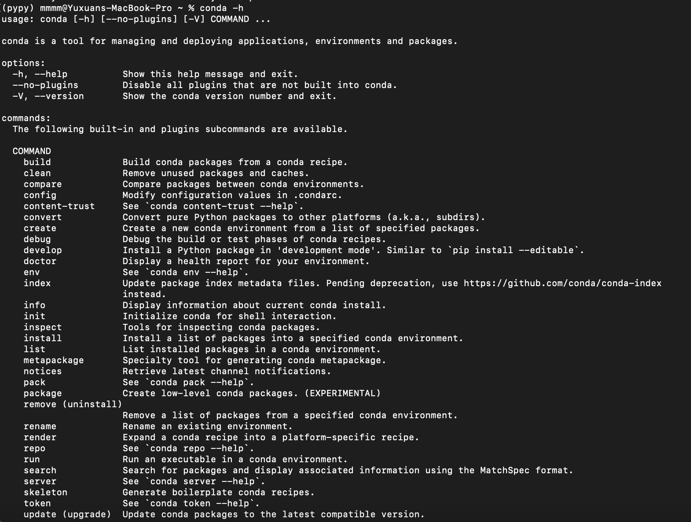
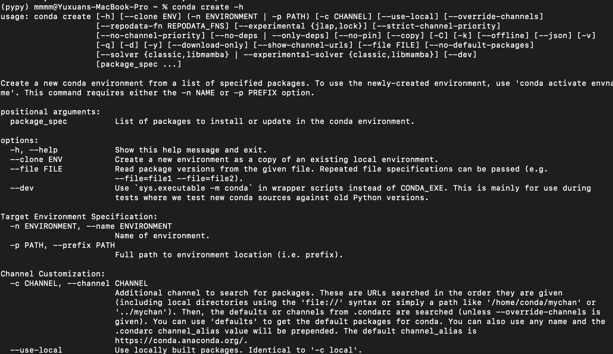

## Viewing command-line help

Conda provides comprehensive command-line help to guide users through various tasks and operations. Here's how you can access and utilize command-line help in Conda:

### Viewing General Help

To access general help and get an overview of available commands and options, the user can use the conda --help command. This command displays a summary of Conda's main commands and provides guidance on usage.

conda --h will do the same effect as conda --help which will return a list of conda help list.

To get help of a specific command, try running conda xxx(the command the user wish to work on) -h. For example: conda create -h, which will output the help menu of the specific command of conda create:

