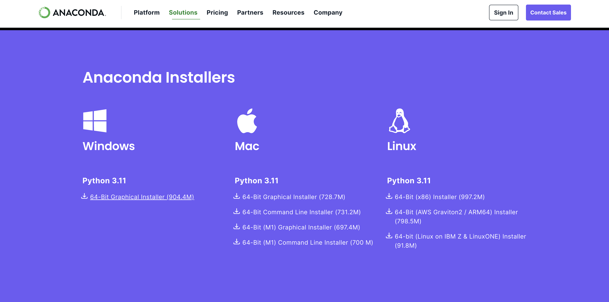
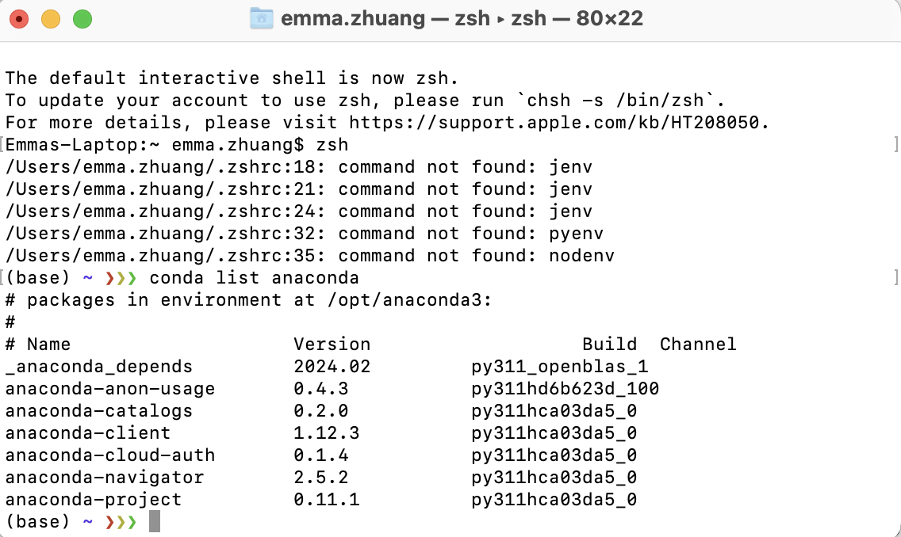
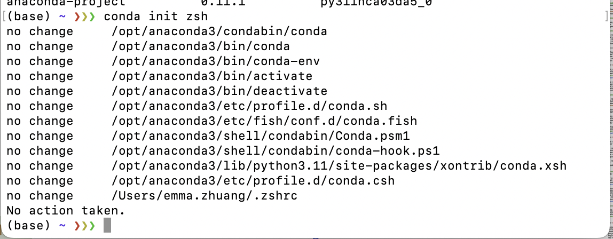

### Installation (Miniconda)

With a little bit of navigation, we see that there are download links here: [https://docs.conda.io/projects/miniconda/en/latest/](https://docs.conda.io/projects/miniconda/en/latest/)

So the first step here will just be to download the installer for your system, and then executing it. 

For systems that doesn't have a GUI, you can also use the other installation methods like an installation script provided on the website. 

In the picture shown above, download the one that fits your system, in my case, it is the one that says `Miniconda3 macOS Apple M1 64-bit pkg`

Then just download and click through the install process until you have completed. 

The setup guide for **MacOS** is [here](#setup-macos), for **Windows** is [here](#setup-windows)

### Setup [MacOS]

Regarding the setup process for Miniconda, multiple different situations can arise. 

Now, you want to start up the shell of your system and verify if Conda is successfully installed. In my case, MacOS has the default shell being `zsh`, so you can just open up `zsh` by pressing "Command + Space" and typing `terminal`, the first one should be your `shell`. 

Then, after `zsh` appears as a window, type in `conda`, then press enter. 

If you press enter and a bunch of information showed up, then it is likely that conda has successfully installed, and you can proceed directly to the next part [Creating Environments (Python)](#creating-environments-python)

However, if you called conda and nothing seems to have showed up, then it is likely that the installation did not successfully go through. To resolve this issue, depending on your system, there might be different solutions. 

One of the common fixes for this is to call `conda init [shell_type]`. For example, if you are on MacOS, you can follow this guide stated [here](https://docs.conda.io/projects/conda/en/latest/user-guide/install/macos.html)

With all that being said, we can finally start to unleash the power of Conda. [Hyperlink here](#creating-environments-python)

### Installation (Anaconda)

You can find the Anaconda installer and detailed installation instructions on their official download page: [https://www.anaconda.com/products/individual](https://www.anaconda.com/products/individual)

The initial step involves downloading the appropriate installer for your operating system. If you're working on a system without a GUI, you might prefer to use command-line installation methods, which are also detailed on the Anaconda website.

In the screenshot above, select the installer that matches your system. For instance, if you are using a macOS with an M1 chip, you might choose the `Anaconda macOS Apple M1 64-bit pkg`.

Download the installer and follow the prompts to complete the installation process.

Setup guides for different operating systems can be found through the following links: for **MacOS** [here](#setup-macos), and for **Windows** [here](#setup-windows).

### Setup [MacOS]

The setup process for Anaconda can vary based on your operating system and shell configuration.

To verify if Anaconda has been installed successfully, open your system's shell. For macOS users, the default shell is typically `zsh`. You can open `zsh` by pressing "Command + Space", typing `terminal`, and selecting the first result.

In the terminal window, type `conda` and press enter.

If a list of command options appears, it indicates that Anaconda is installed correctly, and you can proceed to [Creating Environments (Python)](#creating-environments-python).

Should you encounter any issues where Anaconda commands are not recognized, one common fix is to initialize Anaconda for your shell. This process can be completed by running `conda init [shell_type]`. If you're using macOS, guidance for this step is provided [here](https://docs.conda.io/projects/conda/en/latest/user-guide/install/macos.html).

With Anaconda successfully installed and initialized, you're ready to explore its robust features. [Start creating Python environments with Anaconda](#creating-environments-python).
