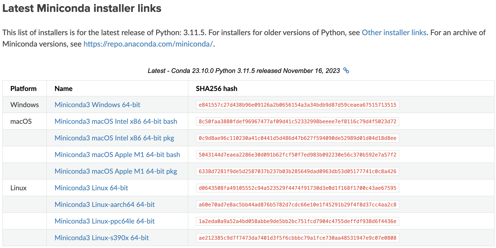
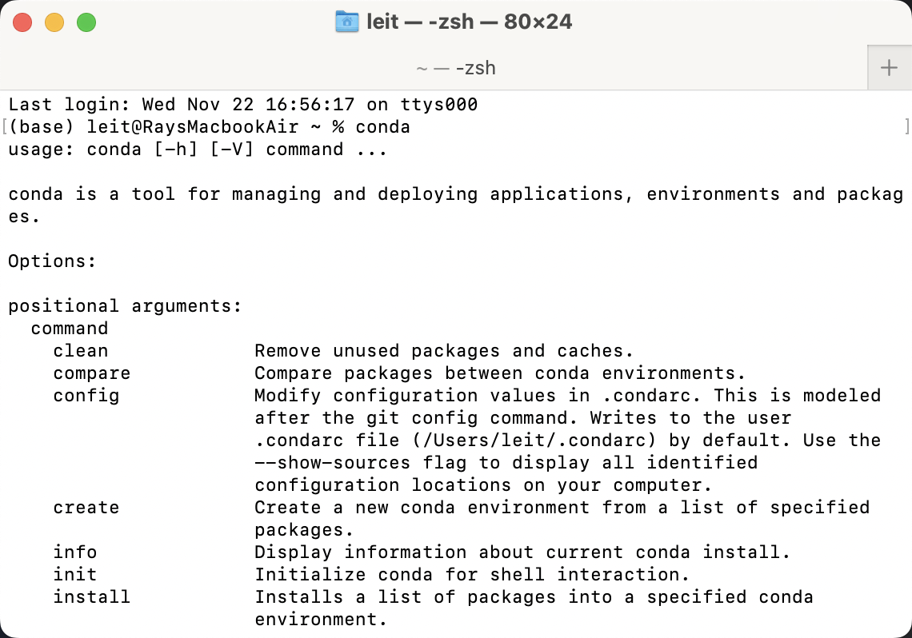
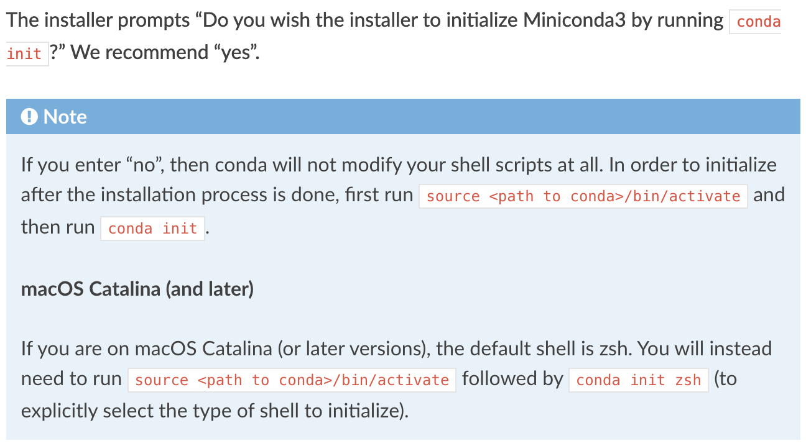

### Installation (Miniconda)

With a little bit of navigation, we see that there are download links here: [https://docs.conda.io/projects/miniconda/en/latest/](https://docs.conda.io/projects/miniconda/en/latest/)

So the first step here will just be to download the installer for your system, and then executing it. 

For systems that doesn't have a GUI, you can also use the other installation methods like an installation script provided on the website. 

In the picture shown above, download the one that fits your system, in my case, it is the one that says `Miniconda3 macOS Apple M1 64-bit pkg`

Then just download and click through the install process until you have completed. 

The setup guide for **MacOS** is [here](#setup-macos), for **Windows** is [here](#setup-windows)

### Setup [MacOS]

Regarding the setup process for Miniconda, multiple different situations can arise. 

Now, you want to start up the shell of your system and verify if Conda is successfully installed. In my case, MacOS has the default shell being `zsh`, so you can just open up `zsh` by pressing "Command + Space" and typing `terminal`, the first one should be your `shell`. 

Then, after `zsh` appears as a window, type in `conda`, then press enter. 

If you press enter and a bunch of information showed up, then it is likely that conda has successfully installed, and you can proceed directly to the next part [Creating Environments (Python)](#creating-environments-python)

However, if you called conda and nothing seems to have showed up, then it is likely that the installation did not successfully go through. To resolve this issue, depending on your system, there might be different solutions. 

One of the common fixes for this is to call `conda init [shell_type]`. For example, if you are on MacOS, you can follow this guide stated [here](https://docs.conda.io/projects/conda/en/latest/user-guide/install/macos.html)

With all that being said, we can finally start to unleash the power of Conda. [Hyperlink here](#creating-environments-python)