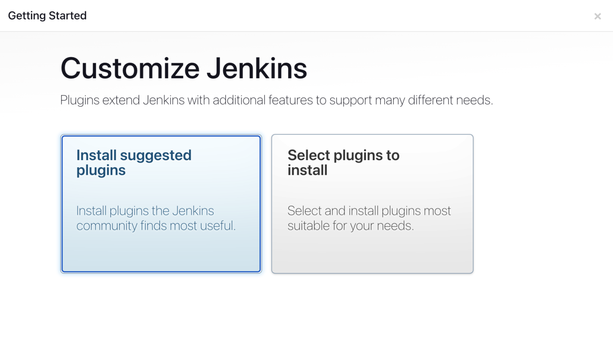
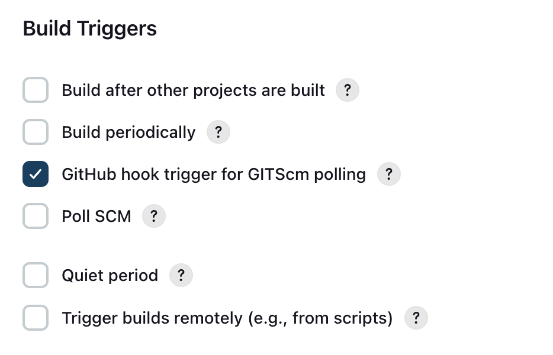
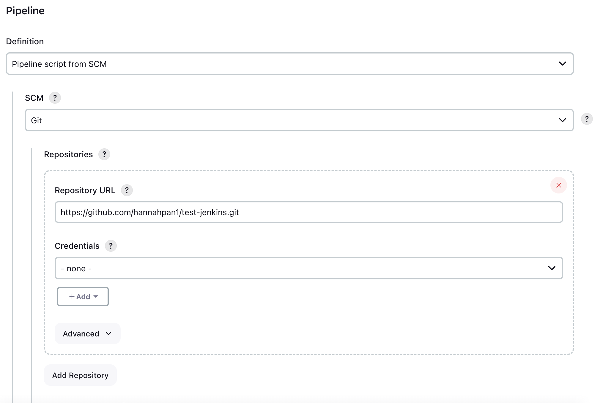
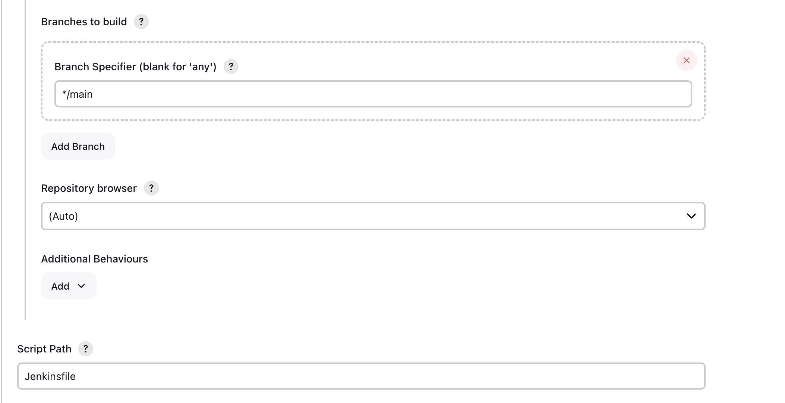
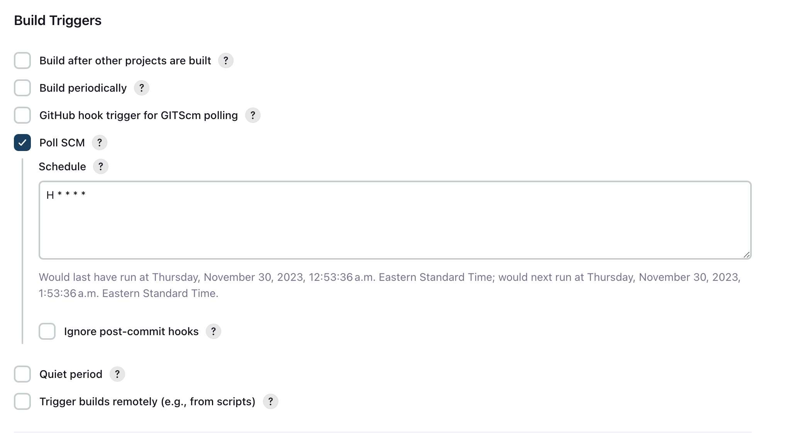

# Table of Contents
1. [Introduction to Jenkins](#introduction-to-jenkins)
2. [Terminology](#terminology)
3. [Setting up Jenkins with Github](#setting-up-jenkins-with-github)

# Introduction to Jenkins
## What is Jenkins?
Jenkins is an open source tool written in Java used for CI/CD (the method of frequently delivering software by automating the stages of developing, testing and deploying). For more information on CI/CD refer to the page on [Continous Integration](/Topics/Software_Engineering/continuous_integration/Continuous_Integration.md).

## When should you use Jenkins?
With Jenkins, you are able to trigger builds and automated testing with any change to your code repository. This can be used to run a suite of unit tests upon every commit to a 'main' branch of a repository. This ensures that the repository is tested frequently and any breaking commit can be found immediately. It can also be used to deploy your build to an environment for user acceptance testing before releasing it to production. If those pass, it can be merged into a final production ready repository where it can be deployed immediately.

## Comparison with Other Tools:

**Jenkins vs Gitlab:**

Both Jenkins and Gitlab are popular, free open source CI/CD tools. While Gitlab supports Jekyll which allows for easier use of plugins, Jenkins has a more extensive library of plugins. Therefore if you don't mind a more complex plugin integration, Jenkins offers a broader range of plugins. One major pro of Gitlab is that it comes with GitLab repository meaning that you can manage code, perform code reviews, issue tracking as well as build test pipelines very fast. Jenkins is more limited in your control over repositories.

More information: [Jenkins vs GitLab CI: Battle of CI/CD Tools](https://www.lambdatest.com/blog/jenkins-vs-gitlab-ci-battle-of-ci-cd-tools/)

 

**Jenkins vs CircleCI:**

The biggest difference is that Jenkins is a free and open source software while CircleCI is a payed service. As a result of this, however, CircleCI has some perks. Jenkins requires a dedicated server to run on while CircleCI is hosted on the cloud. Therefore for Jenkins someone must moniter and maintain the server while in CircleCI it is managed for you. In addition, CircleCI offers a build configuration file that can be shared amongst teams. Jenkins build configurations are done through the UI and therefore any configuration settings are saved in the Jenkins file system. This can make sharing configurations hard. That being said, Jenkins has large community support which can be very helpful in comparison to CircleCI due to it being free and open source.

More information: [CircleCI vs Jenkins: What's the Difference?](https://testsigma.com/blog/circleci-vs-jenkins/)

 

# Terminology
**Jenkins Controller**

This is the main Jenkins server and it is ideally the machine you have installed Jenkins on. It is responsible for scheduling and delegating tasks to Jenkins agents (also known as slaves). This allows for the distribution of tasks and speeds up and improves performance. It also supervises the health of the agents and will stop delegating tasks to an agent if it is too busy. 

**Jenkins Node**

A node is any machine that the agent executable runs on. As mentioned before, Jenkins moniters the health of these nodes with metrics such as disk space, free temp space, free swap, clock time/sync, and response time and will take it offline if it goes below a certain threshold.

**Jenkins Agent**

Jenkins Agent is a Java executable which allows the node it is running on to connect to the Jenkins Controller. It will also install any packages or tools necessary for building and testing on the node. The Jenkins Controller can then send and communicate tasks to the Jenkins Agent to perform on the node. If you'd like to set up a Jenkins Agent yourself, here is a tutorial: [Jenkins Slave Node Setup](https://www.baeldung.com/ops/jenkins-slave-node-setup.)

**Jenkins Pipeline**

A pipeline is a series of steps that the user defines and which Jenkins will run when the pipeline is triggered. There are multiple ways to create a pipeline including through a Jenkinsfile in your repository, through the Jenkins UI or through Blue Ocean. 

**Jenkins Architecture**

Jenkins checks if repository has been changed. If there has been a change, then a build is triggered. Some builds require different environments than others which may not be possible on some machines. Thus, Jenkins delegates the job of building to different slaves and asks them to generate logs. 

 

# Setting up Jenkins with Github
## Setting up Jenkins Server
To begin working, we need a Jenkins server that is up and running with the Github plugin. If you already have this feel free to skip to the next step. 

Follow instructions on the Jenkins documentation for installation information specific to your machine: [Jenkins Installation](https://www.jenkins.io/doc/book/installing/)
- For MacOS: you will have to install Homebrew if you don’t have it already: [Install Homebrew](https://docs.brew.sh/Installation)
    - If you have an apple silicon machine, you may need to add homebrew to your PATH. This stack overflow answer has a fantastic step by step:
    - [Stack Overflow Install Mac Homebrew](https://stackoverflow.com/questions/66666134/how-to-install-homebrew-on-m1-mac)

 
Once you have installed Jenkins and have unlocked your server, you should enter the customize Jenkins page:

 

Select **Install suggested plugins**. This will install the github plugins necessary to connect Jenkins to your repository. If you're interested in what plugins are actually being installed, you can find the list here: [Suggested Plugins](https://github.com/jenkinsci/jenkins/blob/6ca9b5ee5f601f72fcd094f8d159272c6b504b2f/core/src/main/resources/jenkins/install/platform-plugins.json). Jenkins will now prompt you to create an admin user. Ensure to save this login information in a secure location.

## Creating a Jenkins Job
1. Click on **new Item**. 
2. Enter a name and select **Pipeline**.
3. In the Build Triggers section, select **Github hook trigger for GITScm polling**. GitScm stands for Git source control management and will ensure that this job will be triggered after any change to your Github repository. 

    

4. In the **Pipeline** section, select **Pipeline script from SCM** (SCM refers to Source Control Management). For the **SCM**, select **Git**. Then add your repository URL. In the **script path**, add the path to your Jenkinsfile in your repository. 
    - If you are unfamiliar with what a Jenkinsfile is check out the documentation for some more information: [Jenkins Pipelines](https://www.jenkins.io/doc/book/pipeline/jenkinsfile/). If you want to get started right away, create a file in your repo called Jenkinsfile and copy the script from the section <em>Creating a Jenkinsfile, Jenkinsfile (Declarative Pipeline)</em> in the documentation.
    - **Note**: the default value for the option for the branch to build is <em>master</em>, but the default Github branch is called <em>main</em> now. Make sure to select the correct branch. 
    
    

5. If your Jenkins server is:

    - **hosted remotely:**
        You can add a webHook to Github. In your Github repository navigate to **Settings** then **Webhooks**. Click **Add webhook**. You will need your Jenkins endpoints (must be publicly available over the internet) to enter into the Payload URL section.

    - **hosted locally:**
        Select the **Poll SCM** option instead. For the **Schedule** text box, adding H \* \* \* \* \* (see image below for example) will poll your github repository every hour for changes in your github or alternatively when you input \* \* \* \* \* github will be polled every minute (which is not a good idea in reality since polling is expensive, but can be good for testing).

        

Hooray, now any changes you make to your repository will trigger your job to run!

 

## Sources:
- Arvind. (2020, November 25). Jenkins Master and Slave Architecture – a complete guide. Edureka. https://www.edureka.co/blog/jenkins-master-and-slave-architecture-a-complete-guide/
- CircleCI vs Jenkins: What’s the Difference? [2022 Updated]. (2023, May 3). Testsigma Blog. https://testsigma.com/blog/circleci-vs-jenkins/
- GitLab vs. Jenkins: Top CI/CD Tool 2023 | Spiceworks - Spiceworks. (2023, March 10). Spiceworks. https://www.spiceworks.com/tech/devops/articles/gilab-vs-jenkins#:~:text=While%20reviewing%2C%20testing%2C%20and%20reporting,code%20reviews%20and%20merge%20requests.
- Jain, R. (2023, October 26). Jenkins vs GitLab CI: Battle of CI/CD Tools. LambdaTest. https://www.lambdatest.com/blog/jenkins-vs-gitlab-ci-battle-of-ci-cd-tools/
- Munetsi, T. (2020, March 6). What is Jenkins used for? OpenLogic by Perforce. https://www.openlogic.com/blog/what-is-jenkins-used-for#:~:text=Jenkins%20is%20used%20to%20build,alongside%20other%20cloud%20native%20tools.
- Managing nodes. (n.d.). Managing Nodes. https://www.jenkins.io/doc/book/managing/nodes/
- ProgrammingKnowledge. (2021, March 7). Jenkins Tutorial is For Beginners, DevOps and Software Developers [Video]. YouTube. https://www.youtube.com/watch?v=EYA2YNHHPls
- Team, C. O. (2023, August 30). Jenkins. Codefresh. https://codefresh.io/learn/jenkins/
- Trapani, K. (2023, March 3). How to Integrate Jenkins with GitHub. Cprime. https://www.cprime.com/resources/blog/how-to-integrate-jenkins-github/