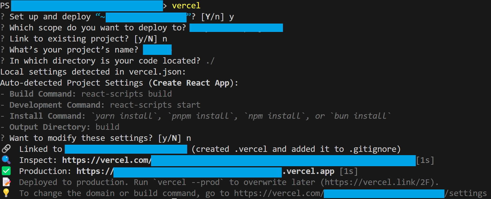

# Vercel Frontend Deployment: A Guide for Beginners

## Table of Contents:
### [Introduction](#introduction-1)
### [What is Vercel?](#what-is-vercel-1)
### [Why Deploy with Vercel?](#why-deploy-with-vercel-1)
### [How to Deploy on Vercel?](#how-to-deploy-on-vercel-1)
### [Deploying with Vercel CLI](#deploying-with-vercel-cli-1)
### [Advanced Vercel Features](#advanced-vercel-features-1)
### [Useful Articles](#useful-articles-1)

## Introduction

Welcome to the Learning Software Engineering Repository. This section specifically focuses on Vercel Frontend Deployment. Deployment is a crucial phase in the software development lifecycle, transforming your code into a live, interactive web experience. This guide is designed to explain what Vercel is, why it's beneficial for frontend deployment, and how to utilize its features effectively. By the end of this guide, you should have a foundational understanding of Vercel and be ready to deploy your frontend projects.

## What is Vercel?

Vercel is a cloud platform for static sites and Serverless Functions that fits perfectly with your workflow. It enables developers to host web applications with ease, providing features like global distribution, real-time analytics, and integration with various headless CMSs. 

## Why Deploy with Vercel?

Deploying with Vercel offers numerous advantages:
- **Simplicity and Speed**: Vercel simplifies the deployment process, allowing for quick and efficient project launches.
- **Performance Optimization**: It offers optimal performance with smart CDN distribution.
- **Scalability**: Vercel scales automatically to meet demand, ensuring your application remains stable under varying loads.
- **Developer Experience**: Integration with Git and real-time feedback loops enhance the overall development experience.

## Comparative Analysis: Vercel vs. Other Deployment Platforms

### Vercel vs. Netlify

- **Performance and Speed**:
Both Vercel and Netlify offer excellent performance. However, Vercel is often praised for its superior edge network performance, making it a great choice for high-traffic applications.
- **Build Process**:
Vercel offers zero-config deployments with frameworks like Next.js, while Netlify provides a more flexible build process which can be advantageous for complex build setups.
- **Serverless Functions**:
Netlify and Vercel both support serverless functions, but Vercel's integration is often considered more seamless, especially with Next.js applications.
- **Pricing**:
Both platforms have free tiers. Netlify's pricing is based more on build minutes, while Vercel focuses on the number of deployments and serverless function invocations.

### Vercel vs. GitHub Pages

- **Use Case**: 
GitHub Pages is ideal for static sites and simple web pages. Vercel, with its support for serverless functions and dynamic applications, is better suited for more complex web applications.
- **Build and Deployment**:
Vercel offers more advanced build and deployment features compared to GitHub Pages, which is fairly basic and limited to static site deployment.
- **CI/CD Integration**:
Vercel provides more robust integration with CI/CD workflows, making it a better choice for professional and enterprise-level projects.

### Vercel vs. AWS Amplify

- **Integration with AWS Services**:
AWS Amplify is deeply integrated with the AWS ecosystem, making it a good choice for those heavily invested in AWS services. Vercel, while not as integrated, offers a simpler and more streamlined experience.
- **Ease of Use**:
Vercel is often highlighted for its user-friendly interface and ease of setup, whereas AWS Amplify has a steeper learning curve but offers more customization and control.

## How to Deploy on Vercel?

This section covers the steps to deploy a frontend project on Vercel:
1. **Creating a Vercel Account**.
2. **Connecting to Your Repository**: Using platforms like GitHub or GitLab.
3. **Configuring Deployment Settings**: Setting environment variables and build configurations.
4. **Deployment and Monitoring**: Understanding how to deploy and monitor your applications.

Vercel Step-by-Step Tutorial: Vercel's own documentation offers a comprehensive step-by-step tutorial that guides you through the process of using their platform. It's designed as an end-to-end guide for developers to create and deploy web applications​. (https://vercel.com/docs/getting-started-with-vercel)

## Deploying with Vercel CLI

Deploying your project using the Vercel CLI offers flexibility and control over the deployment process. Follow these steps to deploy your frontend project with Vercel CLI:

1. **Install Vercel CLI**: If you haven't already installed the Vercel CLI, you can do so by running the following command in your terminal:

```bash
npm install -g vercel
```

2. **Login to Vercel**: Log in to your Vercel account using the following command:

```bash 
vercel login
```

select your method of authentation (Github, GitLab, Bitbucket, etc) and follow instructions on logging in
3. **Navigate to Project Directory**: Use the `cd` command to navigate to your project directory in the terminal:

```bash
cd path/to/your/project
```

4. **Initialize Deployment**: Once you're in your project directory, initiate the deployment process by running:

```bash
vercel
```

5. **Follow Deployment Prompts**: Vercel CLI will guide you through the deployment process with a series of prompts:

- Choose the scope (personal account or team) for the deployment.
- Choose project name
- Confirm the project to deploy.
- Review and confirm deployment settings such as the framework (e.g Next.js, Create React App) and project settings (e.g Build Command, Development Command, Install COmmand, Output Directory)
- Note, Vercel will automatically detect your framework (e.g React, Vue, Angular) and determine the appropriate build settings based on the detected framework.


6. **Monitor Deployment**: After confirming the deployment settings, Vercel CLI will start deploying your project. You can monitor the deployment progress directly in your terminal.

7. **Access Deployment URL**: Once the deployment is complete, Vercel CLI will provide you with a URL where your project is hosted. You can visit this URL to access your deployed frontend application.

8. **Additional Deployment Options**: Vercel CLI offers additional options for customizing your deployment process, such as setting environment variables, specifying deployment regions, and more. Refer to the Vercel CLI documentation for advanced usage.

By following these steps, you can deploy your frontend project using Vercel CLI, leveraging its simplicity and flexibility for a seamless deployment experience. [For more information, see the Vercel documentation](https://vercel.com/docs/cli/deploy).

### Adding Environment Variables

Environment variables are an important part of the project.Here's how you can add environment variables using Vercel CLI:

The `--build-env` option, shorthand `-b`, allows you to provide environment variables to the build step. Here's an example of how to use it:

```bash
vercel --build-env KEY1=value1 --build-env KEY2=value2
```

This command sets environment variables KEY1 and KEY2 with the respective values value1 and value2 during the build process.

The --env option, shorthand -e, allows you to provide environment variables at runtime. Here's an example:

```bash
vercel --env KEY1=value1 --env KEY2=value2
```

This command sets environment variables KEY1 and KEY2 with the respective values value1 and value2 during runtime.

For more CLI usages, refer to [Vercel documentation](https://vercel.com/docs/cli/deploy).

## Advanced Vercel Features

- **Custom Domains**: 
Learn to link a custom domain to your Vercel deployments for a professional touch. [This detailed tutorial](https://vercel.com/guides/custom-domains) guides you through the process of connecting a real domain to your Vercel project.
  
- **CI/CD Integration**: 
Set up continuous integration and deployment to automate your workflow. Vercel seamlessly integrates with various CI/CD tools. [Here's how to set it up](https://vercel.com/docs/concepts/git).

- **Performance Analytics**: 
Utilize Vercel's analytics tools to gain insights into the performance of your deployed applications. Understand your application's metrics better with [Vercel Analytics](https://vercel.com/docs/analytics).

- **Serverless Functions**: 
Vercel supports Serverless Functions, which lets you deploy backend code without managing servers. [Learn about deploying Serverless Functions](https://vercel.com/docs/serverless-functions/introduction).

- **Integrations**: 
Enhance your projects with numerous integrations available on Vercel. From headless CMS to monitoring tools, [explore Vercel Integrations](https://vercel.com/integrations).

Each feature comes with its own set of practices and considerations. These resources provide real-life examples and step-by-step guides to effectively utilize Vercel's advanced capabilities.

At the end of this guide, you'll have a comprehensive understanding of Vercel's capabilities and be ready to utilize it for your frontend projects.

## Useful Articles
Some useful article for using Vercel:
1. **Using Templates in Vercel**: 
This guide helps you to leverage popular frontend frameworks and maximize Vercel's features. It also details how Vercel can create a new repository with your chosen Git provider for easy project updates after deployment​. (https://vercel.com/docs/getting-started-with-vercel/template)
2. **Deploying Front-End Applications on Vercel**:
This is a walkthrough for deploying front-end applications, especially focusing on static and Jamstack apps. It includes instructions for deploying Next.js JSS apps and highlights Vercel's support for Next.js. (https://doc.sitecore.com/xmc/en/developers/xm-cloud/walkthrough--deploying-your-front-end-application-to-vercel.html)
3. **Creating & Deploying React Apps to Vercel**:
If you're focused on React applications, Vercel provides a guide for deploying React sites. This documentation explains how to deploy your site with zero configuration and connect to your favorite APIs, databases, and content management systems. (https://vercel.com/guides/deploying-react-with-vercel)
