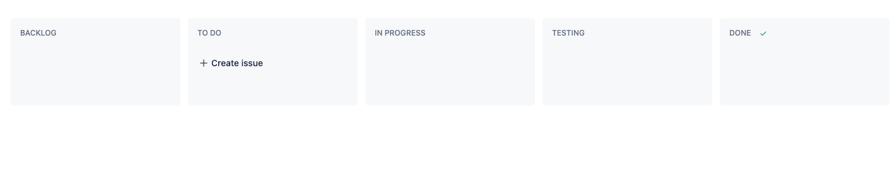
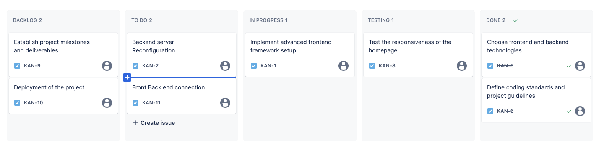

# KanBan Introduction and Implementation
## Table of Contents
- [Introduction to Kanban](#introduction-to-kanban)
- [Why Kanban Suits Software Teams](#why-kanban-suits-software-teams)
- [Components of Kanban](#components-of-kanban)
    - [Kanban Boards and Their Functions](#kanban-boards-and-their-functions)
    - [Kanban Cards and Their Role](#kanban-cards-and-their-role)
- [Benefits of Using Kanban](#benefits-of-using-kanban)
- [Differences Between Scrum and Kanban](#differences-between-scrum-and-kanban)
- [Applying Kanban to CSC301 Projects](#applying-kanban-to-csc301-projects)
- [Guides and Additional Resources](#guides-and-additional-resources)

---
---
## Introduction to Kanban

Kanban is a system framework used in agile and DevOps software development, focusing on complete work visualization and real-time communication. It allows team members to understand the status and progress of each task through a visual representation.

---
## Why Kanban Suits Software Teams

Kanban is particularly effective in software development due to its flexibility, continuous delivery, and visual workload management.

- **Flexibility**
In software development, priorities and requirements can shift frequently. Kanban's adaptable nature allows for seamless integration of these changes into the workflow.

- **Continuous Delivery**
Kanban encourages a continuous flow of work, enabling software teams to deliver updates and improvements promptly.

- **Visualizing Workload**
The Kanban board provides a clear visual representation of all ongoing work, aiding in workload management and prioritization.

- **Low Implementation Cost**
A basic Kanban system requires minimal setup, making it a cost-effective option for teams.
---
## Components of Kanban

- **Kanban Boards and Their Functions**
Kanban boards visualize work in various stages and can be customized to fit team needs.

- **Kanban Cards and Their Role**
   
Each task in the Kanban system is represented by a card, containing key task information and tracking progress.
---
## Benefits of Using Kanban

- **Flexibility in Task Management**
Kanban enables real-time adjustments in task prioritization, enhancing workflow management.

- **Enhanced Team Focus**
Limiting work-in-progress allows teams to concentrate better on current tasks.

- **Improved Delivery Time**
With a streamlined workflow and clear visibility, Kanban reduces the time from task initiation to completion.

- **Increased Team Efficiency**
The visual nature of Kanban optimizes team operations, leading to increased efficiency.

- **Better Workload Management**
Kanban helps in evenly distributing work among team members, preventing burnout and bottlenecks.

- **Continuous Improvement**
Kanban fosters an environment of ongoing improvement through continuous feedback and adaptations.
---
## Differences Between Scrum and Kanban

| Aspect                  | Scrum                                             | Kanban                                            |
|-------------------------|---------------------------------------------------|---------------------------------------------------|
| **Rhythm**              | Fixed-length sprints                              | Continuous flow                                   |
| **Release Methodology** | Typically at the end of each sprint               | Continuous delivery or as determined by the team  |
| **Roles**               | Product Owner, Scrum Master, Development Team     | No fixed roles, Agile Coach may be used           |
| **Key Metrics**         | Velocity                                          | Cycle Time                                        |
| **Change Philosophy**   | Changes discouraged during the sprint             | Changes can occur at any time                     |
---
## Setting Up Kanban for CSC301 Projects

#### 1. Create a Kanban Board
   - **Choice of Board:** Decide whether to use a physical board (like a whiteboard with sticky notes) or a digital board (using tools such as Trello, Asana, or Jira).
   - **Board Layout:** Set up your board with columns to represent different stages of tasks. Common columns include:
   
     - "Backlog" for tasks that are identified but not yet started.
     - "To Do" for tasks that are ready to be worked on.
     - "In Progress" for tasks currently being worked on.
     - "Testing" for tasks undergoing testing.
     - "Done" for completed tasks.

#### 2. Define Tasks

   - **Task Identification:** Break down the CSC301 project into smaller, manageable tasks or user stories. For example, if you're developing a software application, tasks might include writing specific code functions, designing a user interface, or conducting user research.
   - **Task Representation:** Represent each task as a card or a sticky note on the board, starting in the "Backlog" column.

#### 3. Limit Work in Progress (WIP)
   - **Setting WIP Limits:** Determine the maximum number of tasks allowed in each column (except for "Backlog" and "Done") to prevent bottlenecks and ensure that team members focus on completing tasks rather than starting new ones.
   - **Managing Workload:** Adjust WIP limits based on the team's capacity and the complexity of tasks to maintain a steady workflow.

#### 4. Conduct Regular Meetings
   - **Frequency and Duration:** Organize short, regular meetings (preferably daily or weekly) to review the board's status.
   - **Meeting Goals:** During these meetings, the team should update the board with the progress of tasks, discuss any blockers or challenges, and plan for upcoming tasks.
---
### Example Scenario in a CSC301 Project

#### Task Breakdown
   - **Project Example:** Consider a project aimed at developing a web application.
   - **Specific Tasks:** Breakdown tasks such as designing the UI, setting up the backend, writing specific features, conducting tests, etc. Each task is represented as a separate card on the Kanban board.

#### Progress Tracking
   - **Task Movement:** As work progresses, move each card from "Backlog", "To Do" to "In Progress," then to "Testing," and finally to "Done."
   - **Visual Indicator:** This movement across the board provides a clear visual indicator of each task's progress and the overall project advancement.

#### Adapting to Changes
   - **Responding to New Requirements:** In case new features are requested, or significant bugs are discovered, add these as new cards to the board immediately.
   - **Flexibility:** This process ensures that the team can quickly adapt their priorities and workflow to accommodate new developments or changes in the project requirements.
---
## Conclusion

In conclusion, this Expanded Kanban Guide provides a comprehensive overview of the Kanban methodology, its applications in software development, and its benefits.

I hope this guide has given you valuable insights. If you're interested in exploring Kanban further and trying it out for yourself, we encourage you to visit [OpsLevel vs Atlassian Compass](https://www.opslevel.com/try/opslevel-vs-atlassian-compass?utm_term=atlassian%20software&utm_campaign=G_Search_USA_Comp&utm_source=adwords&utm_medium=ppc&hsa_acc=9194444884&hsa_cam=18658114997&hsa_grp=155384923918&hsa_ad=676928727732&hsa_src=g&hsa_tgt=kwd-305247258217&hsa_kw=atlassian%20software&hsa_mt=p&hsa_net=adwords&hsa_ver=3&gad_source=1&gclid=CjwKCAiAvJarBhA1EiwAGgZl0FRiCisPyQkLV39ABYR2y9hNTkkYTAwij9t6KKZm0NQtwMTBOoIEqRoC5pwQAvD_BwE). This resource offers a hands-on experience with digital Kanban boards, allowing you to implement the principles and practices discussed in this guide in a practical setting.

Happy exploring and implementing!

---

## Guides and Additional Resources
- [Kanban Agile Guide](https://asana.com/resources/what-is-kanban)
- [Kanban vs. Scrum](https://www.coursera.org/articles/kanban-vs-scrum)
- [Jira Software online kanban tool](https://www.opslevel.com/try/opslevel-vs-atlassian-compass?utm_term=atlassian%20software&utm_campaign=G_Search_USA_Comp&utm_source=adwords&utm_medium=ppc&hsa_acc=9194444884&hsa_cam=18658114997&hsa_grp=155384923918&hsa_ad=676928727732&hsa_src=g&hsa_tgt=kwd-305247258217&hsa_kw=atlassian%20software&hsa_mt=p&hsa_net=adwords&hsa_ver=3&gad_source=1&gclid=CjwKCAiAvJarBhA1EiwAGgZl0FRiCisPyQkLV39ABYR2y9hNTkkYTAwij9t6KKZm0NQtwMTBOoIEqRoC5pwQAvD_BwE)

---

