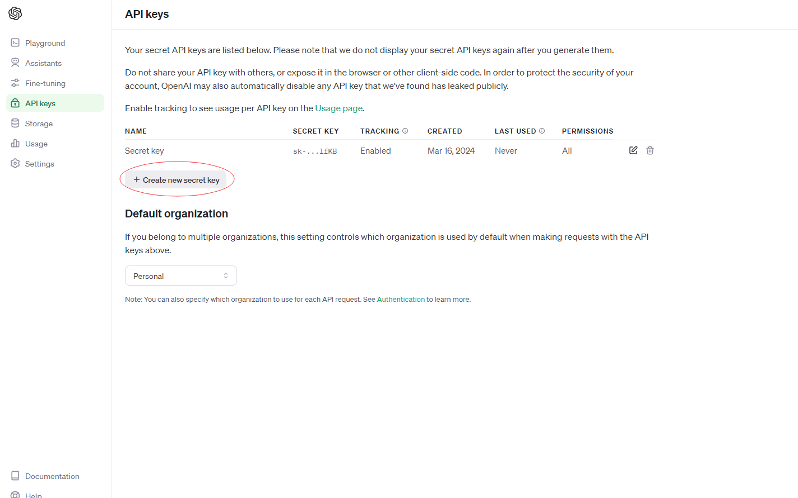
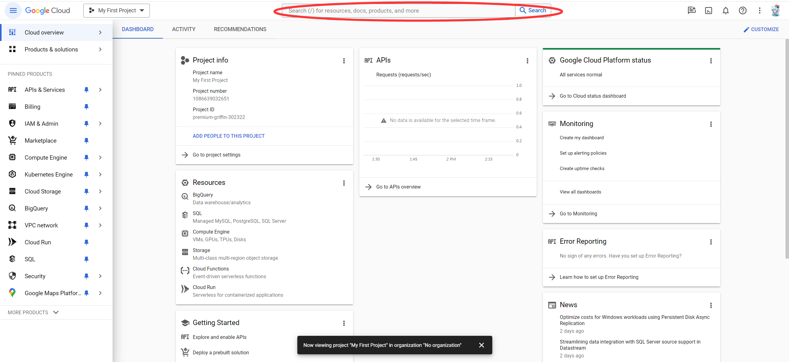

# Text to Speech Using Python

## Introduction

Text to Speech (TTS) is a type of assistive technology that reads digital text aloud. Utilizing a combination of natural language processing and digital signal processing, TTS systems convert words from a document or other sources into audible speech. TTS technology is widely used to assist individuals with visual impairments or reading disabilities, improve user engagement, and provide hands-free computing.

In software engineering, TTS can serve multiple purposes across various domains:
- Accessibility: Enhancing the accessibility of applications for users with visual impairments or reading difficulties.
- User Interface: Providing auditory feedback or guidance in applications, improving user experience.
- Multimedia Applications: Generating voiceovers for videos and presentations automatically.
- Virtual Assistants and Chatbots: Enabling conversational interfaces to communicate with users in a more natural, human-like manner.

## TTS Models and Their Set Up

We will introduce three popular TTS models for python. 

### gTTS:

gTTS is a Python library and CLI tool to interface with Google Translate's text-to-speech API. 

Price: Free!

Voice Choices: Only the default voice, but supports most of languages.

Available Functions: Only contain basic text-to-speech conversions.

**Set-up**

- You can very easily install the gTTS library via pip install: 

    ```bash
    pip install gTTS
    ```

**Quickstart**

- Using Command Line:
    ```bash
    gtts-cli 'hello' --output hello.mp3
    ```

- Using Module:
    ```bash
    from gtts import gTTS
    tts = gTTS('hello')
    tts.save('hello.mp3')
    ```

### OpenAI TTS:


OpenAI's text-to-speech (TTS) technology refers to a suite of artificial intelligence models and tools developed to convert written text into spoken words. This technology is built on advanced machine learning and deep learning principles, making it possible to generate highly realistic and natural-sounding voice outputs. OpenAI's TTS systems are designed to understand the nuances of language, including intonation, emotion, and context, allowing them to produce speech that closely mimics human-like articulation and expressiveness.


*Price*: 	$15.00 / 1M characters

*Voice choices*: There are 6 voices to choose from (alloy, echo, fable, onyx, nova, and shimmer)

*Supported output formats*: Opus, AAC, FLAC, WAV, PCM

*Available Functions*: Have two different models: 1. tts-1(optimized for speed) 2. tts-1-hd(optimized for quality)


**Set-up**

- You can easily get the openAPI library via pip install: 

    ```bash
    pip install --upgrade openai
    ```

**API aquirement**
Getting an OpenAI api key is a mandatory requirement to use the OpenAI TTS module.
- Create an OpenAI account:
    - Go to [OpenAI Api](https://platform.openai.com/api-keys/) and register a new account(log in if you already have one)
- Getting personal api-key
    - After logging in, click the **Create new secret key** button, set any properties you want and you will get    yourpersonal api key.
    
- Checking Usage
    - In the website mentioned before, by clicking the **Usage** section, you can check your usage and recharge your limit.
    
**Quickstart**

- Set environment:
First, create a local **.env** file in your project folder with the following content:
    ```bash
    # Once you add your API key below, make sure to not share it with anyone! The API key should remain private.
    OPENAI_API_KEY=abc123
    ```

- Import Module:
    ```bash
    from pathlib import Path
    from openai import OpenAI
    ```

- Use Module:
    ```bash
    client = OpenAI()

    speech_file_path = Path(__file__).parent / "speech.mp3"
    response = client.audio.speech.create(
    model="tts-1",
    voice="alloy",
    input="Today is a wonderful day to build something people love!"
    )

    response.stream_to_file(speech_file_path)
    ```
By changing output file name, the output can be configured to any of supported formats. By changing input model name("tts-1", "tts-1-hd"), voice name("alloy", "echo", "fable", "onyx", "nova", and "shimmer"), you can get different output quality and voice.

- Stream real time audio
    ```bash
    client = OpenAI()

    response = client.audio.speech.create(
        model="tts-1",
        voice="alloy",
        input="Hello world! This is a streaming test.",
    )

    response.stream_to_file("output.mp3")
    ```
By using this code, the audio will be able to be played before the full file has been generated and made accessible.


### Google Cloud TTS:

Google Cloud Text-to-Speech API is a powerful tool offered by Google Cloud Platform for converting text into natural-sounding speech. It utilizes advanced machine learning techniques to generate high-quality audio output, allowing developers to integrate speech synthesis capabilities into their applications with ease.


*Price*: Based on the number of characters, $4 / 1M characters for Standard voice, will be more expensive depending on Feature. First 4 million characters is free for Standard voice each month.

*Voice choices*: Support most of languages. Only default voiceline, but can upgrage for other voicelines.

*Supported output formats*: MP3, Linear16, OGG Opus, and a number of other audio formats.

*Key features*: Custom voices, Long audio synthesis, Text and SSML support, Pitch tuning

**Set-up**

- Installing the Cloud Client Libraries for Python:
To install the package for an individual API like Cloud Storage, use a command similar to the following:
    ```bash
    pip install --upgrade google-cloud-storage
    ```

- Install the gcloud CLI [here](https://cloud.google.com/sdk/docs/install).

**API aquirement**
Before you can begin using Text-to-Speech, you must enable the API in the Google Cloud Platform Console. 

- Make sure billing is enabled for Text-to-Speech:
    - A Google Cloud Platform (GCP) account. If you don’t have one, sign up for a free trial here.A Google Cloud Platform (GCP) account. If you don’t have one, sign up for a free trial [here](https://cloud.google.com/free?hl=en).

- Enable Text-to-Speech on a project:
    - Sign in to [Google Cloud console](https://console.cloud.google.com/?_ga=2.129120079.235760447.1710698738-1413217027.1710698726&_gl=1*kikz2f*_up*MQ..&gclid=Cj0KCQjwhtWvBhD9ARIsAOP0GojMbBDoPoxjjjBzHoMMO_J0Q0Px3S3uaXCqBS0b4HzfBOtlK0klpAQaAkwMEALw_wcB&gclsrc=aw.ds) and Go to the [project selector page](https://console.cloud.google.com/projectselector2/home/dashboard?_ga=2.128728655.235760447.1710698738-1413217027.1710698726&_gl=1*195xabo*_up*MQ..&gclid=Cj0KCQjwhtWvBhD9ARIsAOP0GojMbBDoPoxjjjBzHoMMO_J0Q0Px3S3uaXCqBS0b4HzfBOtlK0klpAQaAkwMEALw_wcB&gclsrc=aw.ds)
    
    - Once you have selected a project and linked it to a billing account, you can enable the Text-to-Speech API. Go to the **Search products and resources** bar at the top of the page and type in "speech". 
    Select the **Cloud Text-to-Speech API** from the list of results.

    - To try Text-to-Speech without linking it to your project, choose the **TRY THIS API** option. To enable the Text-to-Speech API for use with your project, click **ENABLE**.

**Quickstart**
Text-to-Speech supports programmatic access. You can access the API in 2 ways: Clinet libraries and REST

- Clinet libraries:
Install the client library:
    ```bash
    pip install --upgrade google-cloud-texttospeech
    ```
    
- To use the client library, you must first create a `TextToSpeechClient` object.
    ```python
    from google.cloud import texttospeech

    # Instantiates a client
    client = texttospeech.TextToSpeechClient()

    # Set the text input to be synthesized
    synthesis_input = texttospeech.SynthesisInput(text="Hello, World!")

    # Build the voice request, select the language code ("en-US") and the ssml
    # voice gender ("neutral")
    voice = texttospeech.VoiceSelectionParams(
        language_code="en-US", ssml_gender=texttospeech.SsmlVoiceGender.NEUTRAL
    )

    # Select the type of audio file you want returned
    audio_config = texttospeech.AudioConfig(
        audio_encoding=texttospeech.AudioEncoding.MP3
    )

    # Perform the text-to-speech request on the text input with the selected
    # voice parameters and audio file type
    response = client.synthesize_speech(
        input=synthesis_input, voice=voice, audio_config=audio_config
    )

    # The response's audio_content is binary.
    with open("output.mp3", "wb") as out:
        # Write the response to the output file.
        out.write(response.audio_content)
        print('Audio content written to file "output.mp3"')
    ```
    
-REST:
It is suggested to call this serevice with Google-providede client libraries. However, if you nned to use your own libraries to call this service, following information will help you make the API requests.


The service endpoint(base URL) for this API service is https://texttospeech.googleapis.com


A Discovery Document serves as a machine-readable blueprint detailing and facilitating the utilization of REST APIs. Its purpose lies in enabling the construction of client libraries, IDE plugins, and various tools that engage with Google APIs. Cloud Text-to-Speech API service provides the following Discovery Documents : [v1](https://texttospeech.googleapis.com/$discovery/rest?version=v1) and [v1beta1](https://texttospeech.googleapis.com/$discovery/rest?version=v1beta1).

Here is one example of text.sythesize:
```http
POST https://texttospeech.googleapis.com/v1/text:synthesize
```
Request Body:
```JSON
{
  "input": {
    object (SynthesisInput)
  },
  "voice": {
    object (VoiceSelectionParams)
  },
  "audioConfig": {
    object (AudioConfig)
  }
}
```

Response body:

```JSON
{
  "audioContent": string
}
```


## Comparison Between the Three Models

In summary, the choice between these TTS APIs depends on factors such as the level of customization needed, pricing considerations, ease of integration, and the specific requirements of your project or application. Google Cloud Text-to-Speech API and gTTS are suitable for general-purpose TTS tasks, while OpenAI's TTS models offer advanced capabilities and natural-sounding speech synthesis as the cost is much higher. Furthermore, while Google Cloud Text-to-Speech API and gTTS offer relatively straightforward pricing models, gTTS may be simpler to use for basic text-to-speech tasks. Ultimately, the choice depends on the specific requirements and preferences of the project.

## Reference

* [Text to Speech Explained](https://speechify.com/blog/text-to-speech-explained-a-comprehensive-guide/)

* [gTTS](https://pypi.org/project/gTTS/)

* [OpenAI-TTS](https://platform.openai.com/docs/guides/text-to-speech/)

* [Text-to-Speech documentation](https://cloud.google.com/text-to-speech/docs)

* [Speech-synthesis](https://www.w3.org/TR/speech-synthesis/)