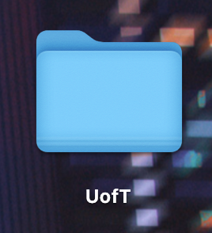

# PyAutoGui Tutorial: Automate Tasks with Python

PyAutoGui is a Python module that allows you to programmatically control the mouse and keyboard to automate tasks. In this tutorial, we'll cover the basics of PyAutoGui and some advanced features. You can find the official documentation for it [here](https://pyautogui.readthedocs.io/en/latest/index.html).

## Requirements
- PyAutoGUI works on Windows/Mac/Linux and on Python 2 & 3.
- So you will need to have installed Python first. You can refer to [this website](https://realpython.com/installing-python/) for installation details.
- This tutorial shows examples in Python 3.

## What can you do with PyAutoGUI?
- **Simulate mouse movement:** The mouse can be moved to any desired location on the screen and used to click on things as well.  
  *You can*: Automate the process of clicking through a series of buttons in a software application.

- **Simulate keypresses:** Simulate keypresses without having to touch the keyboard.  
  *You can*: Automate the process of filling out a form on a website by simulating keypresses to enter text.

- **Take screenshots.**  
  *You can*: Capture screenshots of the entire screen or just a portion of it to document the state of a program or website.

- **Find a particular image on a screen.**  
  *You can*: Locate a specific image within the current screen to automate tasks that require interacting with elements that are not easily accessible through other means.

- **Display alerts and message boxes.**  
  *You can*: Provide feedback to the user or prompt the user to take a specific action by displaying custom alerts and message boxes on the screen.


## Installation

To use PyAutoGui, you need to install it first. You can install it using pip:

```bash
pip install pyautogui
```

## Getting Started
Create a brand new python file and import pyautogui

```python
import pyautogui
```

## Positions on the Screen
Before we start moving the mouse around, we must first understand how points on your screen are defined and used by PyAutoGUI. Locations on your screen are defined using $x$ and $y$ coordinates. But unlike in your math courses, the origin, or (0, 0), is located at the top left, instead of the bottom left. 

For example, if you have a 500x500p display, here is how pixels/locations are mapped on your screen.


(from Coordinates and Modes - CMPT 166 Fall 2016 1 documentation. (n.d.). https://www2.cs.sfu.ca/CourseCentral/166/tjd/coordinates.html)

You can use PyAutoGUI to get your screen resolution size like this:
```python
>>> pyautogui.size()
Size(width=2304, height=1296) # weird mac displays
```

## Mouse Control

### Mouse Movements
Now you're ready to move your mouse around! 
To do so, PyAutoGUI provides us with `moveTo()` and `move()`

`moveTo()` allows you to move the mouse to a specific location on the screen.
```python
>>> pyautogui.moveTo(100, 200)   # moves mouse to X of 100, Y of 200.

>>> pyautogui.moveTo(None, 500)  # wont change the X coordinate of the mouse, just the Y. 
# So the mouse moves to X of 100, Y of 500

>>> pyautogui.moveTo(600, None)  # Similarly, moves mouse to X of 600, Y of 500.
```

`move()` on the other hand lets you move the mouse to a location relative to its current one.
```python
>>> pyautogui.move(10, 0) # move the mouse 10 pixels to the right
>>> pyautogui.move(-50, 100) # move the mouse 50 pixels to the right and 100 pixels up
```

This movement is instantaneous, but both these functions also take a third argument, which can be used to change the duration of the movement in seconds.

```python
>>> pyautogui.move(10, 0, 2) # move the mouse 10 pixels to the right over 2 seconds
>>> pyautogui.moveTo(100, 200, 10)   # moves mouse to X of 100, Y of 200 over 10 seconds
```

How do I know where to move my mouse? Well here is a simple trick that you can use to find the $(x, y)$ coordinates of a pixel on your screen:

```python
import pyautogui
import time

time.sleep(5) # 5 second buffer to let you move your mouse
print(pyautogui.position()) # prints the current position of the mouse
```
All you have to do is simply run the program above and move your mouse to the location you want the coordinates for (make sure its within 5 seconds). The output will tell you exactly where the mouse is!

### Clicking
Now that you can move your mouse around freely to wherever you want, how do you finally perform a mouseclick? PyAutoGUI provides multiple options as follows:
```python
>>> pyautogui.click()  # perform a simple left-click
>>> pyautogui.click(x=450, y=230)  # move to 450, 230, then left-click
>>> pyautogui.click(button='right')  # right-click the mouse
>>> pyautogui.doubleClick()  # double left-click
>>> pyautogui.click(clicks=3)  # triple left-click
>>> pyautogui.click(button='right', clicks=4, interval=0.5) #quadruple right-click 
# but with a 0.5 second pause in between the clicks
```

### Other Cool Mouse Functions
There's a lot more than just clicking that you can do with the PyAutoGUI mouse.
Here are a few examples:
```python
>>> pyautogui.dragTo(300, 400, 2, button='left')  # drag mouse to X of 300, Y of 400 over 2 seconds while holding down left mouse button
>>> pyautogui.drag(30, 0, 2, button='right')   # drag the mouse left 30 pixels over 2 seconds while holding down the right mouse button
>>> pyautogui.scroll(10)   # scroll up 10 "clicks"
>>> pyautogui.hscroll(-10)  # scroll left 10 "clicks"
```
Go check out the [docs](https://pyautogui.readthedocs.io/en/latest/mouse.html) for a lot more!

## Locating Images and Screenshots
Let's say you want to click on something that's going to pop up on the screen but you don't know where it's going to be. PyAutoGUI has just the solution for that. 

Suppose you want to open the UofT folder on your desktop below, but you don't want to bother finding its coordinates.


First take a screenshot of the folder and save it:



You have two options:
- Locate the center of the folder and click on it
```python
>>> import pyautogui
>>> uoft_folder = pyautogui.locateOnScreen('uoft_folder.png')
>>> uoft_mid = pyautogui.center(uoft_folder)
>>> uoft_midx, uoft_midy = uoft_mid
>>> pyautogui.click(uoft_midx, uoft_midy, clicks=2)
```

- Or you could take advantage of the PyAutoGUI shorthands
```python
>>> import pyautogui
>>> pyautogui.click('uoft_folder.png') # yes it's that easy
```

Additionally, PyAutoGUI also provides screenshot functionality, in case you need it.
```python
>>> import pyautogui
# Takes a screenshot and returns an PIL Image object
>>> im1 = pyautogui.screenshot()
# This one also saves the screenshot with the name being the string passed in
>>> im2 = pyautogui.screenshot('my_screenshot.png')
# You can also take screenshots of specific regions by specifying the x,y coordinates of the top left and bottom right of the desired region
>>> im3 = pyautogui.screenshot(region=(0,0, 300, 400))
```

### Putting it together
Here is an example of how you can locate the UofT folder, drag it 400 pixels to the left, and then open it.
```python
import pyautogui
uoft_folder = pyautogui.locateOnScreen('uoft_folder.png')
uoft_midx, uoft_midy = pyautogui.center(uoft_folder)
pyautogui.moveTo(uoft_midx, uoft_midy, 1)
pyautogui.drag(-400, 0, 1, button='left')
pyautogui.doubleClick()
```


## Keyboard Controls
Pending

## Message Box Functions
Pending