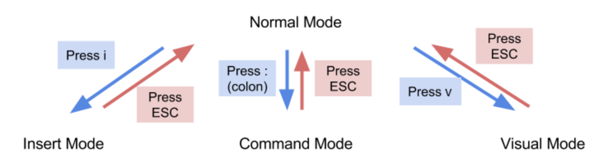

# Introduction to Vim

## Introduction


### What is Vim?

Vim, short for Vi Improved, is a light-weight, customizable and powerful text
editor that comes with most UNIX-like operating systems (Linux, BSD, macOS).
What separates Vim from other text editors and IDEs is it's unique methods of
traversing text files and making edits, all without the need for using your
mouse.  In addition, Vim runs entirely within the terminal, meaning it has a
smaller memory footprint and generally runs faster than something like VSCode.

### Why Vim?

One of the strongest arguments against using Vim over something like VSCode is
that Vim has a steep learning curve. While it is true that Vim has a steeper
learning curve, learning the basics of navigation and editing with Vim is not a
complicated task. Furthermore, knowing how to use Vim can be a useful skill on
the job. For instance, when working with remote machines, you will often need to
edit things like system configuration files, systemd services etc. Furthermore, you'll
often have to SSH into them from the terminal, meaning you won't have access to other
editors, only Vim.


### Installation

#### Linux

Run the following command(s) in the terminal (specific to the Linux distribution you have installed)

##### Debian/Ubuntu

```
sudo apt update
sudo apt install vim
```

##### Red Hat/CentOS

```
sudo yum install vim-enhanced
```

##### Fedora

```
sudo dnf install vim
```

#### macOS

Using Homebrew:

If you have Homebrew installed:

```
brew install vim
```

Using MacPorts:

If you have MacPorts installed:

```
sudo port install vim
```

#### Windows

Using Chocolatey (Package Manager for Windows):

If you have Chocolatey installed:

```
choco install vim
```

## Basics

Manual Installation:

- Go to the Vim website: https://www.vim.org/download.php

- Download the latest version for Windows

- Run the installer and follow the installation prompts


### Modes
Here is a diagram of the modes available on vim and how to access them, they will be used in the following sections.


### Navigation

- To create/open a file in vim, go to your terminal and type `vim myfile`

- When you first launch Vim, you will be in Normal mode, this is the default mode when launching Vim

    - Normal mode is primarily used for navigation of a text file as well as moving text around

- Once the file is open, you use `h,j,k,l` to move your cursor left, down, up and right respectively

- Moving text around

    - Being able to move text around is another important part of Normal mode

    - If you want to cut a line and paste it elsewhere then press `dd`, navigate to the line you want to paste to and then press `p`

    - If you just want to copy a line, then press `yy`

    - If you want to delete a character while in Normal mode, then move your cursor over the character and press `x`

- Other useful Normal mode keybindings

    - To move to the end of the file, press `Shift+G`

    - To move to the beginning of the file, press `gg`

    - To move to the end of a line, press `$`

    - To move to the beginning of a line, press `0`

    - To move `x` lines up or down, press `x j` or `x k`


### Making Edits
You can create a file if you don’t already have one you want to edit by using vim <filename>. Now to edit in vim is slightly different
to editors you may have used in the past, you’ll first want to enter ‘insert’ mode which can be done by pressing i on your keyboard, 
now you can navigate around the document and type as you usually would. When you’re done typing you’ll want to press the ESC button 
which will take you back to ‘command’ (normal) mode. See saving a file for next instructions.

### Saving a file
Saving a file you have edited is simple in vim. Following the previous section first make sure you’re in command mode. Once there all 
you have a few options, press : (colon) followed by the following letters to perform the following actions. w – save the current file, 
wq OR x – save the current file and exit.

### Copy and pasting
Though there are a lot of options for copy and pasting we’ll simply cover cursor copy and paste since it will be more familiar. You’ll 
want to begin by putting yourself in command mode on your desired file (pressing ESC). Now you’ll want to enter visual mode, there are 
a variety of visual mode options but we will be using lowercase v which will begin selecting wherever the cursor is at that moment. 
More your cursor until you’ve selected the portion you’d like to copy. Now you have to either copy by pressing ‘y’ or cut by pressing 
‘d’. Now move your cursor to the desired location and press ‘p’ to paste!

## Additional resources

https://help.dreamhost.com/hc/en-us/articles/115006413028-Creating-and-editing-a-file-via-SSH
https://cs111.byu.edu/articles/vim/assets/vim-modes.png


