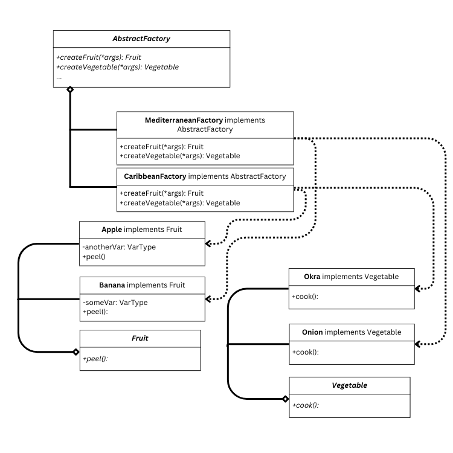
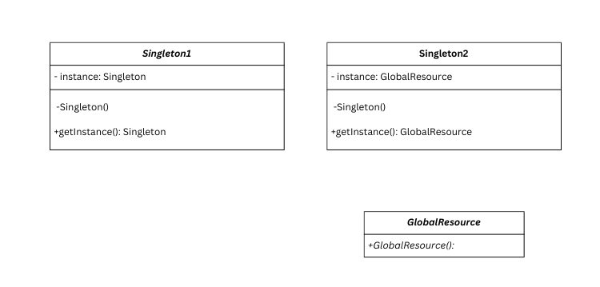
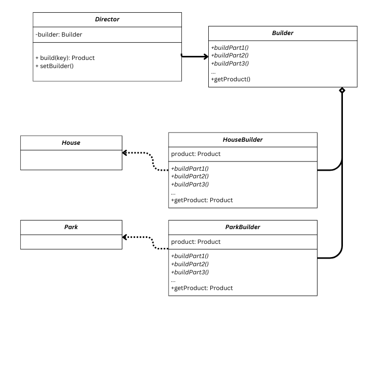

# Creational Design Patterns

## Table of Contents

1. [Introduction](#intro)
2. [Types of Creational Design Patterns](#types)
3. [Simple Factory](#simple)
4. [Factory Method](#factmethod)
5. [Abstract Factory](#abstfactory)
6. [Singleton](#singleton)
7. [Builder](#builder)
8. [Further Reading](#further-reading)

## Introduction <a name="intro"></a>

As the name suggests, creational design patterns are standardized ways to deal with the creation and maintenance of objects in object-oriented programming. They are used to instantiate different classes of objects and their subclasses in the best way to achieve their intended purposes. 

There are 5 major types of creational patterns that are commonly used in software development.

## Types of Creational Design Patterns <a name="types"></a>

### Simple Factory <a name="simple"></a>

#### Usage

A complex object needs to be created multiple times.

The simple factory works by delegating the instantiation of an object class to a dedicated method. This allows the object to be hidden from the user endpoint, by preventing the need to directly instantiate (and thus access) the object.

#### Structure

A factory class is introduced in addition to the object class. The factory has a create method, whose purpose is to generate and return an instance of the object class.

<p align="center">

</p>

#### Benefits

- Hides the object class creation behind a layer of abstraction. Can be used to simplify the object creation provided a few parts need to be built before instantiation, or adjustments need to be made after instantiation.

#### Example

Suppose you have a Burger class that allows you to make a burger using an initializer that accepts ingredients as input.

```
class Burger:
    """ Create a burger"""

    def __init__(patty, bun, sauce, vegetables):
        ...
```

However, you don't want the user to have to manually select ingredients, and you don't want them to know any of your secret burger recipes. To hide the recipes from the user's view and still allow them to have your trademark burgers, you can protect introduce a simple factory, which the user uses instead to create burgers in a simpler, and more secure, way.

```
class BurgerFactory:
    """Order trademark burgers. """
    def static createBurger(burgerKey):
        
        if key == ...:
            burger = Burger(...)
        elif ...:
            ...
        ...

        return burger
```

### Factory Method <a name="factmethod"></a>

#### Usage

A singular class of objects needs to be produced multiple times, and in a dynamic way via subclasses of the object.

The factory method design pattern introduces a class containing a singular create method that creates one class of objects (products). Extensions of the factory class are created as needed to override the default implementation (or abstraction) of the create method to produce different subclasses of the product.

#### Structure

A factory class containing one (abstract) create method that produces a product class of the required type. Implementations of the factory override the create method as required to output subclasses of the product.

<p align="center">

</p>

#### Benefits

- Allows variations of the product class to be easily created without having to define new calling behaviour in programs utilising the product and factory classes.

#### Example

Utilizing the burger analogy from Simple Factory, now consider a somewhat different, independent scenario:

You are Louis Lassen, the man who invented the hamburger. You are very excited about your new invention, and you want to allow other people to also make hamburgers. You recognize that not everyone would want to use the same recipes you do. You don't want other chef to have to independently re-invent the hamburger, and you don't want to have to go back to your simple BurgerFactory to add a new else-if statement every single time someone comes up with a new burger recipe. You could resolve your dilemma by introducing a **BurgerFactoryMethod** - you tell them the general (abstract) method of creating a burger, and you let the chefs (your users) come up with their own burger recipes (methods) to make burgers without relying on you or creating conflict between different recipes.

```

class AbstractBurger:
    """ Create a burger"""
    ...

abstract class BurgerFactoryMethod:
    """Typical procedure of creating a burger."""
    def abstract createBurger() -> AbstractBurger:

```

Thanks to your efforts, both Mr. Ronald and Mr. King are inspired, and can easily create their own burger recipes as implementations of your abstract BurgerFactoryMethod.

```
class RonaldBurgerFactory extends BurgerFactoryMethod:
    """Order Ronald's trademark burgers. """
   def  createBurger() -> AbstractBurger:
        ...
        return ronburger

class BigRon extends AbstractBurger:
    """Ronald's trademark burger. """
    def __init__(patty, bun, sauce, vegetables):
        ...
```

```
class KingBurgerFactory extends BurgerFactoryMethod:
    """Order King's trademark burgers. """
    def createBurger() -> AbstractBurger:
        ...
        return kingburger

class KingBurger extends AbstractBurger:
    """King's trademark burger. """
    def __init__(patty, bun, sauce, vegetables):
        ...
```

(Once again, note carefully that each factory method class is only producing 1 object type using just one create method.)

### Abstract Factory <a name="abstfactory"></a>

#### Usage

when there are multiple related object classes that need to be separately instantiated using different creation processes.

An abstract factory is a factory of factories: it is a design pattern that takes advantage of abstraction and inheritance to define a common public API for factories of a set of related subclasses of some parent class. This allows the user of the factory to define functions and creation behaviour for an extendible set of classes, each of which can have a different object construction process under the hood, without having to define if-else behaviour for every single subclass factory in dependent methods. As with all abstract classes, this allows extension and modularity as a result of not relying on the internal workings of specific factory classes relating to certain subclasses.

Note that this differs from the factory method in that a singular abstract class is introduced to deal with the creation of _multiple_ related products, rather than a separate factory method being introduced for each product.

#### Structure

An abstract factory class contains multiple factory methods, each producing a different, but related, abstract class of objects. Implementations of the abstract factory implement these methods to produce (different) subclasses of the abstract object classes.

<p align="center">

</p>

#### Benefits

- By using an abstract factory, the user is able to avoid having to implement separate code for each different object factory necessary for their product.
- As with the factory method, the object creation system becomes highly extensible: if a new extension of an object is declared, the user can simply create another implementation of the abstract factory to produce it, without having to change the behavior of any other classes/functions that utilise the factory.

#### Example

Assume for a moment that you are Billy Ingram (founder of White Castle, the first restaurant to sell both hamburgers and fries). You've come up with a great fast food concept of selling burgers, fries and a soft drink. However, you know that you are not going to be the only one to have this concept. You can model this situation ideally using the Abstract Factory design pattern.

```
class AbstractBurger:
    """ Create a burger"""
    ...

class AbstractFries:
    """ Create fries."""
    ...

class AbstractDrink:
    """ Create a drink"""
    ...

abstract class AbstractFastFoodFactory:
    """The generic menu of a burger restaurant."""
    def abstract createBurger() -> AbstractBurger:

    def abstract createFries() -> AbstractFries:

    def abstract createDrink() -> AbstractDrink:

```

```
class WhiteCastle extends AbstractFastFoodFactory:
    """Order food from White Castle. """

    def createBurger() -> AbstractBurger:
        ...
        return whiteburger

    def createFries() -> AbstractFries:
        ...
        return straightFries  

    def createBurger() -> AbstractDrink:
        ...
        return cola  

class WhiteCastleBurger extends AbstractBurger:
    """White Castle's trademark 5 cent slider. """
    def __init__():
        ...

class StraightFries extends AbstractBurger:
    """Classic, sliced fries. """
    def __init__():
        ...

class Cola extends AbstractDrink:
    """ A classic, caramel soft drink."""
    def __init__():
        ...

```

```
class McRonald extends AbstractFastFoodFactory:
    """Order food from MacRonald. """

    def createBurger() -> AbstractBurger:
        ...
        return bigRon

    def createFries() -> AbstractFries:
        ...
        return curlyFries  

    def createBurger() -> AbstractDrink:
        ...
        return lemonade  

class BigRon extends AbstractBurger:
    """The world famous McRon burger. """
    def __init__():
        ...

class StraightFries extends AbstractBurger:
    """Spring-like curly fries. """
    def __init__():
        ...

class Lemonade extends AbstractDrink:
    """ A sweet and sour drink with the refreshing taste of spring lemons."""
    def __init__():
        ...

```

### Singleton <a name="singleton"></a>

#### Usage

A class or resource needs to only have one central instance that is globally accessed across the program.

A singleton achieves 2 purposes: 
- it maintains exactly 1 instance of a given class  across the entire program
- it provides a global access point to that class. 

It achieves these by hiding the default constructor of the original class, and then providing a static constructor for the class. The first time the constructor is called, it generates an instance of the class and caches it within a static variable. Further calls to the constructor return the cached instance rather than creating a new one.

Note that this differs from the factory method in that a singular abstract class is introduced to deal with the creation of _multiple_ related products.

#### Structure

The simplest implementation of a singleton design pattern consists of the desired class, adjusted to contain an instance of itself, the default constructor hidden and a getInstance method that returns the cached instance if not null, and creates a new instance(storing in the cache) if the cache is null. If the original object should not be modified, the singleton class can store it in its static cache, and should be used to get instances of the object using the getInstance method call, rather than making direct instances of the object.

<p align="center">

</p>

#### Benefits

- Maintain and access a central resource with a singular call to the singleton.

#### Example

Ronald's Burgers have hit it off, and have become a worldwide sensation. Ronald is very proud of his franchise, and wants to keep track of how many burgers, fries and drinks his franchise has sold around the world. Yet, there's an issue: how could he possibly have every single one of his restaurants access the same set of burger statistics, without accidentally creating a separate set of statistics everytime a different restaurant accesses the statistics? After asking a computer scientist, he learns that he can use a Singleton to achieve this.

```
class RonaldStatistics:
    """ The global set of Ronald's Burgers statistics. Only one instance of this exists at any given moment."""
    _instance = None

    def private __init__():

    def private __init__(burger_count, fries_count, drinks_count):

    def getInstance():
        if _instance == None:
            burgers_sold = 0
            fries_sold = 0
            drinks_sold = 0
            _instance = RonaldStatistics(burgers_sold, fries_sold, drinks_sold)

        return _instance
    
    ...

```

### Builder <a name="builder"></a>

#### Usage

A highly complicated and modular object needs to be created in a step-by-step process, multiple times. Some steps may differ between iterations.

A builder is a design pattern that is deployed to automate the instantiation of objects that require a step-by-step process to deal with many nested parts. It works by splitting the creation of each nested part/step into a separate method within the builder class. A director class is also introduced in order to handle the ordering/calling of these steps for a chosen builder class. By taking advantage of instantiation, it is possible to extend a given builder class or director class and override one or more methods to partially alter the creation process without having to redo the entire creation process.

#### Structure

The builder design pattern typically consists of an abstract builder class containing the methods(steps) common to all building processes for the given family of products, concrete implementations of that class that override/implement methods of the abstract builder, and a director class that stores a builder object and controls the calling of methods for the process.

<p align="center">

</p>

#### Benefits

- Simplifies the creation process of complicated objects.
- Allows the adjustment of individual steps without having to rewrite the entire creation process.

#### Example

You are Warren Bechtel, a construction work director who has been hired for building multiple buildings in Cityville, including a Ronald's Burgers. All these buildings have the same components (walls, windows, roofs, etc) that each need to be created with their own procedure for each building type. Rather than manually creating each of the buildings from start to finish by hand, you can use the builder design pattern to abstract and automate much of the required process.

```
class BuildingDirector:

    _builder = None

    def build():
        ...
    
    def setBuilder(builder):
        ...

abstract class Builder:
    
    def buildWalls():

    def buildWindows():

    def buildRoof() -> Building:

    ...

    def getBuilding():

class McRonaldBuilder extends Builder:
    
    def buildWalls():
    ...

    def buildWindows():
    ...

    def buildRoof():
    ...

    def getBuilding() -> Building:


```

## Further Reading <a name="further-reading"></a>

Refactoring Guru provides a detailed reference guide with examples for creational design patterns, as well as other design patterns that can be useful to implement in the right scenarios.

[Refactoring Guru: Creational Patterns](https://refactoring.guru/design-patterns/creational-patterns)

Source Making also provides a more technical description of the same: it can be useful to understand the structure of these design patterns.

[Source Making: Creational Patterns](https://sourcemaking.com/design_patterns/creational_patterns)

