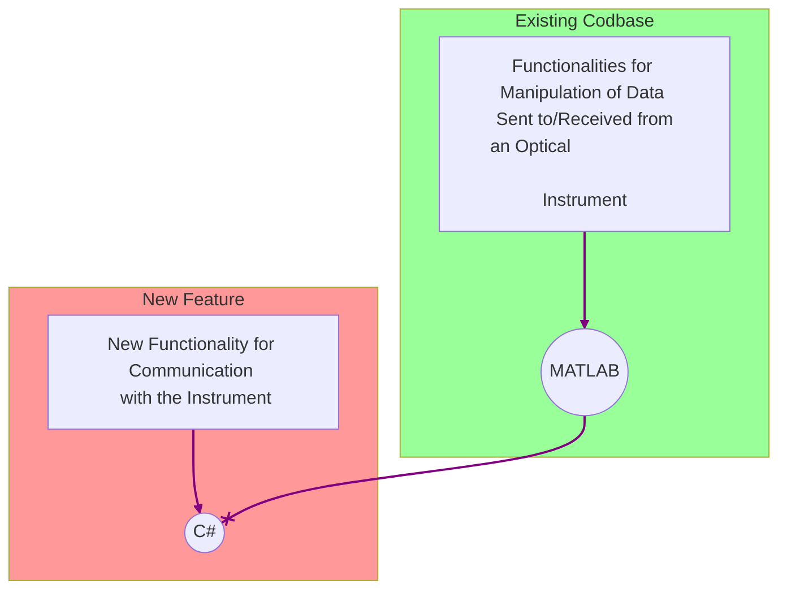
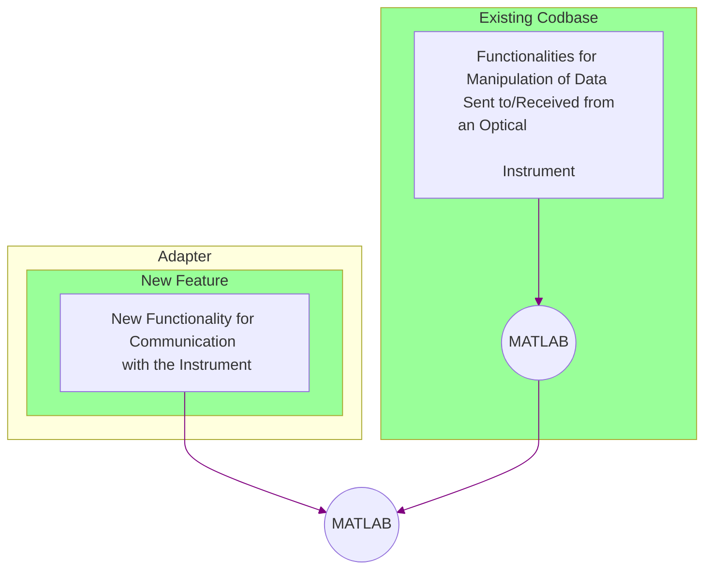
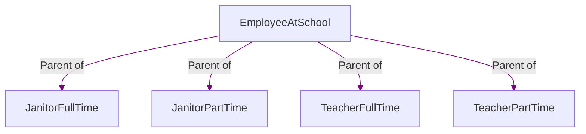
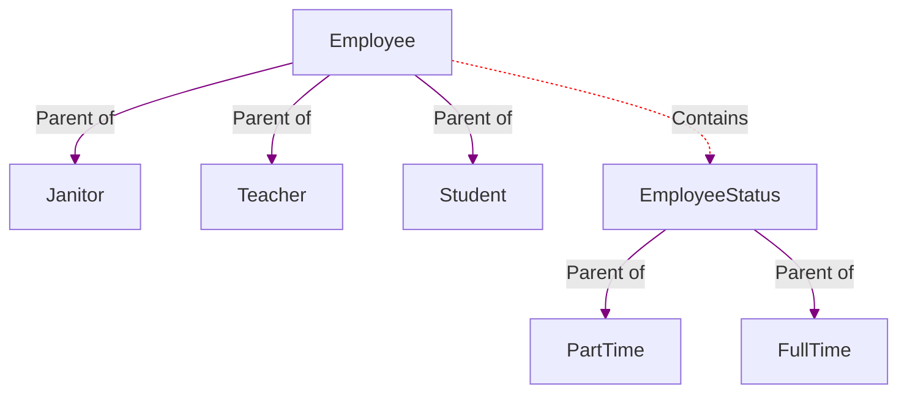

# Structural Design Patterns

**Structural Design Patterns** are an important category of design patterns that help software engineers to create well-designed, flexible, and structured bif software projects. To be more precise, structural design patterns are about assembling, combining, and composing objects and classes into larger structures, while still making sure these structures are flexible and efficient. They simplify the design of big software projects by allowing us to identify relationships between entities (classes or interfaces). 

In this tutorial, we will go through two important design patterns that belong to the category of Structural Design Patterns.
# Table of Contents

1. [Adapter Design Pattern](#adapter)
   1. [Goal and What It Does](#goal)
   2. [Example Scenario](#example)
   3. [Small implementation](#small)
   4. [Pros and Cons](#PC)
2. [Bridge Design Pattern](#bridge)
	1. [Goal and What It Does](#goalb)
	2. [Example Scenario](#exampleb)
	3.  [Pros and Cons](#PCb)
3. [Conclusion](#conclu)
4. [References](#ref)


## *Adapter Design Pattern* <a name="adapter"></a>
### Goal and What It Does: <a name="goal"></a>
Let's suppose that there is a client code that has a target class regarding its domain. Consider that there is another class that has an interface that is not appropriate to be combined and matched with the interface of the client class. The **Adapter  Design Pattern** adjusts the interface of the class (which has an inappropriate and incompatible interface) into another interface that is compatible with the client code and domain.  It wraps an existing class that is incompatible with a new interface that allows it to be compatible with the client code.  In other words,  Adapter allows classes that are not compatible currently, to work together and be assembled together. 

### Example Scenario: <a name="example"></a>
Let's give a small real-world example (scenario) where the Adapter Design Pattern is useful. Suppose that in a company working with optical instruments, all the functionalities regarding the manipulations of the resulting data received from an instrument as well as those for the data that users send to the instrument are done in MATLAB programming language. However, consider there is a functionality that is written in C# programming language related to communicating with the instrument.  We can change the code written in C#  to be written in MATLAB but this might cause issues because communication with the instrument works well in C#. 

Let's visualize the scenario described:

The solution would be to use an Adapter that would wrap the functionalities code written in C# and adjust them to a compatible format that can be used by the existing functionalities of the instrument that are written in MATLAB. 


### Small implementation: <a name="small"></a>
In order to better understand the Adapter Design Pattern,  we will show a small simple implementation of an adapter below.  For simplicity, we will use Python for our implementation.
```python 

class EnglishWriter:
    """
    This class defines the interface that is used by the client code and 
    that is related to its domain. It simply write a text in English and 
    output it using a method. The client code wants text in English only,
    so that is why we say this interface relates
    to the domain of client code. 
    """
    def write_in_english(self):
        return "This is a text in English"

class FrenchText:
    """
    This corresponds to our adaptee which has a useful text in French for the 
    client code. However its interface is not compatible with the existing 
    client code because the client code works in English but 
    this adaptee works in French. 
    The adaptee will need an Adapter class later before client code can use it. 
    """
    def write_useful_text_in_french(self):
        return "Bonjour tout le monde!"

class EnglishLanguageAdapter(EnglishWriter):
    """
    The is our Adapter. It makes the class "FrenchText" (Adaptee's interface) 
    compatible with the class "EnglishWriter" (Target's interface). Here we use
    the composition method to do that.  This means that the Adapter has an
    instance of type "FrenchText" which corresponds to our Adaptee as mentioned
    before. 
    """
    def __init__(self, french_adaptee):
        self.adaptee = french_adaptee
        
    def write_in_english(self):
        return "Adapter translation:" + \
            self.adaptee.write_useful_text_in_french() + ": " + \
                "Hello everyone!"

def client_code(english_target):
    """
    The client code uses "english target" which corresponds
    to the Target interface class (EnglishWriter).
    Both are working in English. 
    """
    return english_target.write_in_english()
    
if __name__ == '__main__':
    print("Without considering the Adapter:")
    english_target = EnglishWriter()
    print(client_code(english_target))
    
    french_adaptee = FrenchText()
    print(french_adaptee.write_useful_text_in_french())
    
    print("\n")
    
    print("With consideration of the Adapter:")
    adapter = EnglishLanguageAdapter(french_adaptee)
    print(client_code(adapter))
    
```
The output of the above implementation is:
```plaintext
Without considering the Adapter:
This is a text in English
Bonjour tout le monde!


With consideration of the Adapter:
Adapter translation:Bonjour tout le monde!: Hello everyone!
```
### Pros and Cons:  <a name="PC"></a>

 - Pros: Allow the separation of the client code from the conversion and adjustment process done by the Adapter and allow the inclusions of more adapters in the existing program without breaking the current client code.
 - Cons: Add a layer of complexity to the code base because of the addition of the Adapter.
 

## *Bridge Design Pattern* <a name="bridge"></a>
### Goal and What It Does:  <a name="goalb"></a>

**Bridge Design Pattern** is a structural design pattern that enables the splitting of a large class into a set of  closely related classes. Although these classes are closely related, each of them will be implmented and developped individually from one another. It allows a complex class to be simplified by the creation of smaller related classes that will individually include and implement some of the related functionalities of that complex class. Those smaller classes would be abstracting their respective functionalities from one another so that we do not have to worry about how all the functionalities are implemented at once. 

### Example Scenario: <a name="exampleb"></a>
Suppose we have a class called "*EmployeeAtSchool*" which is the parent of  4 children classes called "*JanitorFullTime*",  "*JanitorPartTime*",  "*TeacherFullTime*" and "*TeacherPartTime*" respectively.  Let's visualize this clearly:

Suppose we want to add another child class to "*EmployeeAtSchool*" class called "*Student*".  However, we cannot simply add the class "*Student*".  Based on the current structure and design of "*EmployeeAtSchool*" class,  we must add two child classes:  one for full-time student and one for part-time student. In other words, we must add the child classes "*StudentFullTime*" and "*StudentPartTime*" respectively to the "*EmployeeAtSchool*" class. We can already see how complex and badly designed and structured the "*EmployeeAtSchool*" class is becoming. 

To solve this problem, we will use the Bridge Design Pattern. By its definition, in this scenario, we will create two classes. One of them is called  "*Employee*"  which cares about the types of employee only, and  the other is called  "*EmployeeStatus*" which only cares about the full-time and part-time types for employees. To connect these two classes, we will make sure that the "*Employee*" class **contains** an the object of type "*EmployeeStatus*". Let's demonstrate this:


### Pros and Cons:  <a name="PCb"></a>

 - Pros: Allows the client code to work with abstractions which is good for the user because he does not have to know about the implementation process. It also allows abstractions and implementations to be done for each class separately. 
 - Cons: Causes the creation of more classes which might add complexity.
 
## *Conclusion* <a name="conclu"></a>

In summary, in this tutorial, we covered what **Structural Design Patterns** are, what are their characteristics and how and when they are useful. We also went through the **Adapter Design Pattern** and the **Bridge Design Pattern** respectively, which are two of the important design patterns in the category of Structural Design Patterns. To learn more about this categoty of design patterns visit [Structural Design Patterns]([Structural Design Patterns (refactoring.guru)](https://refactoring.guru/design-patterns/structural-patterns). 

## *References* <a name="ref"></a>

 1. [Structural Design Patterns (refactoring.guru)](https://refactoring.guru/design-patterns/structural-patterns)
 2. [Structural patterns (sourcemaking.com)](https://sourcemaking.com/design_patterns/structural_patterns)
 3.  [Structural Design Patterns - Scaler Topics](https://www.scaler.com/topics/design-patterns/structural-design-pattern/)
