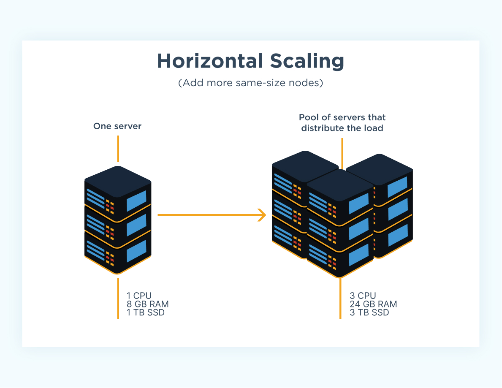

# Architecting a System to Handle 100k+ Requests

## Motivation
When we build a project, we are often concerned with the product; what features does the user want? After we've identified the features to build, we come up with a specification and implement our solution accordingly. We test our code to ensure correctness before then finally shipping. 

But what happens after this? If we have tens or hundreds of thousands of users each making lots of requests, how do we know that our system can handle the load? This page aims to provide a high-level framework for designing such a system and provides additional resources for interested readers. 

We consider an app with three components: a client, an API, and a database. The database stores persistent information, our APIs serve requests for data from the database, and the client renders data for the user to interact with in some capacity. 

## Vertical and Horizontal Scaling

*Image from CloudZero*

Suppose we have an influx of thousands of users, there are two ways we can think about scaling the system: vertically and horizontally. **Vertical scaling** refers to the resource capacity of our APIs; we can increase their capacity by increasing the amount of memory (RAM) and compute power (CPUs) available to our server. However, we can see that this approach will not scale beyond a certain limit simply from a physical and cost perspective. 

*Image from CloudZero*

So we also consider **horizontal scaling** which refers to increasing the number of servers we have hosting our APIs. We can have virtually infinite servers running to distribute the workload of all the requests we're receiving from the client. Naturally, we will need a way to direct traffic according to some logic so that the load is balanced amongst our servers. 

## Load Balancing

*Image from NetScaler*

A **load balancer** is responsible for routing requests from our clients to an instance of our APIs. This will enable the horizontal scaling we discussed previously. Some load-balancing strategies include distributing requests across instances sequentially or routing requests to the instances with the least amount of traffic. A load balancer also improves the reliability of our system, if one of our servers goes down, we can reroute traffic to another server instead of having the entire system fail. Additionally, we can set up a load balancer to increase the number of instances when the number of requests exceeds the capacity of the current instances or to reduce the number of instances when we might expect less traffic. 

## Database Scaling

*Image from Apurva Agrawal's Medium*

We will focus on scaling relational databases in this section. There exist many techniques such as **replication**, **federation**, **sharding**, and so on. We will briefly touch on **replication** and defer to the sources below for more detailed information on the other techniques. **Replication** refers to the concept of replicating data from a primary database to replica databases such that any updates to the database requested by the client are first written to the primary before then being propagated to each replica. Then, the other clients and servers can read from any of the replicas to distribute the workload from all our requests.  

## Caching

*Image from Backendless*

Another way we can reduce the load on our databases is by introducing a cache layer using something like [Redis](https://redis.io/). When a user makes a request for some data from the database, we store that information in the cache layer with some expiration time *t*. Any future requests made for that information within time period *t* are actually hitting the cache rather than the database. This reduces the workload of our database by handling some of it with the cache layer, and we can scale our cache layer as well by using distributed caching and storing data across multiple machines. 

## Content Delivery Networks (CDNs) 
CDN servers keep a cache of our files (images, HTML/CSS, JS, ...) at data centers close in geographical proximity to users across the world. When user's make a request for data, it is retrieved from the server closest to the user. This again offloads some of the requests from the main server and helps with reducing errors by increasing redundancy. 

## Sources 

This page was inspired by Alex Pareto's blog post [Scaling to 100k Users](https://alexpareto.com/scalability/systems/2020/02/03/scaling-100k.html), and drew information from High Scalability's [Guide to Scaling to 11 Million+ Users on AWS](https://highscalability.com/a-beginners-guide-to-scaling-to-11-million-users-on-amazons/), Linh Truong's page on [Building & Scaling to 100 Million Users](https://scholar.harvard.edu/linh/system-design), Anh T. Dang's Medium post on [Designing a System to Scale to 100 Million Users](https://levelup.gitconnected.com/how-to-design-a-system-to-scale-to-your-first-100-million-users-4450a2f9703d), and the Redis [Glossary](https://redis.com/glossary/)

Images from [CloudZero Vertical Scaling](https://www.cloudzero.com/wp-content/uploads/2023/10/how-vertical-scaling-works-1.webp), [CloudZero Horizontal Scaling](https://www.cloudzero.com/wp-content/uploads/2023/10/how-horizontal-scaling-works-1.webp), [NetScaler](https://www.netscaler.com/articles/what-is-load-balancing),[Apurval Agrawal's Medium Article](https://miro.medium.com/v2/resize:fit:1400/0*MfnjmNOUZ7Wd7BNS),[Backendless](https://backendless.com/wp-content/uploads/2022/12/How-Redis-typically-works.png)