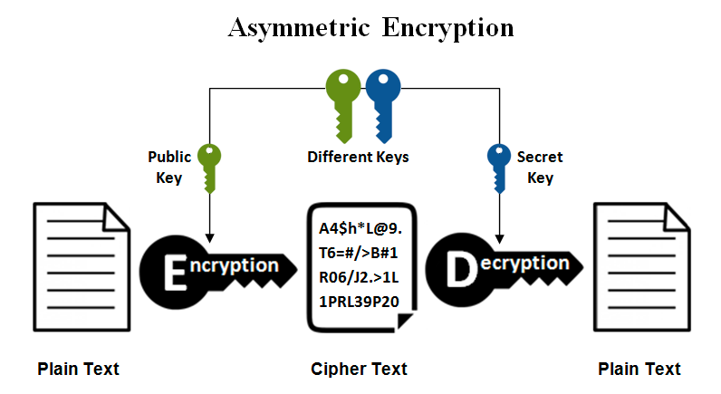
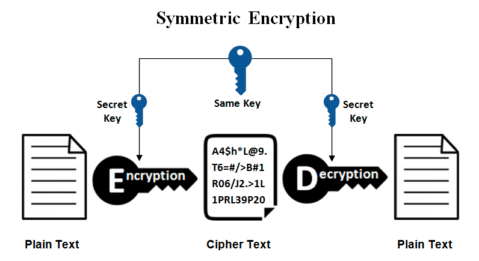
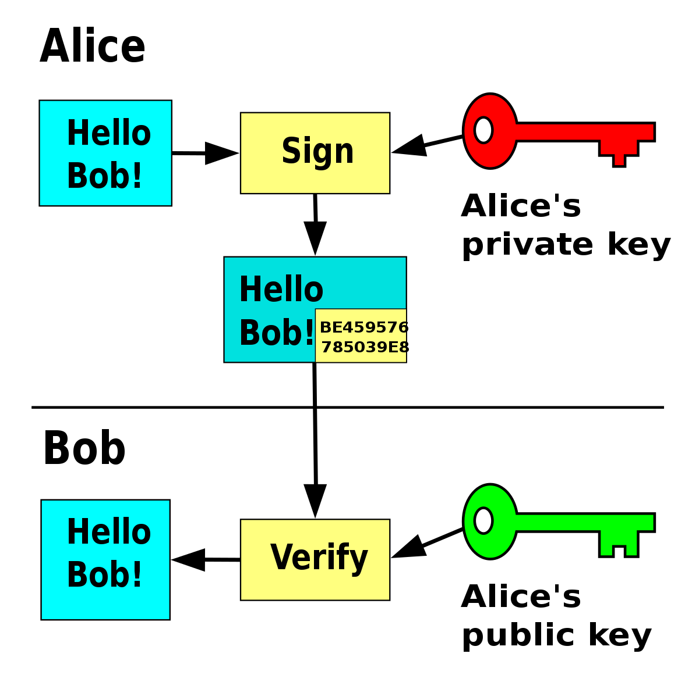

# Importance of Security: An Introduction to RSA and the Secure Boot Process

As technology evolves, we are found in an era dominated by digital connectivity as well as data-driven operations, where the security and integrity of computing systems have been more important than ever. Imagine if a device that is responsible for the functioning of a hospital or financial institution is compromised during startup; or if someone with malicious intent was able to gain control over the core components of your device before the OS is even launched.
Malicious actors could manipulate firmware and bootloader code or even inject harmful software at the very foundation of your device. 

In the year 2011 Sony's PlayStation network was the victim of a major security breach, where a lack of robust encryption allowed hackers to access and steal sensitive user information and data. This ultimately caused major financial losses for the company while damaging their reputation. The situation encountered by Sony should serve as a lesson for us all, as it highlights the importance of encryption; especially for sensitive user data, as inadequate security measures can lead to severe consequences.

This documentation aims to explain the Secure Boot process, as well as RSA, its usages, and the importance of good security in Software Development

### How do you prevent security issues and gurantee that the OS you are loading on your device is untampered with?
Secure Boot addresses this concern by verifying the digital signatures of the OS kernel and critical system files, ensuring that you are running a legitimate and risk-free operating system

Secure Boot is essentially a security feature implemented in modern computer systems and embedded devices to guarantee that only trusted software is executed during the boot process.
Secure Boot involves a chain of trust, ensuring that each component loaded during the boot process is signed and verified before execution. RSA plays a critical role in this digital signing process.

For a more in depth explanation of how the entire secure boot process works, feel free to consult external resources such as the provided link 
[here](https://www.particle.io/iot-guides-and-resources/iot-secure-boot/#:~:text=In%20the%20context%20of%20Internet,at%20the%20time%20of%20manufacture)

## What is RSA?
RSA (Rivest–Shamir–Adleman) is an asymmetric encryption algorithm, meaning it uses a pair of keys where one key is used for encryption and one key is used for decryption. The security of RSA relies on the difficulty of factoring the product of two large prime numbers, making it computationally impossible to derive the private key from the public key.

### Asymmetric Encryption versus Symmetric Encryption

In symmetric encryption, a single key is used for both encryption and decryption, rather than a public private key pair. This means that the same key is used by both the sender and the recipient to secure and access the information.

It is a lot faster than asymmetric encryption and computationally less intensive.
The challenge in symmetric encryption lies in securely distributing and managing the shared secret key. If a third party gains access to the key, they can decrypt all the communication.

An example of an asymmetric encryption algorithm is the [Advanced Encryption Standard (AES)](https://www.techtarget.com/searchsecurity/definition/Advanced-Encryption-Standard)

### The Math behind RSA

#### Key Generation
1. Choose two distinct prime numbers, p = 11 and q = 17.

2. Calculate n = p x q, in this case 11 x 17 = 187. This term is called the modulus

3. Calculate the Eulers Toient Function ϕ(n) = (p-1) x (q-1) = 10 x 16 = 160

4. Choose a public exponent e such that 1<e<ϕ(n) and e is coprime with ϕ(n). Let's choose e=7.

5. Calculate the private exponent d such that d≡e^(mod ϕ(n)). In this case, d≡23.

6. The public key is (e, n) and the private key is (d, n). Where e = 7, n = 187, d = 23

#### Encryption

1. Allen wants to send a message like M=88 to Kai. Kais public key is (e,n) = (7, 187)

2. Compute the ciphertext C using C≡M^(e)(modn). So, C≡88^ (7) (mod187) which is 11.
3. The calculated ciphertext is sent to Kai using his public key

#### Decryption

1. The calculated Ciphertext C = 11 is sent to Kai
2. Kai will use his private key (d,n) = (23, 187) to decrypt M ≡ C^(d)(mod n). So now we have that M ≡ 11^(23) (mod 187)
3. The result is M = 88 which is the original message we sent!

##### This is just a simple explanation of the math behind RSA, and in reality much larger numbers like 2048, and 4096-bit numbers are often used to guarantee that the private key cannot be derived from the public key

## RSA Usage

### Secure Communications

##### Key Exchange: 
RSA is often used in a setting where two parties may need to communicate a secure key. Imagine a scenario where Allen and David want to communicate over an insecure channel. RSA can be used to exchange a symmetric encryption key. Allen can use his public key to encrypt the symmetric key so that only Allen's private key can decrypt it. Once both Allen and David have the shared symmetric key they can use a faster symmetric key encryption algorithm for actual communication.

##### Digital Signature: 
RSA can also be used to create digital signatures to ensure authenticity of certain messages. When Allen wants to send a message to David, he can sign the message with his private key. Allen's public key can be known by anyone, and David has access to this. David can use this public key to verify the signature belongs to Allen, ensuring the message was not tampered with in transit.

### Data Encryption

##### File or Message Encryption:
RSA can be used to encrypt sensitive data, like files or messages, to ensure its confidentiality during transmission or storage. The sender uses the recipient's public key to encrypt the data, and only the recipient who posseses the corresponding private key can decrypt and access the original content.

##### Secure Sockets Layer (SSL) / Transport Layer Security (TLS):
RSA is an essential step in the establishment of secure connections over the Internet. In protocols like SSL and TLS, RSA is often used for key exchange during the initial handshake phase. The client and server use RSA to exchange a pre-master secret. This pre-master secret is then used to derive session keys for encrypting the actual data exchanged during the session.

## Summary
The secure Boot Process acts as a first line of defense against unauthorized or malicious code during the system's startup process. A sequence of digitally signed certificates and cryptographic checks, guarantees that only authenticated and unaltered software components are loaded into the system's memory

In the context of software development, RSA finds application in secure key exchange protocols, digital signatures, and data encryption. Digital signatures generated by RSA provide a means to verify the authenticity and integrity of software packages, ensuring that they have not been tampered with or compromised during distribution.

## The importance of security in software development

Beyond these specific applications, the broader emphasis on security in software development is just as important. Throughout the software development life cycle it is important to incorporate security measures like threat modeling, code reviews, penetration testing, and adherence to secure coding practices.

Security in software developing deals with protection against external threats, but also ensures user privacy, data confidentiality, and compliance with rules and regulations. Security is an integral part of software developing where every good software engineer has a commitment to it in what they create. As technology advances further, it becomes a fundamental responsibility to ensure the reliability and trustworthiness of products and content within the digital world.