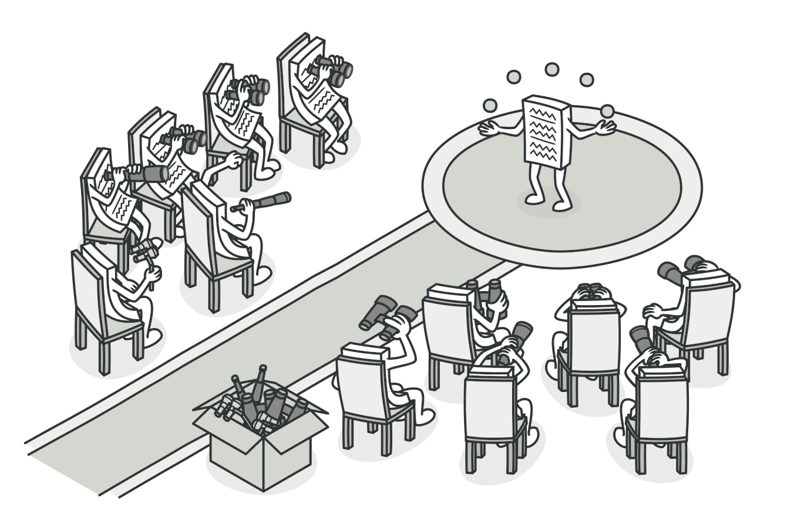
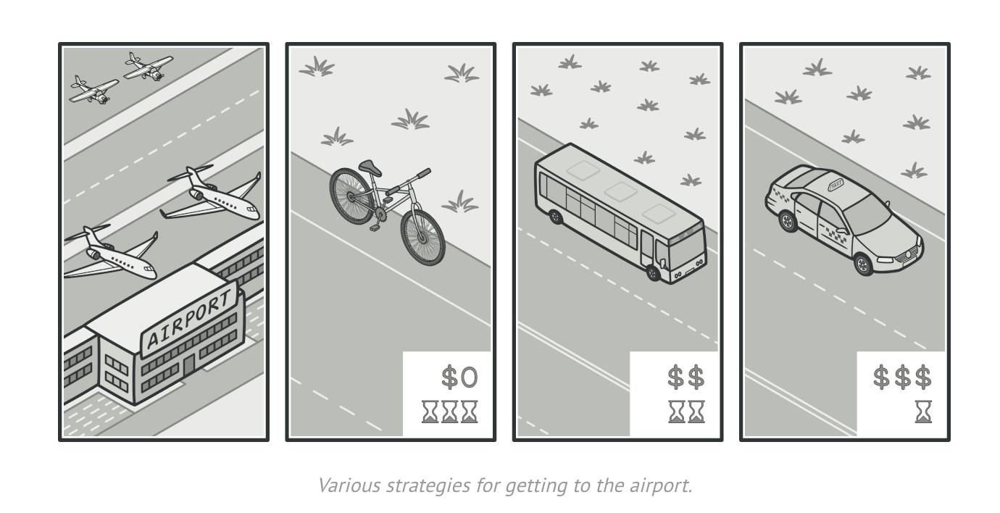
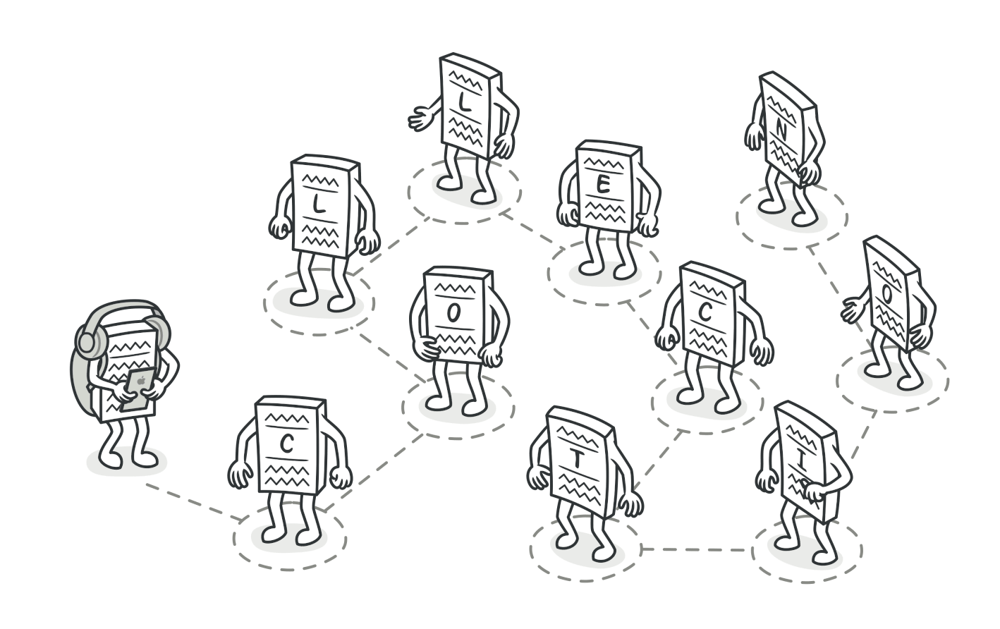
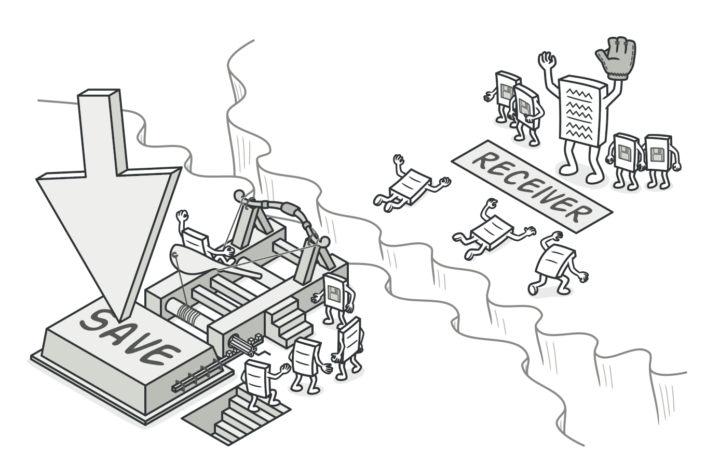

# Behavioral Design Patterns

In software engineering, behavioral design patterns  are a set of patterns that focus on the interaction between objects and how they communicate and collaborate with each other. These patterns address the assignment of responsibilities between objects, encapsulation of behavior, and the flow of control among them. They aim to improve the flexibility, extensibility, and maintainability of software systems by providing solutions to common communication and collaboration problems.

## Table of Contents

1. [Usefulness of Behavioral Design Patterns](#use)
2. Examples of Behavioral Design Patterns
    1. [Observer](#obs)
    2. [Strategy](#str)
    3. [Iterator](#itr)
    4. [Command](#com)
    5. [Examples of other Behavioral Design Patterns](https://refactoring.guru/design-patterns/behavioral-patterns)

## Usage 

Behavioral design patterns are useful when you need to define how objects interact in a flexible and reusable manner, ensuring that changes in one part of the system do not require modifications to other parts. They are particularly valuable in scenarios where the behavior of objects needs to vary dynamically during runtime. 

Now, we will dicuss some commonly used behavioral patterns with real world analogies to get some intuition about when these patterns can be useful and how they can be implemented. For UML diagrams and implementation details check out [Refactoring Guru: Behavioral Patterns](https://refactoring.guru/design-patterns/behavioral-patterns). 

## Observer Design Pattern 

The Observer design pattern is a behavioral pattern where an object, known as the subject, maintains a list of its dependents, called observers, and notifies them of any changes in its state. This pattern establishes a one-to-many relationship between the subject and its observers, allowing multiple objects to react to state changes in the subject independently. Observers register with the subject to receive notifications and update themselves accordingly. The Observer pattern promotes loose coupling between objects, making it easier to maintain and extend systems by separating concerns and allowing objects to interact without having direct knowledge of each other. It's commonly used in event handling, user interface design, and other scenarios where objects need to be notified of changes in another object's state.

 

Image from [Refactoring Guru](https://refactoring.guru/design-patterns/observer)

### Analogy

Let's consider a scenario of a news agency broadcasting news to its subscribers. Here's how the Observer pattern can be illustrated in this context:

1. **News Agency (Subject):** The news agency acts as the subject in this scenario. It broadcasts news updates to its subscribers.

2. **Subscribers (Observers):** These are the entities interested in receiving news updates. Each subscriber registers with the news agency to receive notifications whenever new news is available.

3. **News Update (State):** The news updates represent the state changes that trigger notifications. Whenever the news agency releases a new update, it notifies all its subscribers.

4. **Notification Mechanism:** The news agency maintains a list of subscribers and notifies them whenever a new update is available. Subscribers receive the notification and can then react accordingly, such as reading the news update or taking any relevant actions.

In this example, the Observer pattern enables the news agency to inform its subscribers about new news updates without them having to constantly check for updates. Subscribers can register and deregister as they wish, and the news agency can broadcast updates without needing to know the specific subscribers. This decoupling of the news agency and its subscribers promotes flexibility, scalability, and modularity in the system.

## Strategy Design Pattern 

The Strategy design pattern is a behavioral pattern that allows a class to define a family of algorithms, encapsulate each one as a separate object, and make them interchangeable. This pattern enables clients to choose a specific algorithm from the family of algorithms dynamically without modifying the client code. By encapsulating algorithms in separate classes and providing a common interface, the Strategy pattern promotes flexibility, modularity, and extensibility in software design. It's particularly useful when multiple algorithms exist for a task or when algorithms need to vary independently from the client that uses them.

### Analogy

Imagine you're planning a vacation, and you have multiple options for transportation: you could travel by car, train, bus, or airplane. Each mode of transportation has its own advantages and disadvantages depending on factors like distance, cost, time, and personal preferences. Here's how the Strategy pattern can be applied in this scenario:

Image from [Refactoring Guru](https://refactoring.guru/design-patterns/strategy)

1. **Context:** You, as the traveler, represent the context in this scenario. You have a goal (getting to your destination) but are open to different strategies for achieving it.

2. **Strategy Interface:** This is an abstract representation of the transportation strategy. It defines a common interface for all transportation methods, such as a TravelStrategy interface with a method travel(). This interface ensures that all strategies can be used interchangeably.

3. **Concrete Strategies:** These are the different transportation methods - car, train, bus, and airplane. Each concrete strategy implements the TravelStrategy interface and provides its own implementation of the travel() method. For example, the CarTravelStrategy might involve driving your own car or renting one, the TrainTravelStrategy might involve booking a train ticket, and so on.

4. **Context with Strategy:** You, as the traveler, hold a reference to a specific transportation strategy. Depending on your requirements, preferences, and circumstances, you can dynamically switch between different strategies without affecting the rest of your vacation plans.

In this example, the Strategy pattern allows you to decouple the selection of transportation method from the vacation planning process. You can easily switch between different strategies based on factors like distance, cost, and time constraints without having to modify the rest of your vacation itinerary. For instance, if you initially planned to travel by train but find that flights are more affordable, you can switch to the airplane strategy without rewriting your entire travel plan.

Overall, the Strategy pattern promotes flexibility, modularity, and maintainability by encapsulating algorithms or strategies in separate classes and allowing them to be selected or swapped at runtime based on specific requirements or conditions.

## Iterator Design Pattern 

The Iterator design pattern is a behavioral pattern that provides a way to access elements of an aggregate object sequentially without exposing its underlying representation. It allows clients to traverse the elements of a collection without needing to know its internal structure. The Iterator pattern typically consists of two main components: the Iterator interface or class, which defines methods for accessing elements sequentially, and the Aggregate interface or class, which defines a method for creating an iterator object. By decoupling the traversal algorithm from the collection, the Iterator pattern enhances the flexibility and reusability of both the collection and the traversal algorithm. It's commonly used in scenarios where collections vary in structure or where there's a need to iterate over elements in a uniform manner.

Image from [Refactoring Guru](https://refactoring.guru/design-patterns/iterator)

### Analogy

Let's imagine you're exploring a vast library with numerous shelves filled with books. Each shelf represents a collection of books, and you want to browse through all the books in the library without knowing the specific layout of the shelves. Here's how the Iterator pattern can be applied in this scenario:

1. **Library Collection:** The library represents the collection of shelves filled with books. Each shelf can be considered a collection of books.

2. **Iterator Interface:** This is a common interface defining methods like getNextBook() and hasNextBook() that allow traversal through the books. It abstracts the process of moving from one book to the next without needing to know the internal structure of the shelves.

3. **Concrete Iterator:** Each shelf has its own iterator, representing a specific traversal strategy for that collection. The iterator keeps track of the current position and allows navigation through the books on that shelf.

4. **Client:** You, as the visitor to the library, are the client in this scenario. You use the iterator provided by the library to iterate over the books without needing to understand how the shelves are organized.

In this example, the Iterator pattern enables you to browse through the books in the library without having to worry about the internal layout of the shelves. You can simply use the iterator provided by the library to move from one book to the next, regardless of how the books are arranged on the shelves. This separation of concerns between the traversal algorithm (iterator) and the collection (library shelves) enhances flexibility and reusability, making it easier to iterate over collections with varying structures or to switch between different traversal strategies.

## Command Design Pattern 

The Command design pattern is a behavioral pattern that encapsulates a request as an object, thereby allowing for parameterization of clients with queues, requests, and operations. It separates the sender of a request from the receiver, allowing for decoupling and flexibility in how requests are processed. The pattern typically involves four main components: the Client, which creates and sets up commands; the Invoker, which executes commands; the Command, which defines an interface for executing operations; and the Receiver, which carries out the requested action. By encapsulating requests as objects, the Command pattern enables the implementation of operations such as undo functionality, remote execution, and logging, among others, in a reusable and extensible manner.

Image from [Refactoring Guru](https://refactoring.guru/design-patterns/command)

### Analogy

Let's consider a scenario of a restaurant where customers place orders with a waiter. Here's how the Command pattern can be illustrated in this context:

1. **Waiter (Invoker):** The waiter takes orders from customers and serves as the invoker in this scenario. Instead of directly executing the requests (orders), the waiter holds onto them until they are needed.

2. **Order (Command):** Each order placed by a customer represents a command in the Command pattern. It encapsulates all the information needed to fulfill the request, such as the type of dish, quantity, and any special instructions.

3. **Kitchen Staff (Receiver):** The kitchen staff prepares the dishes requested by the customers and acts as the receiver of commands. When the waiter submits an order, it's sent to the kitchen staff for execution.

4. **Customer (Client):** The customer places orders with the waiter but doesn't need to know the details of how the orders are processed. The customer is the client in this scenario, interacting with the waiter to request dishes.

In this example, the Command pattern allows for decoupling the waiter (invoker) from the kitchen staff (receiver). The waiter collects orders from customers (commands) and passes them to the kitchen staff for execution without needing to know the specific details of how each dish is prepared. This separation of concerns promotes flexibility and extensibility in the restaurant's operation, as new dishes can be added without requiring changes to the waiter's behavior. Additionally, the Command pattern facilitates features like order queuing, order modification, and order history, enhancing the overall dining experience for customers.

## Further Reading 
[Refactoring Guru: Behavioral Patterns](https://refactoring.guru/design-patterns/behavioral-patterns)

[geeksforgeeks: Behavioral Patterns](https://www.geeksforgeeks.org/behavioral-design-patterns/)
