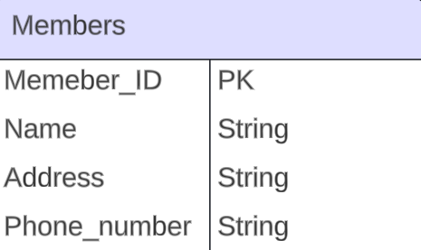
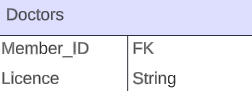
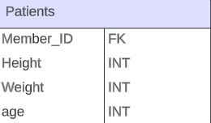
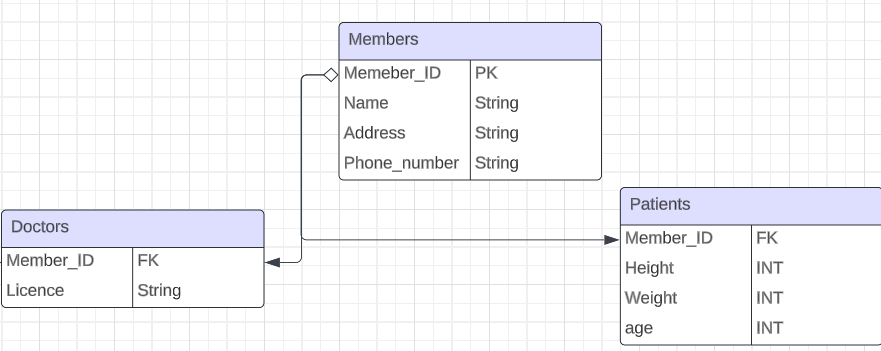
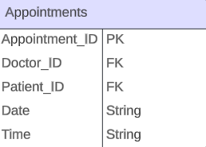
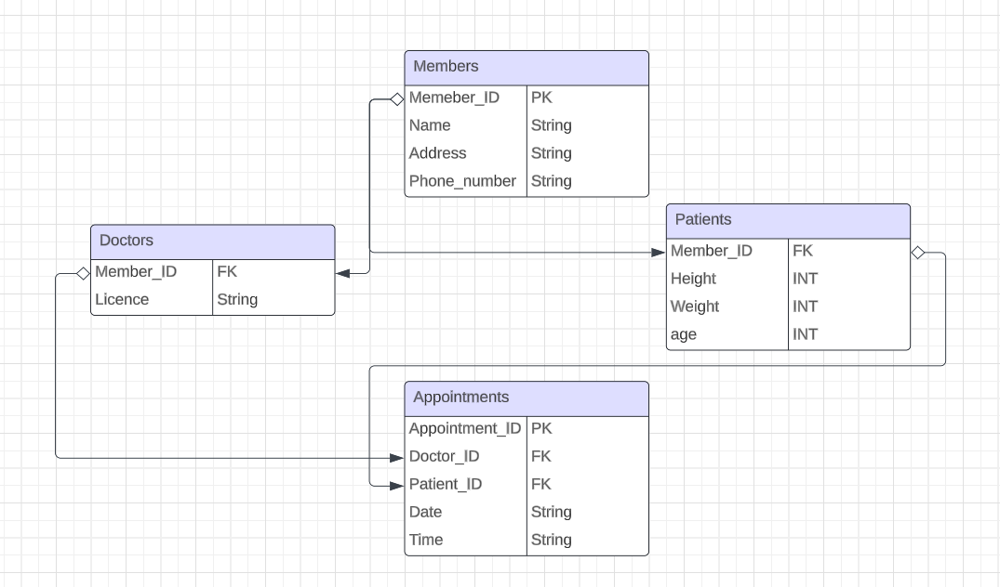

## Intorudction to Database Schemas and ER Diagrams

### Introduction:

In this section I will give you an introduction to what a database schema is, why it is used, and how to come up with a database schema using ER diagrams through a simple example.

### What is a database schema?

Look at a database schema like a structure that defines the data in a database. It represents the logical and structural design of the database, outlining how data is organized, stored, and related to one another.

We use database schemas to define the structure of a database, to help specify how data is stored, related, and accessed. This allows us to ensure data consistency, integrity, and provides a blueprint for efficient data management within the database system.

### What is contained in a database schema?

Tables/Relations:
This is the fundamental structure of a database schema. Tables organize data into rows and columns, with each column representing a specific attribute/field, and each row containing a unique record.

Fields/Attributes:
These are the individual pieces of data stored in a table. Each field corresponds to a specific part of the table/relation and is represented by a column in the table/relation.

Relationships:
These define how tables in the database are related to each other. Relationships establish a connection between tables based on common fields, allowing for the retrieval of related data across different tables.
 
Constraints:
Constraints are rules applied to the data in the database to maintain data integrity. Common constraints include primary keys and foreign keys

Primary Key: 
A primary key is unique in each row and can never be null e.g. a user id can be a primary key

Foreign Key:
A foreign key is a primary key being used from another table. This is a common way to set up a relationship between two tables. For example imagine you are creating a schema for a hospital and you have two tables user and appointments, let’s say user has a primary key user id then in the appointments table you might have an appointment id as a primary key but also a the user id as a foreign key to reference the user this appointment is for.

Unique:
Unique is also found in some database languages such as postgreSQL. It is similar to the primary key where it should be unique but the value can be null.

### How to come up with a schema using ER diagrams (Hospital example):

Let’s create a simple schema for a hospital appointment booking system. Imagine you have been tasked to create an appointment booking system so that we can store all of our doctors, patients, and relate each patient to their specific appointment and doctor.

I will be using LucidChart to create the ER diagrams (https://www.lucidchart.com/blog/getting-started-in-lucidchart)

**ER (Entity Relationship) Diagrams:** Allow us to to describe a relationship between entitites within a system (in our case the tables in our database). You can learn more about them in the link I have provided above.

**NOTE: the main limitation with ER diagarms is that they are not useful for unstructured data (data that doesn't have any relationship between each other)**

First let us think about what tables/relations we will need and what data will be stored in them

We will need a table for all of the types of members and then two other tables to split them into doctors and patients. Let’s for both Doctors and Patients you want to store their name, address, and phone number. 

So we can have table as such: 
We will have a Members table with a Member_ID as a private key (PK) as well as the other attributes mentioned above. Let’s store the phone number as a string to keep it simple.

Then let’s say for doctors only I want to store their practicing license and for each patient I want to store their height, weight, and age.

So we would have these two tables:
Both tables would have their corresponding Member_ID as a foreign key (FK) along with the attributes mentioned above.

So let’s draw arrows to ensure we are creating the link correctly. 

Finally we also need an appointments table that should connect each appointment with corresponding patient and doctor as well as the date and time of the appointment.

So the attributes I will need are: appointment_ID as a primary key (PK), Doctor_ID as a foreign key (FK), Patient_ID as a foreign key (FK), as well as Date and time as strings for simplicity of the example.

Let’s draw arrows to create the connections for the foreign keys.

This is our final schema in the form of a ER diagram using LcuidChart.

**NOTE: You will see that in the diagrams above I have used Primary Key (PK) and Foreign Key (FK) as the type of the ID attributes. For clarification Primary Keys and Foreign Keys are not a type (in our case the type of the IDs are integers) I am just using it to state that it is a primary key or foreign key. You could also include the type and say Integer PK in your diagrams but it is not necessary.**

There may be some further constraints to look for that you should create using your chosen sql language. For example every doctor should have a valid license (would probably have to create some new tables for that); also, there can’t be two points that start at the same time. Furthermore each appointment is strictly an hour long so there can’t be another appointment which starts earlier than an hour after another appointment e.g. if an appointment starts at 7:00 am the next appointment has to be 8:00 am or later.

### Helpful resources:

* If you are really interested in database systems I would reccomend taking CSC343 as you will go into a lot more details than covered here as well as learn about making queries and relational algebra.

* https://www.lucidchart.com/pages/er-diagrams#:~:text=Make%20an%20ERD-,What%20is%20an%20ER%20diagram%3F,each%20other%20within%20a%20system. This is a helpful guide on ER diagrams that goes into heavy details.

* https://youtu.be/3BZz8R7mqu0?si=yjFV2lpJD1Ovexf. This is a short video giving a high level idea of what a database schema is.

* https://www.educative.io/blog/what-are-database-schemas-examples. Another good resource that explains what a database schema is. Gives a SQL and a NoSQL example.
