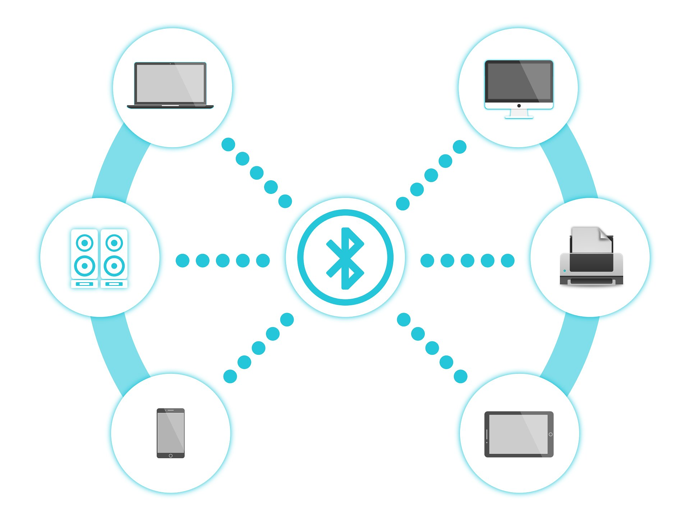
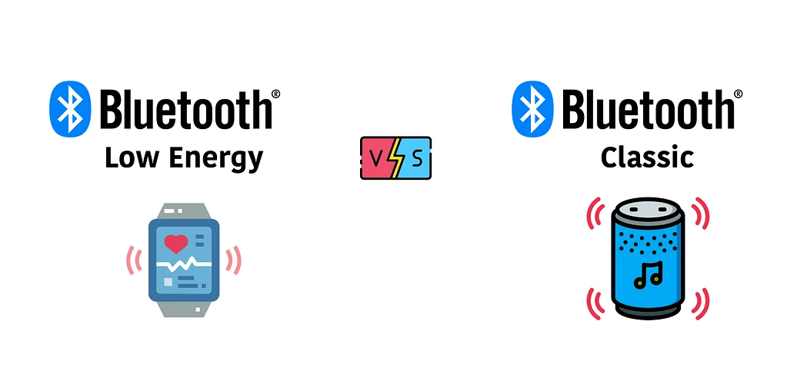
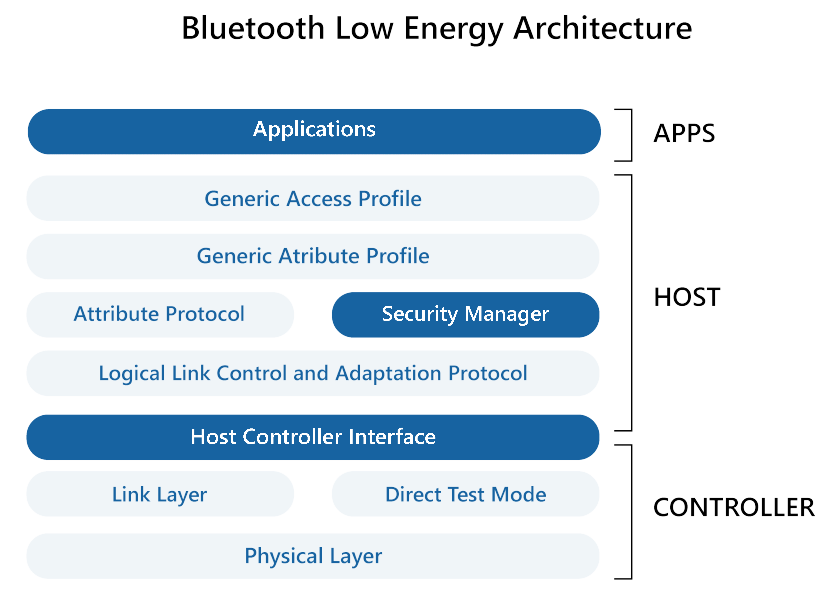

# Understanding Bluetooth in Mobile App Development

## Introduction to Bluetooth



> Image credit: CC0 Public Domain

### Principles for Data Communication

As a wireless technology, Bluetooth is used to exchange data between devices over short distances. Since the fundamental functionality of Bluetooth technology
is to enable communication between devices, it is important to understand the principles of data communication.

There are several characteristics of Bluetooth technology that are important to understand:

#### Delivery

Bluetooth technology is designed to deliver data between devices. This means that data from one device must be delivered to and received by the correct destination device.

#### Accuracy

Data transmitted over Bluetooth must be accurate. This means that data received by the destination device must be the same as the data sent by the source device, with no alterations or errors. Think of the scenario where your phone tries to play a song over a Bluetooth speaker, but the song is distorted or skips.

#### Timeliness

Data transmitted over Bluetooth must be delivered in a timely manner. Continuing the example of playing a song over a Bluetooth speaker, the song should play without any noticeable delay or lag. When you press play, the song should start playing immediately.

#### Jitter

Jitter refers to the variation in the time it takes for data to be delivered. Specifically for audio and video transmission, it is the uneven spacing between data packets. For example, you might have noticed slight cuts in audio or video when using Bluetooth headphones or speakers. This is an example of jitter.

### Architecture of Bluetooth Technology

Being a type of Wireless Personal Area Network (WPAN), the architecture of
Bluetooth can be defined using two types of networks: piconet and scatternet.

#### Piconet

A piconet is a minimal network of devices connected using Bluetooth technology.
Here, it contains a primary node called the master and one or more secondary
nodes called slaves. The communication between the master and the slave can be
one-to-one or one-to-many, but it is restricted to only master-slave communication,
with no slave-to-slave communication allowed. The master is responsible for the
synchronization of the piconet.

#### Scatternet

A scatternet is a network of piconets interconnected by a bridge device. This
bridge node essentially acts as a slave in one piconet and a master in another.


> Image credit: raman_257, Geek for Geeks

### Applications of Bluetooth in Mobile Use Cases

Bluetooth is a Wireless Personal Area Network (WPAN) technology that is widely 
used in mobile app development. Due to its feature of short-range communication, 
we have commonly encountered Bluetooth in various mobile use cases, especially
when our phones are used as the source of data. For example, we use Bluetooth
to connect our phones to wireless headphones, speakers, and other audio or
video devices.

While sending data from our phones to other devices is a common use case,
Bluetooth is also used to receive data from other devices, and this typically
involves specially designed mobile apps to deal with data transfer. For example,
in the healthcare setting, many wearable medical devices use Bluetooth to send
data to a mobile app for monitoring and analysis. This method eliminates the
need for wired connections and allows for more mobility and flexibility for the
device design. However, unlike broadcasting data to a speaker, these type of 
data transfer are rather lightweight, but require a high level of accuracy and
timeliness, as well as a low energy consumption for the advertising device.
Therefore, an alternative to the most common Bluetooth technology, Bluetooth
Low Energy (BLE), is often used in these cases.

## Understanding BLE

Since a common use case in which Bluetooth is used in mobile app development is
to send and receive data from other devices, (as in a mobile app is developed
to communicate with a wearable device), it is important to understand the
principles of Bluetooth Low Energy (BLE).

### What is Bluetooth Low Energy (BLE)?

Unlike classic Bluetooth, BLE is a distinct and independent protocol that is
designed for **low energy consumption**. It is optimized for low power devices and
is designed to operate for a much longer period of time. However, the low
energy consumption comes at the cost of **reduced data throughput**. In this
case, the data is not transmitted continuously, but in small packets at regular
intervals. This is known as **advertising**. The feature of low energy consumption
and intermittent data transmission makes BLE suitable for wearable devices,
healthcare devices, and other IoT devices where the size and battery life of
these devices are important.

A classical application of BLE is the sport/fitness band. Before the era where
everyone has a smartwatches, sport bands are the most common wearable devices
used to track the user's physical activities. Not only does it detect the user's
movements, but often the band is equipped with monitors for heart rate,
respiratory rate, and blood oxygen level. These data are usually not constantly
send to the user's phone, but are stored in the band and sent to the phone at
regular intervals. That is why users often has to manually open the related
mobile app and sync the data from the band to the app to see the most recent 
data. The above scenario is a typical use case of BLE.



> Image credit: Mohammad Afaneh, Novel Bits

### BLE Architecture

The BLE architecture can be broken down into three main components: the
application, the host, and the controller. They are connected in a hierarchical
manner and are considered as subsytems of the BLE stack. The following figure
illustrates the BLE architecture:



> Image credit: WeMakeIoT


#### Application

The application is the top layer of the BLE architecture and is a user-defined
software that bundles the entire BLE functionalities. It is responsible for
defining the behavior of the BLE device and managing data exchange and is
accessible to the user.

#### Host

As the middle layer of the BLE architecture, the host is fairly complex and
contains multiple sublayers. It modulates the data communication between different
aspects of the BLE device.

#### Controller

The controller is the bottom, physical layer of the BLE architecture. It holds
the hardware that hosts the BLE services and is responsible for the actual
transmission of data.

### Data Communication in BLE

Connection between devices in BLE primarily involves two types of communication:
connection-oriented communication and broadcasting-oriented communication.

#### Connection-Oriented Communication

In this form, a BLE device can behave either as a central or a peripheral device.
The primary device is called the "client", which searches for other devices 
it can connect to. Once a secondary device is found, the client sends a request
to establish a connection. The secondary device is called the "server", which
accepts the request and establishes a connection.

This process involves four steps: advertising, initiating, connection, and
exchanging data. As discussed earlier, the data is not transmitted continuously.
Instead, advertising is used as the server sends out timed small packets of data
in the hope that the client will discover it. Only after the client discovers
the server, the client can initiate a connection.

#### Broadcasting-Oriented Communication

In contrast to connection-oriented communication, broadcasting-oriented
communication is not a one-to-one communication. In this case, a connection is
not established. Instead, the server broadcasts data to all nearby devices in
an undirected manner. However, due to the fact that a connection is not
established, data security is a concern in broadcasting-oriented communication.

## Developing with BLE in React Native

Since mobile apps are commonly developed to handle connections to BLE devices,
it is common that developers use React Native to develop these apps due to the
cross-platform nature of React Native. Here, we provide a brief overview of the
steps to integrate BLE into a React Native app.

### BLE Libraries for React Native

There are two common libraries associated with BLE in React Native: 
`react-native-ble-plx` and `react-native-ble-manager`. While both libraries
handles basic BLE functionalities, `react-native-ble-plx` is more popular and
handles more advanced functionalities such as multi-device connections.

To install the library, use the following command:

```bash
npm install react-native-ble-plx
npm install react-native-ble-manager
```

### Steps to Integrate BLE into a React Native App

#### Step 1: Master BLE Manager

The first step is to create a master BLE manager that handles all the BLE
functionalities. This manager is essentially an instance of the BLE library
that is used to handle all the BLE functionalities.

```javascript
import { BleManager } from 'react-native-ble-plx';

const bleManager = new BleManager();
```

#### Step 2: Scan for Devices

Before connecting to devices, the app must first scan for devices. This is done
via the `startDeviceScan` method.

```javascript
const scanForDevices = () => {
  bleManager.startDeviceScan(null, null, (error, device) => {
    if (error) {
      console.log(error);
      BleManager.stopDeviceScan();
      return;
    }
    console.log(device.name, device.id);
  });
};
```

#### Step 3: Connect to Devices

Here, we exploit the connection-oriented communication mode of BLE. Once a
device is found, the app can connect to the device using the `connectToDevice`
method.

```javascript
const connectToDevice = (device) => {
  BleManager.stopDeviceScan();
  BleManager.connectToDevice(device.id)
    .then((device) => {
      console.log('Connected to device', device.name);
    })
    .catch((error) => {
      console.log(error);
    });
};
```

#### Step 4: Disconnect from Devices

Once the current batch of data exchange is finished, usually the connection is
stopped to save energy until the next batch of data exchange.

```javascript
const disconnectFromDevice = (device) => {
  BleManager.disconnectFromDevice(device.id)
    .then(() => {
      console.log('Disconnected from device', device.name);
    })
    .catch((error) => {
      console.log(error);
    });
};
```

## References:

- [Data Communication Terminologies](https://www.geeksforgeeks.org/data-communication-terminologies/?ref=ml_lbp)
- [What is Bluetooth?](https://www.geeksforgeeks.org/bluetooth/)
- [Bluetooth Low Energy (BLE): A Complete Guide](https://novelbits.io/bluetooth-low-energy-ble-complete-guide/)
- [Bluetooth Low Energy Software Developer's Guide v3.0](https://software-dl.ti.com/lprf/simplelink_cc2640r2_sdk/1.00.00.22/exports/docs/blestack/html/ble-stack/index.html#)
- [Bluetooth Low Energy](https://www.wemakeiot.com/iot-technology-solutions/bluetooth-low-energy-ble/)
- [What Is Bluetooth LE? Meaning, Working, Architecture, Uses, and Benefits](https://www.spiceworks.com/tech/iot/articles/what-is-bluetooth-le/)