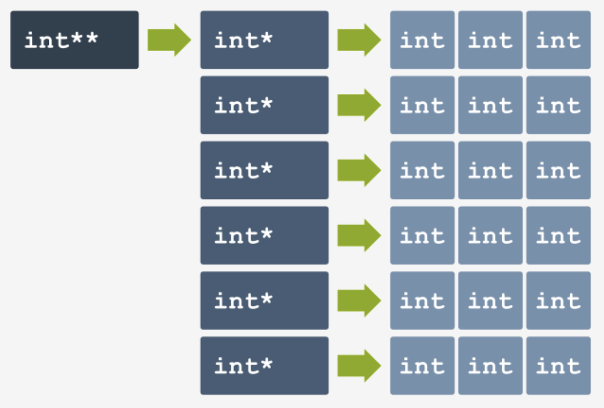
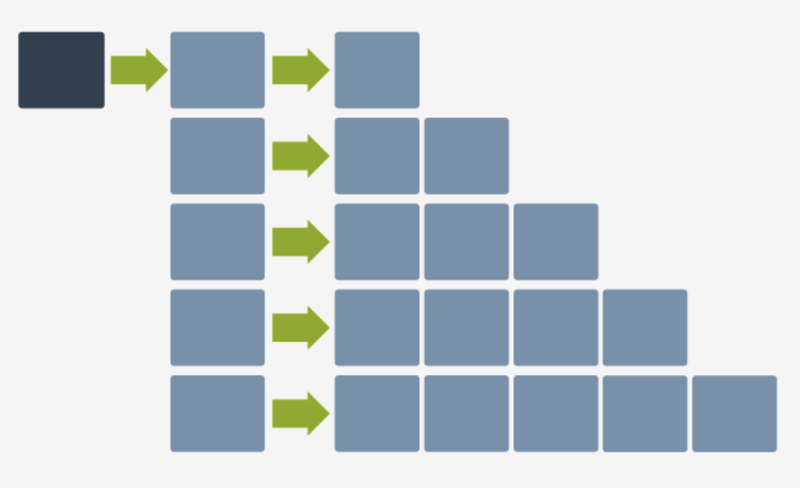

# Memory Management

In the examples so far, memory management is taken place outside of our awareness. And the parts of the memory which we’ve used to store values have been hidden behind the **names of scalars (variables) and arrays**. This allows the developer to not worry about basic memory management, which is very convenient.

But very often the developer wants to **have full control over how much memory is used and when exactly it is used**. This is especially important when you **don’t know in advance what the size of the data to be processed is**.

To manage memory, C provides a set of specialized functions in the `stdlib.h` library.

### General Idea:

We have a function that **requests access to a block of memory of a specific size**. And the operating system can either **grant the access** (given sufficient memory), or **deny the access** (if there is short of memory space).

We have another function that **gives the access to that block of memory back to the operating system** (i.e. it ”**frees**” the memory). 

# The Stack and the Heap

If you’ve ever tried creating an array with an indeterminate size before (e.g. by creating an array using something like `int a[n]` where `n` is a variable), you would quickly find out that that is not possible in C. In fact all arrays, if not created by dynamic memory allocation, must be of constant size in a C program. This is because static memory and dynamic memory “live in different places” when the program is being run.

Statically allocated memory in a program lives in a place called the **Stack**, while dynamically allocated memory lives in a place called the **Heap**. For a detailed explanation, see below:

[Stack vs Heap: What's the difference?](https://www.educative.io/blog/stack-vs-heap)

# Allocating and Freeing Memory

## The `malloc` Function

The `malloc()` (”**memory allocation**”) function **allocates memory dynamically** according to **how many bytes** we specify it to give us. And then it returns the **pointer** to the block of memory allocated. 

The pointer given is of type `void *` (which means a pointer to any type of data), which we then have to **cast** it to other pointer types like `int *` or `char *`.

Also expect the memory block allocated to be **uninitialized**, so it **may contain garbage**.

For example:

```c
int *p = malloc(4);  // allocating 4 BYTES and giving it to an integer pointer
*p = 7;
```

## The `free` Function

The `free()` function **releases / “frees” the memory that was allocated dynamically (**using `malloc()`**) back to the operating system**. 

The function takes any type of dynamically allocated pointer as a parameter, and has no outputs.

For example:

```c
int *p = malloc(4);  // allocating 4 BYTES and giving it to an integer pointer
*p = 7;
free(p);  // frees the block of memory back to the system
```

We can also make **dynamic arrays**, like so:

```c
int *arr = malloc(sizeof(int) * 10);  // similar to "int arr[10];"

// operations on the array
for(i = 0; i < 10; i++) 
    arr[i] = i;

free(arr);  // freeing of the array
```

Note that **all dynamically allocated variables MUST BE FREED after their usage**. Or else it will result in a **memory leak**!

# Dynamically Allocated 2D Array

If we use our current technique of dynamically allocating arrays, we can create a 2D array like so:

```c
int rows = 8;
int cols = 8;
int *arr = (int *) malloc(rows * cols * sizeof(int));
// The type casting (int *) is optional in C.
```

But if we do it this way, if we have to access `arr[r][c]`, we have to do it like this:

```c
int i = arr + (r * cols) + c; 
```

In order to access it as if it’s a normal 2D array, we have to **dynamically allocate an array of arrays**, i.e. an array of `int *`.



We can achieve this like so:

```c
int rows = 8, cols = 8, **arr;  // a pointer to int-pointers

arr = malloc(sizeof(int *) * rows);  // the arrays which are rows

for(int i = 0; i < cols; i++){
    arr[i] = malloc(sizeof(int) * cols);  // the rows themselves
}

arr[rows - 1][cols - 1] = 100;  // Now we can access it like normal.

// To free the array: (since we created it manually, we must free it manually)
for(int i = 0; i < cols; i++){
    free(arr[i]);  // free all the rows first
} 
free(arr);  // then free the array of row pointers
```

We can also make arrays that are not rectangular:

```c
int rows = 5, **arr;

arr = malloc(rows * sizeof(int *));

for(int r = 0; r < rows; r++){
    arr[r] = malloc(sizeof(int) * (r+1));
}
```

This array has this structure:



# The `Sizeof` Function

We can use the `sizeof()` function to get **how many bytes** a literal, a variable, or a value of a certain type takes up in memory.

Note that `sizeof` is a **keyword**, it is also considered a **unary operator**.

```c
int i;
i = sizeof(char);  // i is now 1, since a char takes up 1 byte in memory
i = sizeof(int);  // is is now 4, since an int takes up 4 bytes in memory

int vec[20];
i = sizeof(vec[0]);  // vec[0] is an int, thus i is now 4
i = sizeof(vec);  // i is now 80, since there are 20 ints in vec[]
i = sizeof(vec) / sizeof(vec[0]);  // i == 80 / 4 == 20
// Notice how this is equal to the length of the array, which is 20.

double arr[5];
i = sizeof(arr[0]);  // arr[0] is a double, thus i is now 8
i = sizeof(arr);  // i is now 40, since there are 5 floats in arr[]
i = sizeof(arr) / sizeof(arr[0]);  // i == 40 / 8 == 5
// Notice how this is also equal to the length of the array, which is 5.
```

Thus to get the **length of an array** (e.g. `arr`), we can just do `sizeof(arr) / sizeof(arr[0])`.