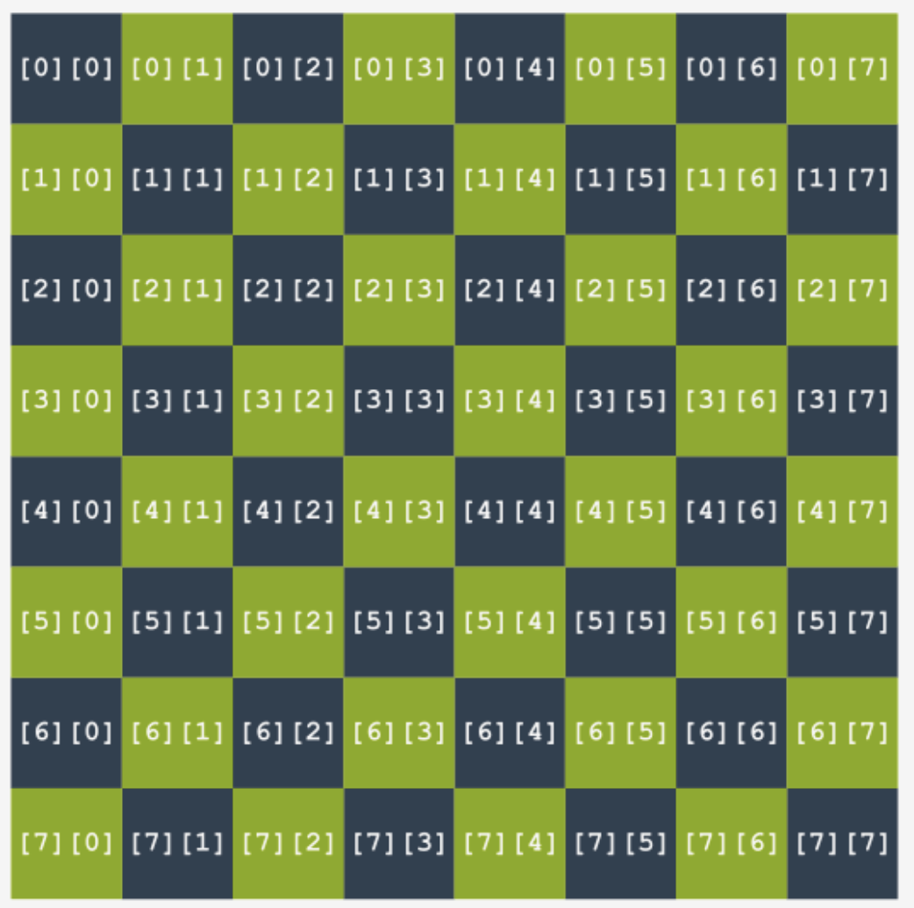

# Multi-Dimensional Arrays

Let’s say a tabular data structure (e.g. a chess board) that has 8 rows and 8 columns.

The primitive solution is to store each row in a separate 1D array, like so:

```c
int row1[8], row2[8], row3[8], row4[8], row5[8], row6[8], row7[8], row8[8];
```

But obviously for data structures with a much larger size, storing data like this is impractical.

Thus, we can define a **2D array**, like so:

```c
int board[8][8];
```

It’s basically an array where **each element is another array**.

We can interpret that each element in a 2D array has 2 indexes: **row number** and **column number**. Or that each element has a “coordinate” from $(0,0)$ to $(7,7)$.



In short, creating a 2D array of $m$ rows and $n$ columns allows to store $mn$ total elements.

Likewise, we can also create a **3D array**, like so:

```c
int arr[10][20][30];
```

Creating a 3D array of $m$ length, $n$ width and $k$ height allows us to store $mnk$ total elements.