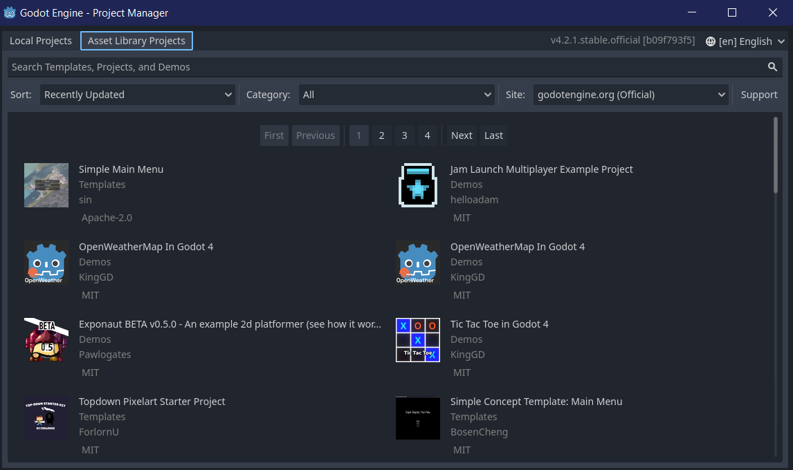
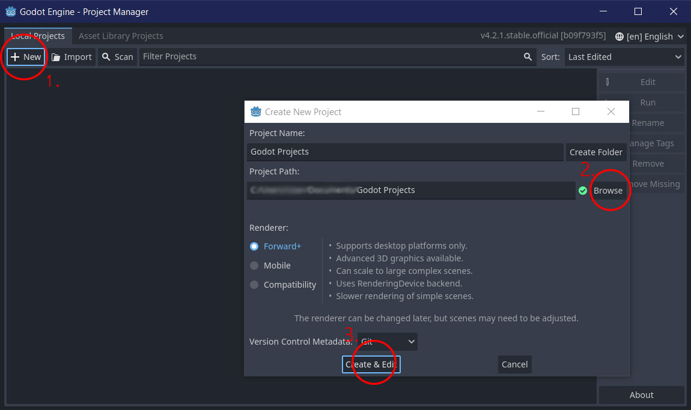
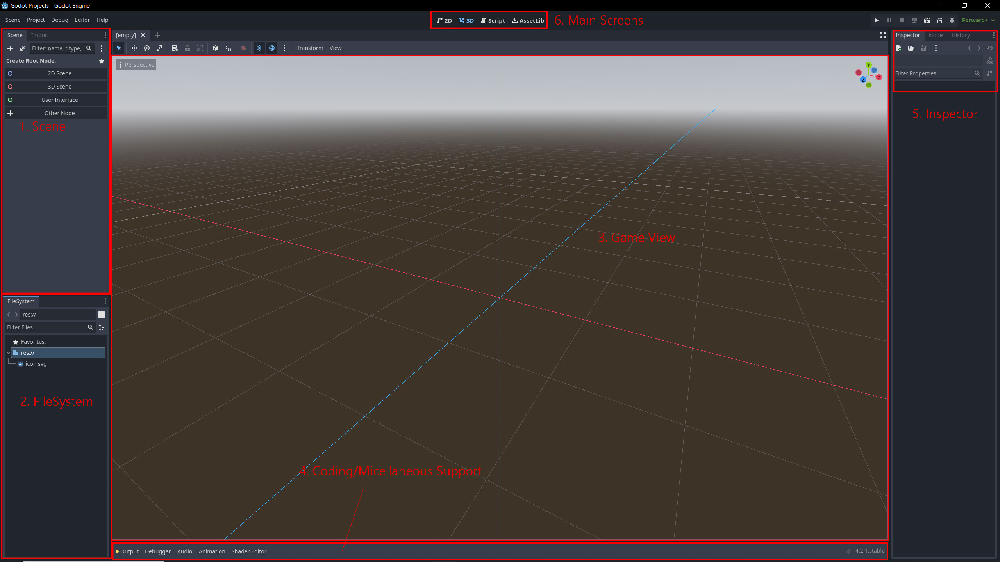

# Intro to Godot

## What is Godot?

Godot is an open source game engine which is considered a versatile platform for developing 2D as well as 3D games to release on the web, mobile, desktop and even console![^1]

It was originally developed in 2001 by an Argentinian Game Studio. Ever since it got released as an open source game engine, the features it provide has tremendously improved.

Since Godot is a free open source game engine, it is less hideous to access compared to game engine like unity where you have to sign up for licenses and even pay fees to access the game engine.
It could be considered a good platform to start learning game development since the game engine is free itself.

Some games one might recognize that are made by the Godot game engine includes would be games like Dome Keeper as well as Endoparasitic.

## Features

The features it includes are:
- Code Editor
- Animation Editor
- Debugger
- Tilemap Editor and More
- It supports Blender
- It supports C# programming
- It also has a custom programming language called GDScript which is similar to python in terms of syntax
- Asset Library is a platform where users can upload and download pre-made assets for their game development

## How to Get Started
### Installation
1. Go to the Godot [official website](https://godotengine.org/) and download the engine. (For linux users go to this [website](https://godotengine.org/download/linux/))
	- There's 2 types of engine, one is the latest version and the other one is the Long Term Support (LTS) version
	- I will be using the Latest Version (4.2.1) for this intro.
2. Unzip the folder and open `Godot_v4.2.1-stable_win64.exe`
### Starting a new Project
After opening the game engine, you'll see something like this:

To create a new project you'll have to:
1. Click on `New`
2. Create a folder to store your project or find a path to the directory you want to store the project
	- Note: Creating a project will not create a new directory, it'll simply put all the required files within the path you set it to
3. Create and your done!
### Introduction to the UI of the Game Engine

Here's a breif introduction to the interface and what you could do with it.
1. The Scene [^2]
   - This is where you create Nodes.
   	- Nodes are basically building blocks for a game, they could be either moving mobs, objects or even traps that the player node can interact with.
   	- They have names, editable attributes, can be extended and have a callback attribute every frame
   - The scene is basically a group of nodes that makes up a stage for your game
        - It always consist of one parent node, and running a game means running a scene. A game can consist of many scenes but for a game to run, they'll have to run on one of the scenes.
2. File System [^3]
     - This is where all your scripts, images, models, audio and many other file component of your project are stored.
3. Game View / Screen
     - This would be introduced with **#6** which is the different menu of the game engine
     - When you click on one of the menus (i.e. 2D, 3D, Script, AssetLib), the Game View will take you to its corresponding Screen
	- For example, 2D will take you to a 2D game development screen for 2D games, 3D will do something similar
	- The script screen is where you write your code for your games and it's supported with a debugger.
 	- Scripts that are written are attached to the nodes created for your scene ([Read More Here](https://docs.godotengine.org/en/stable/getting_started/step_by_step/scripting_first_script.html))
  	- There's also the Assets Library tab which was mentioned here [here](#Features)
4. Coding/Miscellaneous Support
     - The bottom tabs pops up when you click on the respective buttons such as Output, Debugger, Audio, Animation, Shader Editor
     - They help you with constructing and interaction of different nodes within the game
5. Inspector
   	
## What's next?
Now that you know the basics for what the UI does you are now ready to hop into a tutorial to create your first game!

Check out these tutorials for a start!
### GDScript
- [Godot GDScript Tutorial For Beginners Crash Course](https://www.youtube.com/watch?v=ytbwZgWvCfM)
### 2D Games
- [Make A 2D Platformer In 10 MINUTES (Godot 4)](https://www.youtube.com/watch?v=9u6edV5-EEI)
- [2D Platformer Quick Start Guide ~ Godot 4 GameDev Tutorial for Beginners](https://www.youtube.com/watch?v=43c-Sm5GMbc)
### 3D Games
- [Godot 4 3D Platformer Lesson #1: Let's Get Started!](https://www.youtube.com/watch?v=CI-cVKuSD1s&list=PLda3VoSoc_TTp8Ng3C57spnNkOw3Hm_35)
- [Design 3D Game Levels From Scratch - Godot 4 Tutorial](https://www.youtube.com/watch?v=dV6S_11pyzo)
## References
[^1]: [Introduction to Godot](https://docs.godotengine.org/en/stable/getting_started/introduction/introduction_to_godot.html)
[^2]: [Scenes and Nodes](https://docs.godotengine.org/en/3.1/getting_started/step_by_step/scenes_and_nodes.html#scenes)
[^3]: [File System](https://docs.godotengine.org/en/stable/getting_started/introduction/first_look_at_the_editor.html#:~:text=There%20are%20four%20main%20screen,design%20levels%20for%203D%20games.)
