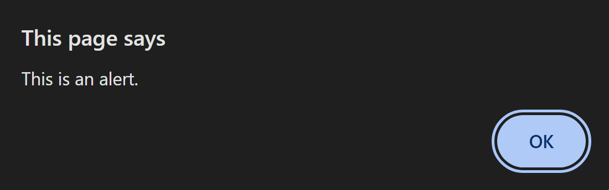
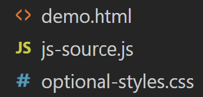
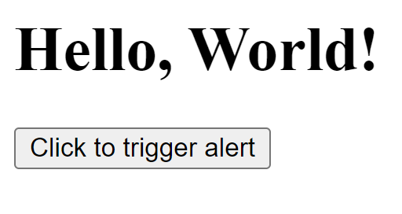
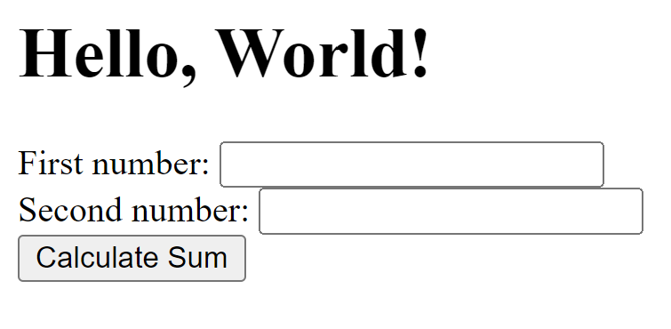
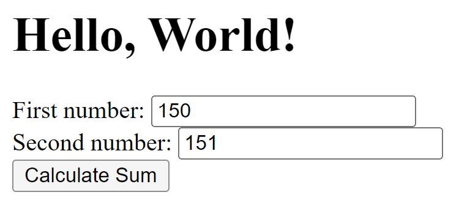
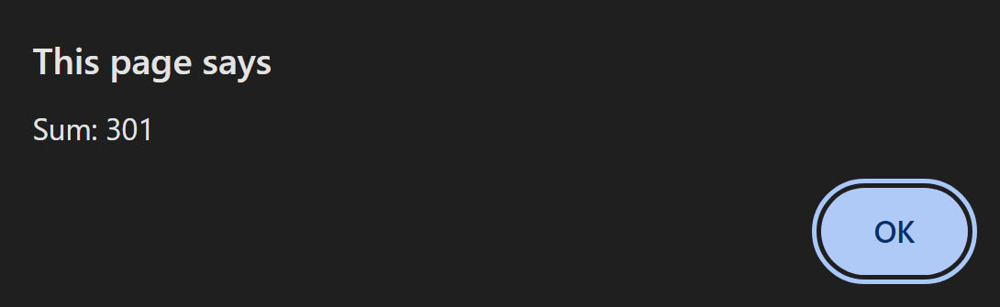

# `JavaScript`

JavaScript is one of the most fundamental coding languages in responsive web design and web development. It is the component that enhances a well-built HTML/CSS site and allows it to have extended functionality over just being a static page.

Note that the examples I outline below do not cover the fundamentals of JavaScript. They simply showcase basic scenarios demonstrating JavaScript in action in a web development context as motivation for its use by a CSC301 student. [Additional Resources](#additional-resources-1) are included near the bottom for further thorough self-teaching.

## Table of Contents
### [Introduction: Embedding JavaScript in an HTML File](#introduction-embedding-javascript-in-an-html-file-1)
### [Linking to a `.js` File in an HTML File](#linking-to-a-js-file-in-an-html-file-1)
### [Further Examples](#further-examples-1)
### [Additional Resources](#additional-resources-1)

## Introduction: Embedding JavaScript in an HTML File

This section assumes you are already familiar with the basics of HTML. If not, you may refer to the first two resources in the [Additional Resources](#additional-resources-1).

For an introduction of how one can integrate JavaScript into web development, we will explore the basic scenario of embedding JavaScript code in HTML.

Suppose we begin with a simple Hello World page.

```html
<!-- A basic Hello World page. -->
<html>
    <body>
        <h1>Hello, World!</h1>
    </body>
</html>
```


To view this page locally, simply paste the code into a text editor and save it as a `.html` file, then you can open it in your preferred browser.

Now, let's enhance this page by incorporating a `<script>` tag within the `<body>` tag. The tag is used to embed JavaScript code.

```html
<html>
    <body>
        <h1>Hello, World!</h1>
        <script>
            // Everything written within this <script> tag is JavaScript code.
            alert('This is an alert.');
        </script>
    </body>
</html>
```


In this example, the `alert()` function simply triggers a pop-up box. Now, I'll specify how we can transfer the JavaScript code to a separate file and link our HTML page to it as the code grows.

## Linking to a `.js` File in an HTML File

Copy everything in the `<script>` tag and save it as a new file with a `.js` extension in the same folder as the HTML file. It should simply contain the following:

```js
// This is the js-source.js file.
alert('This is an alert.');
```
Shown below is the file structure you would currently have (including a CSS file is optional).



Now, an `src` attribute can be added to the `<script>` tag in the HTML file with the filename of the `.js` file such that it looks like this:

```html
<html>
    <body>
        <h1>Hello, World!</h1>
        <!-- src attribute has been added. -->
        <script src="js-source.js"></script>
    </body>
</html>
```
 If you choose to use a different file structure, such as separating files by folder, you can address that accordingly in the `src` attribute by including the folder path before the file name (for example: `src="./js/js-source.js"`).

Upon reloading the HTML page, you'll notice that none of the functionality has been affected. This demonstrates a simple example of keeping HTML files organized by delegating its functionalities to a separate file entirely.

Below, we expand on this example by introducing custom functions, user input, and variables.

## Further Examples

### Activate the Alert with a Button
Now, we enclose the JS alert in a function:

```js
function showAlert() {
    alert('This is an alert.');
}
```

This custom function allows us to call the alert at any time, rather than simply running it when the `<script>` tag gets parsed. Here is how we can call it in the HTML file with the `onclick` attribute of a button:

```html
<html>
    <body>
        <h1>Hello, World!</h1>
        <script src="js-source.js"></script>
        <!-- Our new button that calls showAlert() -->
        <button onclick="showAlert()">Click to trigger alert</button>
    </body>
</html>
```


Try it out&mdash;the alert now pops up only when the user clicks the button.

### Output the Sum of User Inputs

Let's add two text inputs:

```html
<html>
    <body>
        <h1>Hello, World!</h1>
        <script src="js-source.js"></script>

        <!-- Added two text input boxes -->
        <label for="num1">First number:</label>
        <input type="text" id="num1"><br>
        <label for="num2">Second number:</label>
        <input type="text" id="num2"><br>
        
        <!-- And changed the label, see below -->
        <button onclick="calculateSum()">Calculate Sum</button>
    </body>
</html>
```


We can now transform the `showAlert()` function into `calculateSum()`, one which outputs the sum of the text inputs in the alert:

```js
function calculateSum() {
    // document.getElementById retrieves the text inputs.
    var num1 = document.getElementById('num1').value;
    var num2 = document.getElementById('num2').value;

    // parseFloat converts the input into floats for calculation
    var sum = parseFloat(num1) + parseFloat(num2);

    // String concatenation allows us to output the contents of a variable
    alert('Sum: ' + sum);
}
```



And as usual, you can test this out to verify that it works. Both of these examples further demonstrate how JavaScript allows you to program additional functionality and interactivity that isn't possible in pure HTML.

## Additional Resources

The following resources are what I believe to be the best way to get started in the basics of JavaScript and also acquire a grasp of the language beyond the fundamentals.
1. [Software Engineering Learning Center's Guide to HTML](https://learning-software-engineering.github.io/Topics/Tech_Stacks/HTML_Guide.html)

    This guide to HTML is an article included on this wiki, written by other CSC301 students. Since writing this, the page may have already been updated to be more thorough. It contains sections which, most importantly, walk you through the syntax and elements of HTML. 
1. [MDN's Introduction to HTML](https://developer.mozilla.org/en-US/docs/Learn/HTML/Introduction_to_HTML)

    If you need to learn more about HTML after going through the guide from this wiki, this page on the MDN Web Docs website contains a series of their own guides as a basic introduction to HTML. As a prerequisite to understanding and beginning to use JavaScript in HTML pages, this page covers all you need.
1. [MDN's JavaScript First Steps](https://developer.mozilla.org/en-US/docs/Learn/JavaScript/First_steps)

    This module is similarly from MDN Web Docs, as the first module in the [JavaScript](https://developer.mozilla.org/en-US/docs/Learn/JavaScript) page. The module contains a series of guides which cover everything included in the code examples from this article. As noted at the beginning, our article simply walks through example scenarios of JavaScript applied to HTML pages. This is a resource you should refer to if you prefer to learn the fundamentals of JavaScript first in much more detail than we covered. It begins with more high-level introduction guides such as the purpose of JavaScript and how to troubleshoot, before covering the fundamental, frequently-used features of JavaScript such as variables, numbers, strings, methods, and arrays.
1. [FreeCodeCamp's course on JavaScript Algorithms and Data Structures](https://www.freecodecamp.org/learn/javascript-algorithms-and-data-structures/) 
    
    This is a free online resource that has many components for learning JavaScript from the very beginning. It starts with a section on Basic JavaScript that explores the language without any other components like HTML/CSS to worry about. It then continues to more complex topics such as REGEX, Debugging, Data Structures and Object Oriented versus Functional Programming, just to name a few. The main benefit to this course is that is offers coding projects at the end for you to work on that not only ascertains that you have learned a lot from the course, but upon completion gives you a certificate for completing the course which could be a good resume boost.
1. [JavaScript codealong](https://youtu.be/M6etynV-IMo) 

    This YouTube video is part of a series on web design by Leon Noel, one of the best coding instructors on YouTube. It has a slow, relaxed pace that allows newer coders to follow along without needing to frequently pause the video. This link is second because it requires prior knowledge of CSS and HTML but is a great gateway to the marriage of those languages with JavaScript in a more realistic example of how one will use the languages in web design.
1. [CS50's Web Programming with Python and JavaScript](https://cs50.harvard.edu/web/2020/weeks/)

    I used this course as the foundation of much of the code examples included above. This course from HarvardX, which can be freely audited, begins with HTML/CSS and later introduces JavaScript, but also thoroughly explores other topics that any CSC301 student interested in web development would need, such as Git, Django, SQL, and testing. The learner completes projects that combine the material taught throughout the course, which provides a necessary hands-on experience.
