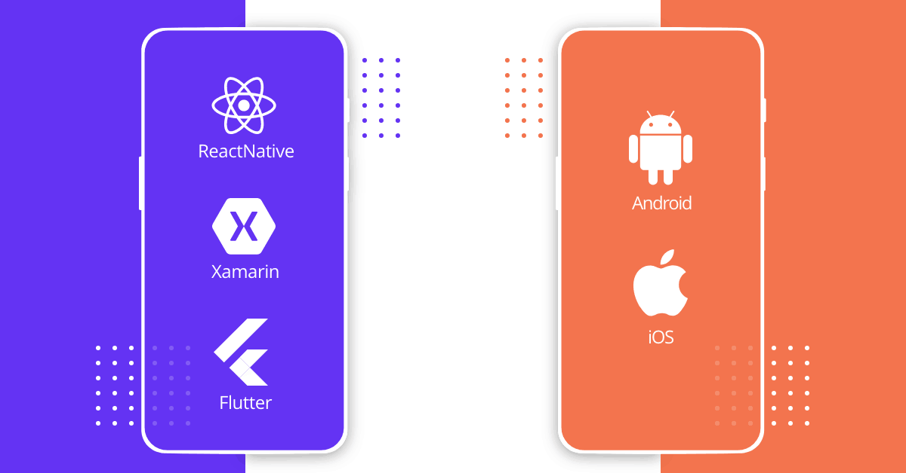

# Introduction to Cross Platform vs Native Mobile Development

## Table of Contents
1. [Cross-Platform Development Frameworks](#cross-platform-development-frameworks)
2. [Advantages and Challenges of Cross-Platform Development](#advantages-and-challenges-of-cross-platform-development)
3. [Popular Cross-Platform Development Tools and Frameworks](#popular-cross-platform-development-tools-and-frameworks)
4. [Native Mobile Development](#native-mobile-development)
5. [Advantages and Challenges of Native Development](#advantages-and-challenges-of-native-development)
6. [Comparing Performance and User Experience](#comparing-performance-and-user-experience)
7. [Examples of Products](#examples-of-products)
8. [Developer Resources](#developer-resources)
9. [References](#references)

## Cross-Platform Development Frameworks

Cross-platform development for mobile involves creating applications that can run seamlessly across multiple operating systems, such as iOS and Android, utilizing a single codebase. Through cross-platform frameworks, developers gain the ability to streamline the development process by writing code once and deploying it across various platforms. CSC301 students can benefit greatly from understanding cross-platform development as it is easier to implement for multiple famous platforms such as iOS and Android. According to Stack Overflow's Developer Survey 2021, React Native was ranked among the top frameworks loved by developers. Students with existing knowledge in web can easily start-off with React Native providing them with a clear transition.

## Advantages and Challenges of Cross-Platform Development

### Advantages

1. Faster development and deployment times compared to native development
2. Cost-effectiveness due to code reuse across multiple platforms
3. Simplified maintenance and updates with a single codebase
4. Greater reach by targeting multiple platforms simultaneously

### Challenges

1. Performance limitations compared to native development
2. Platform-specific nuances and limitations may require workarounds
3. Dependency on third-party frameworks and libraries, which may introduce compatibility issues
4. Limited access to platform-specific features and APIs may restrict functionality

## Popular Cross-Platform Development Tools and Frameworks

| Framework    | Description                                                                                                                                                  | Features and Benefits                                                                       | Key Differences                                                                                     | Companies Using                                                                            |
|--------------|--------------------------------------------------------------------------------------------------------------------------------------------------------------|--------------------------------------------------------------------------------------------|----------------------------------------------------------------------------------------------------|-------------------------------------------------------------------------------------------|
| React Native | Developed by Facebook, allows building native-like apps using JavaScript and React                                                                           | Wide community support and extensive ecosystem of libraries and components                  | Utilizes JavaScript and React for cross-platform development. Notable for its large community.     | Facebook, Instagram, Airbnb                                                               |
| Flutter      | Developed by Google, offers a fast and expressive way to build native apps for iOS and Android from a single codebase                                       | Layered architecture with customizable widgets for building UIs, Hot reload feature         | Utilizes Dart programming language and features a layered architecture with customizable widgets.   | Alibaba, Google Ads, Reflectly                                                            |
| Xamarin      | Acquired by Microsoft, allows building native apps for iOS, Android, and Windows using C# and .NET                                                           | Integration with Visual Studio and support for native APIs, Code sharing across platforms    | Utilizes C# and .NET for cross-platform development. Offers deep integration with Visual Studio.    | UPS, Honeywell, Olo                                                                       |

## Native Mobile Development

Native mobile development for iOS and Android involves creating applications specifically tailored for each platform using their respective programming languages and frameworks. For iOS, developers typically use Swift while for Android, Kotlin or Java are commonly employed. Notable IDEs for native development include Xcode for iOS and Android Studio for Android, providing robust toolsets for designing, debugging, and deploying applications. Understanding native development will help CSC301 students with the ability to harness platform specific capabilities fully, delivering high-performance, feature-rich mobile applications tailored to partners' needs.

### Advantages and Challenges of Native Development

#### Advantages

1. **Performance**: Native apps typically offer superior performance compared to cross-platform alternatives as they are optimized for specific platforms, leveraging platform-specific features and APIs.
2. **Seamless Integration**: Native apps seamlessly integrate with the device ecosystem, providing a cohesive user experience consistent with the platform's design guidelines and user expectations.
3. **Optimized User Interface**: Native development enables developers to create highly responsive and intuitive user interfaces that align closely with the platform's design principles, enhancing user engagement and satisfaction.

#### Challenges

1. **Platform Dependency**: Developing separate codebases for iOS and Android requires additional time and resources compared to cross-platform development, as developers need to maintain platform-specific codebases and implement platform-specific features separately. CSC301 students need people with both domain knowledge otherwise, they won't be able to fulfill partner's requirement.
2. **Learning Curve**: Learning platform-specific languages and frameworks, such as Swift for iOS and Kotlin for Android, may require additional time and effort, especially for developers new to mobile development.
3. **Release Cycle**: Releasing updates and new features simultaneously across multiple platforms may pose challenges due to differences in release processes and approval times between app stores. This can be seen as a challenge for CSC301 students who have limited time for releasing a product.

Native Mobile development also allows ease to follow platform-specific design guidelines. These guidelines provide developers with insights into the user interface (UI) and user experience (UX) expectations specific to each platform, ensuring that applications look and feel native to the respective operating systems.

## Comparing Performance and User Experience

### Performance considerations in cross-platform vs native development

- **Cross-platform Development**:
  - Performance may be impacted due to additional layers of abstraction and interpretation required by cross-platform frameworks.
  - Execution speed and resource consumption may vary depending on the framework used and the complexity of the application.
- **Native Development**:
  - Native apps generally offer better performance as they directly access platform-specific APIs and optimizations.
  - Optimized for the specific hardware and software of each platform, leading to faster execution and responsiveness.

### Testing Environments

- **Cross-platform Development**:
  - Testing across multiple platforms can be streamlined using cross-platform testing frameworks.
  - Ensuring compatibility and consistency across different devices and OS versions is crucial. This can be little challenging for CSC301 students as they have to write tests that ensure logic as well as rendering in their corresponding platform.
- **Native Development**:
  - Testing typically involves separate testing environments for each platform (iOS and Android).
  - Integration Testing and Unit Testing for common for Android and iOS Development which are highly useful for CSC301 students and for developers in large.

### Long-term implications for scalability and codebase maintenance

- **Cross-platform Development**:
  - Codebase maintenance is simplified as changes are applied universally across platforms.
  - Scalability may be limited by the capabilities and constraints of the chosen cross-platform framework. This is one of the biggest advantages as down the line partner's platform may stop working if the libraries for cross-platform language are no longer supported.
- **Native Development**:
  - Scalability can be optimized for each platform individually, allowing for greater flexibility and performance optimization.
  - Maintenance efforts may increase with separate codebases for iOS and Android, but platform-specific optimizations can lead to better long-term scalability. This point needs to be ensured during handover of the project so that future CSC301 students can take over and build more features upon the existing codebase.

### Hybrid Mobile Application Approach 

Hybrid app development approaches involve leveraging web technologies (HTML, CSS, JavaScript) within native app frameworks. One common approach is using web views within native apps, where web content is displayed within a native app container. Popular frameworks for hybrid app development include Apache Cordova/PhoneGap and Ionic. However, hybrid approaches may sometimes face performance and user experience challenges compared to fully native apps.

## Examples of Products

- **Cross-platform Development**:
  - React Native: Facebook, Instagram, Airbnb
  - Flutter: Alibaba, Google Ads, Reflectly
- **Native Development**:
  - iOS Apps: Instagram, Airbnb, Spotify
  - Android Apps: Google Maps, Instagram, WhatsApp

## Developer Resources

Finally, for CSC301 students to get started with the development process, here are some of the resources they could refer to:

- **Documentation and Tutorials:**
This is great for students who need quick access to doucmentations
  - [React Native Documentation](https://reactnative.dev/docs/getting-started)
  - [Flutter Documentation](https://flutter.dev/docs)

- **Video Tutorials:** This is recommended for students who want to get started using online Tutorials or Books
  - [The Net Ninja - React Native Tutorial for Beginners](https://www.youtube.com/playlist?list=PL4cUxeGkcC9ixPU-QkScoRBVxtPPzVjrQ)
  - [Academind - Flutter & Dart - The Complete Guide [2021 Edition]](https://www.udemy.com/course/learn-flutter-dart-to-build-ios-android-apps/)

- **Development Tools:** 
  - [Visual Studio Code](https://code.visualstudio.com/)
  - [Android Studio](https://developer.android.com/studio)
  - [Xcode](https://developer.apple.com/xcode/)

These resources provide a comprehensive starting point for CSC301 students to learn, practice, and excel in the development process. Here are the roadmap that they can follow. This provides an illustration of the all the branches of knowledge that one need to fully understand the concepts and topics behind each of the development process:

[Android Roadmap](android.pdf)

[React Native Roadmap](react-native.pdf)

## References
Ahmed, Kamran. “Learn to Become a Modern React Native Developer.” Roadmap.Sh, 27 June 2023, [roadmap.sh](https://roadmap.sh/). Accessed 17 Mar. 2024.

“Should I Choose Cross-Platform Mobile App Development over Native Apps?” TechAhead, 7 May 2023, [www.techaheadcorp.com/blog/cross-platform-app-development-over-native-apps/](www.techaheadcorp.com/blog/cross-platform-app-development-over-native-apps/) Accessed 17 Mar. 2024.

Schmitt, Jacob. “Native vs Cross-Platform Mobile App Development.” CircleCI, 24 Aug. 2022, [circleci.com/blog/native-vs-cross-platform-mobile-dev/](circleci.com/blog/native-vs-cross-platform-mobile-dev/). Accessed 17 Mar. 2024.