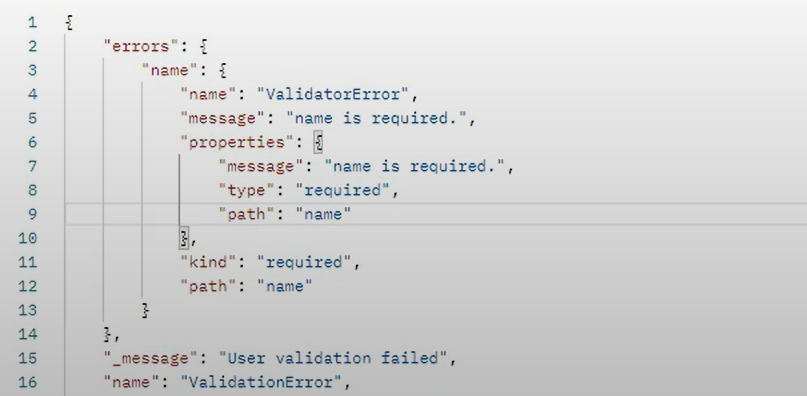

# Learning how to use Mongoose with MongoDB

## Table of Contents

### [Prerequisites](#prerequisites-1)

### [Introduction](#introduction-1)

### [Installation](#installation-1)

### [Setup](#setup-1)

### [Schemas](#schemas-1)

### [Conclusion](#conclusion-1)

### [AdditionalResources](#additionalresources-1)

## Prerequisites

1. [Javascript](https://developer.mozilla.org/en-US/docs/Web/JavaScript)
2. [NodeJS](https://nodejs.org/en/learn/getting-started/introduction-to-nodejs)
3. [MongoDB Atlas](https://www.mongodb.com/atlas/database)
4. [Express](https://expressjs.com/)

## Introduction

This tutorial will aim to help you start defining your own MongoDB schemas using Mongoose, showcasing many of Mongoose’s built-in features to help you create your MongoDB schemas as easily as ever. The prerequisites of this tutorial are having a basic understanding of JavaScript, a NodeJS Express project, and a MongoDB Atlas server.

## What is Mongoose?

Mongoose is an Object Data Modeling library that is primarily used to provide a way to help us easily model our data for MongoDB, using Javascript objects. Yes, it is possible to create your own NodeJS server with MongoDB without using Mongoose, but this tutorial aims to showcase how easy it would be to do it with Mongoose!

## Installation

```
npm install mongoose --save-dev
```

## Setup

In index.js, this will help you set up the server.

```
import mongoose from 'mongoose';
import express from "express"
const server = express()
const startServer = async () => {
	try {
		await mongoose.connect(
			“mongodb-atlas-server-url-here”
		)
		server.listen(port, () => {
			console.log(`server started at http://localhost:${port}`)
		})
	} catch (error) {
		console.error("Failed to start server", error)
	}
}
startServer()
```

## Schemas

Let’s say you want a basic User points system, to create a basic User schema for your project, it could be defined like this. The following schema denotes that we have a username and password which are strings as well as a points field which is an integer field.

```
import mongoose from "mongoose"
const Schema = mongoose.Schema;

const UserSchema = new Schema({
	username: {
	  type: String,
	},
	password: {
	  type: String,
	},
	points: {
	 type: Number,
	}
});
```

But this isn’t really exciting is it? It is just a simple basic User schema with nothing special. However, we realize that we don’t have a userId that would uniquely identify our Users right? Luckily Mongoose automatically generates an \_id field for us so we never have to worry about that unless we want a custom \_id. But in our case, we don’t need one.

Now is that it? No, it’s not, let’s say we want to perform some validation on our Schema, that’s when we can use Mongoose’s built-in validation features.

For example, what happens when someone creates a User without a username OR a password. That would be an invalid request right? So we can enforce that the username and password fields MUST always be present by using the “required” identifier. We can provide that the field is required and also provide a custom error message when someone creates a user without a username or a password

```
const UserSchema = new Schema({
	username: {
	  type: String,
	  required: [true, "name Is Required."]
	},
	password: {
	  type: String,
	  required: [true, "No Password Provided"],
	},
	points: {
	  type: Number,
	}
});
```

If a User was created without a required field such as the username, the following object would be sent back to the person who created the user. This is really helpful isn't it?


Now let’s say we also don’t want people with the same username since that doesn’t really make sense to have two people named SaplingStomper27 do we? We can achieve that by enforcing the “unique” field on our username.

```
const UserSchema = new Schema({
	username: {
	  type: String,
	  required: [true, "Username Is Required."],
  unique: true,
	},
	password: {
	  type: String,
	  required: [true, "No Password Provided"],
	},
	points: {
	  type: Number,
	}
});
```

Furthermore, we can improve our user model by having some sort of password validation right? Since when do websites allow us to have 2 letter passwords? We can add a minimum length requirement to our password using the “min” field. Of course, there are multiple other ways to increase our minimum password strength but I encourage you to look for yourself!

```
const UserSchema = new Schema({
	username: {
	  type: String,
	  required: [true, "Username Is Required."],
  unique: true,
	},
	password: {
	  type: String,
	  required: [true, "No Password Provided"],
 	  min: 6,
	},
	points: {
	  type: Number,
	}
});
```

Our Schema is looking better and better now! But there’s just one thing left that we could do to improve it. What happens when a user with no provided points is created? We should have a default value right? Since our points field isn’t required when we create a user, let’s add a field called “default” that would default our points field to 0 if and only if a points field wasn’t provided when someone was creating a user.

```
const UserSchema = new Schema({
	username: {
	  type: String,
	  required: [true, "Username Is Required."],
  unique: true,
	},
	password: {
	  type: String,
	  required: [true, "No Password Provided"],
 	  min: 6,
	},
	points: {
	  type: Number,
              default: 0
	}
});
```

Now, I think we can agree that this looks more sophisticated than what we had when we first started our Schema right? Now we can use our Schema to create a UserModel and then it is ready to be used in other parts of our server!

```
const UserModel = mongoose.model(“User”, UserSchema);
```

## Conclusion

Overall, after reading this tutorial on Mongoose Schemas, I hope you have a better understanding of how to use Mongoose in your NodeJS projects. It is such an easy way to perform validation on our Schemas and would reduce the amount of work we would need to do ourselves to validate any incoming data since Mongoose would do it for us! For next steps, I suggest looking at password hashing with Mongoose, since we are currently storing our password as plain text right now but it isn't really secure. It is a challenging topic to learn that is outside the scope of this tutorial but I hope this link will shed some more light on it! https://www.mongodb.com/blog/post/password-authentication-with-mongoose-part-1. Otherwise, I encourage you to look more into Mongoose if you are truly interested in becoming the best backend developer you can possibly become!

## AdditionalResources

Official Mongoose documentation:
https://mongoosejs.com/docs/api/mongoose.html

Extra Mongoose Setup guide:
https://www.mongodb.com/developer/languages/javascript/getting-started-with-mongodb-and-mongoose/
