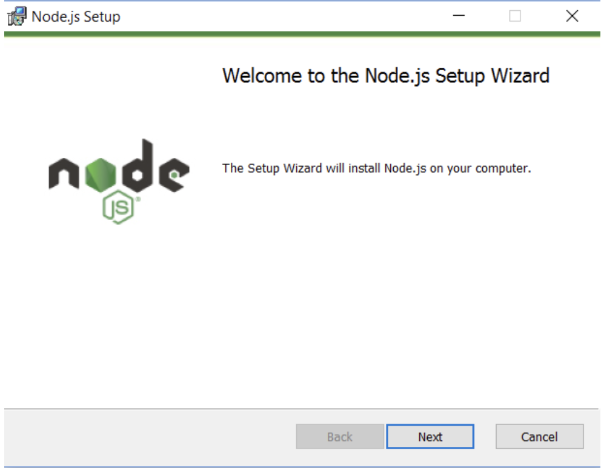
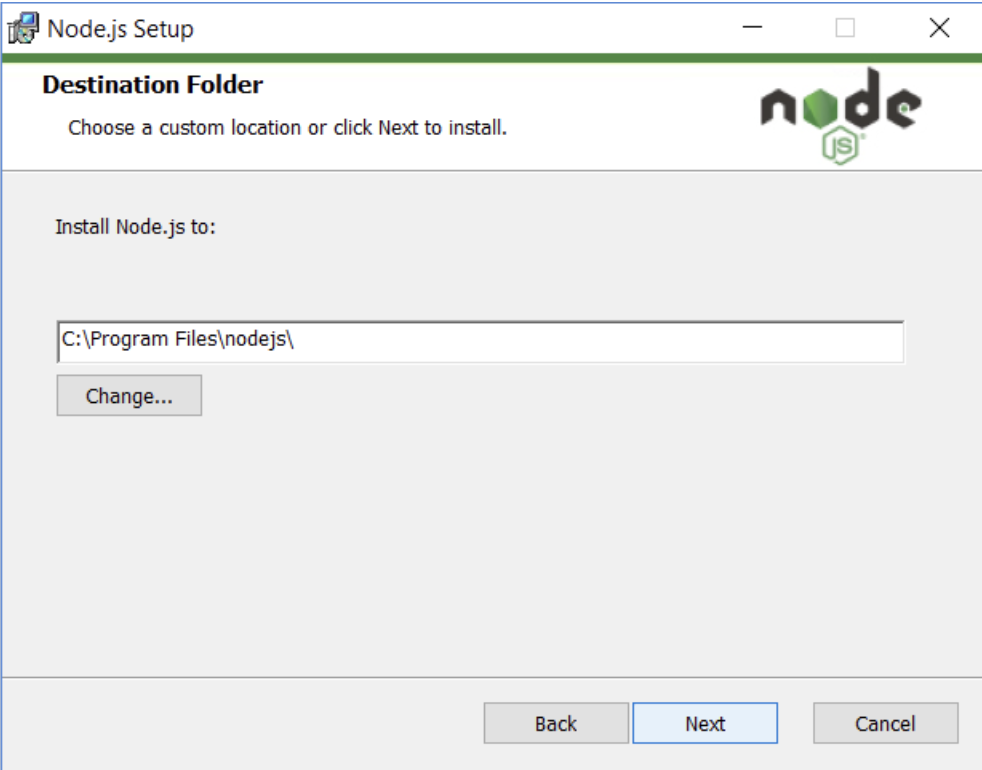
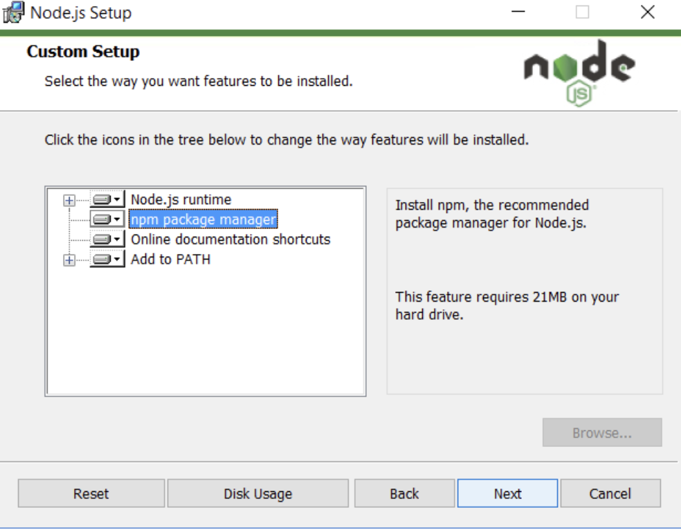

# Node.js Overview

## Introduction to Node.js

Node.js is an open-source JavaScript server environment. It's free and runs on various platforms (Windows, Linux, Unix, Mac OS X, etc.). Operating efficiently within a single process, it handles I/O operations without blocking, enabling it to manage numerous connections without the complexity of thread concurrency. Moreover, it empowers frontend developers familiar with JavaScript to seamlessly code on the server side and adapt ECMAScript standards without waiting for browser updates.

## Installation of Node.js

### On Windows

1. **Download the Installer:**  
    Download official Node.js for Windows from [here](https://nodejs.org/en/download/). Choose the right version for your local machine. Then a .msi file will be downloaded to your browser. Choose a location to save that file.
2. **Install Node.js and NPM:**  
    - Double-click the .msi binary files to initiate the installation process. You will see the following "welcome window":  
      
    - Click "Next" button. The installation process will start.  
    - Choose the path where you want to install Node.js and then click "Next", like the graph shown below:  
      
    - If you want to install NPM simultaneously, choose npm package manager on the custom setup page and click "Next", like below:   
      
    - And then click "Install".  
3. **Check Node.js and NPM Version:**  
    - Open "Command Prompt"
    - To confirm Node installation, type: `node -v`
    - To confirm NPM installation, type: `npm -v`

### On Mac

1. **Download the Installer:**  
    Download official Node.js for Mac from [here](https://nodejs.org/en/download/). Choose the right version for your local machine. Then a .msi file will be downloaded to your browser. Choose a location to save that file.
2. **Run Node.js Installer:**  
    The installer will be opened automatically, follow these steps:  
    Introduction > Continue License > Select Continue > Agree Installation Type > Install > Authenticate with your Mac to allow the Installation > Install Software Summary > Close.   
    The installation will be done.
3. **Verify Node.js Installation:**  
    - Open "Terminal"
    - Type: `node -v`  
4. **Install NPM using Homebrew:**  
    See details [here](https://changelog.com/posts/install-node-js-with-homebrew-on-os-x).

## Get Started with Node.js

Once downloaded and installed Node.js, try displaying "Hello World" in a web browser:

```javascript
const http = require('node:http');
const hostname = '127.0.0.1';
const port = 3000;
const server = http.createServer((req, res) => {
  res.statusCode = 200;
  res.setHeader('Content-Type', 'text/plain');
  res.end('Hello World\n');
});
server.listen(port, hostname, () => {
  console.log(`Server running at http://${hostname}:${port}/`);
});
```

- The createServer() is a method of creating new server.
- The server is set to port 300
- When a request is received, the request event is called and will provide two objects: a request and a response
- The request is usually set by json strings, see details here: https://www.tutorialspoint.com/nodejs/nodejs_restful_api.htm
- The response is used to return data to server, in this case it return a status of 200, the header and the "Hello World" argument.


## Additional Resources
- [Node.js Tutorial for Beginners](https://www.youtube.com/watch?v=TlB_eWDSMt4): a quick Node.js tutorial vedio for beginners
- [Node.js Crash Course Tutorial](https://www.youtube.com/watch?v=zb3Qk8SG5Ms&list=PL4cUxeGkcC9jsz4LDYc6kv3ymONOKxwBU): a comprehensive node.js tutorial
- [Node.js Tutorial W3school](https://www.w3schools.com/nodejs/nodejs_get_started.asp): A webside provides detailed Node.js learning materials

## Reference
- [Introduction and Installiation of Node.js](https://nodejs.org/en/learn/getting-started/how-to-install-nodejs)