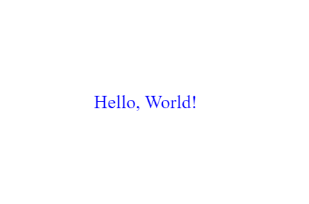
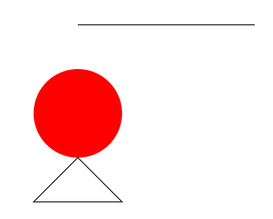
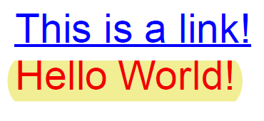

# Introduction to PDFKit
## Table of Contents
- [Introduction](#introduction)
- [Getting Started](#getting-started)
  - [Installation](#installation)
  - [Basic Usage](#basic-usage)
- [Features](#features)
  - [Text](#text)
  - [Images](#images)
  - [Vector Graphics](#vector-graphics)
  - [Annotations](#annotations)
- [Advanced Usage](#advanced-usage)
  - [Custom Fonts](#custom-fonts)
  - [Multipage Support](#multipage-support)
  - [Performance](#performance)
- [Conclusion](#conclusion)
- [References](#references)

## Introduction

PDFKit is a powerful PDF document generation library for Node.js and the browser. It enables developers to create complex PDFs from scratch or manipulate existing PDF documents. PDFKit provides an extensive set of features, including text, images, vector graphics, and more, making it suitable for a wide range of applications, from dynamic invoice generation to creating ebooks and reports.


## Getting Started

### Installation

To use PDFKit in your project, you first need to install it through npm, Node.js's package manager. Open your terminal and run:

```bash
npm install pdfkit
```

### Basic Usage

Here's a simple example of generating a PDF document with PDFKit:

```javascript
// Import PDFKit
const PDFDocument = require('pdfkit');
const fs = require('fs');

// Create a document
const doc = new PDFDocument();

// Pipe the document to a blob
doc.pipe(fs.createWriteStream('output.pdf'));

// Add some content
doc.fontSize(25).text('Hello, World!', 100, 100);

// Finalize the document and end the stream
doc.end();
```

This code creates a PDF file named `output.pdf` with the text "Hello, World!".

## Features

### Text

PDFKit allows you to add text with various styles and alignments. You can customize the font size, color, and type.
```javascript
// Add custom styled text
doc.fontSize(18) // Set font size
   .font('Times-Roman') // Set font type
   .fillColor('blue') // Set text color
   .text('Hello, World!', 100, 100); // Add text at position (x: 100, y: 100)
```



### Images

Adding images to your PDF is straightforward. PDFKit supports JPEG and PNG formats. You can control the positioning and scaling of images.
```javascript
// Add an image
const imagePath = 'path/to/image.png'; // Path to your image
doc.image(imagePath, 50, 150, { width: 300, height: 150 }); // Position (x: 50, y: 150) and scale to width 300, height 150
```


### Vector Graphics

PDFKit excels at drawing shapes and paths, enabling you to add lines, circles, and arbitrary paths to your documents.
```javascript
// Draw a line
doc.moveTo(100, 200) // Start point
   .lineTo(300, 200) // End point
   .stroke();

// Draw a circle
doc.circle(100, 300, 50) // Center (x: 100, y: 300), Radius: 50
   .fill('red'); // Fill color

// Arbitrary path (drawing a triangle here)
doc.moveTo(100, 350) // Start at this point
   .lineTo(150, 400) // Line to this point
   .lineTo(50, 400) // Line to this point
   .closePath() // Connect end to start
   .stroke(); // Stroke the path
```


### Annotations

You can include links, notes, and highlights in your PDF files, making it perfect for interactive documents.
```javascript
// Set the font size and fill color, then add text at position (x: 20, y: 20)
doc.fontSize(25)
   .fillColor('blue')
   .text('This is a link!', 20, 20);

// Measure the width and height of the string 'This is a link!' to use in annotations
const width = doc.widthOfString('This is a link!');
const height = doc.currentLineHeight();

// Add an underline beneath the text and a hyperlink annotation that links to 'http://google.com/'
// The underline and link cover the area defined by the text's width and height
doc.underline(20, 20, width, height, {color: 'blue'})
   .link(20, 20, width, height, 'http://google.com/');

// Set the fill color to red, then add a highlight annotation behind the text 'Hello World!'
// Following this, the text 'Hello World!' is added.
// The highlight covers the width of 'Hello World!' text and a fixed height of 25 units starting from the current document position (doc.y)
doc.fillColor('red').highlight(20, doc.y, doc.widthOfString('Hello World!'), 25).text("Hello World!");

```


## Advanced Usage

### Custom Fonts in PDFKit

PDFKit's support for custom fonts including TrueType (.ttf), OpenType (.otf), WOFF, and SVG formats opens up a wide array of typographic possibilities, making your documents visually appealing and tailored to your branding or design requirements. To use a custom font in PDFKit, you first need to have the font file accessible in your project. Here's a brief guide:

1. **Obtain the Font**: Ensure you have the correct format of the font you wish to use. If the font isn't freely available, you may need to purchase it from a type foundry or a font marketplace.
2. **Include the Font in Your Project**: Place the font file in a directory accessible to your PDFKit script.
3. **Load the Font into PDFKit**: Use the `font()` method to load your custom font. For example, `doc.font('path/to/your/font.ttf')` sets the current font to your custom font.

For more detailed instructions and examples, the PDFKit documentation is a valuable resource. While I can't link to external websites directly, the official [PDFKit website](http://pdfkit.org/) and its GitHub repository contain extensive guides and examples on how to integrate custom fonts.

### Multipage Support

PDFKit automatically handles page creation and management, allowing for dynamic document generation that spans multiple pages.

### Performance

When generating large or complex PDF documents with PDFKit, the library's performance optimizations become crucial. PDFKit is designed to handle vector graphics efficiently and manage memory usage to keep the generation process swift. For complex documents that include high volumes of data, intricate vector graphics, or numerous pages, PDFKit employs techniques like streamlining the rendering processes and optimizing data storage during generation.

To showcase complex document generation and the impact of PDFKit's optimizations, a practical approach would be to review case studies or tutorials that highlight these aspects. While direct examples or video tutorials can't be provided here, searching for "PDFKit complex document example" or "PDFKit performance optimization tutorial" in your favorite search engine should yield comprehensive guides and video demonstrations created by the community. These resources can illustrate how PDFKit handles complex document scenarios, from dynamic data visualization to generating extensive reports.

By delving into these resources, you'll gain a clearer understanding of how to leverage PDFKit's custom font capabilities and performance optimizations in your projects. Whether you're aiming to enhance the visual appeal of your documents with unique typography or ensure smooth and efficient generation of complex PDFs, PDFKit offers the flexibility and power to meet these needs.


## Conclusion

PDFKit is a versatile tool for PDF generation, offering a broad set of features for creating complex documents. Its ability to work both in Node.js environments and the browser makes it an excellent choice for a variety of applications. Whether you're generating reports, invoices, or custom documents, PDFKit provides the flexibility and power needed to create high-quality PDFs.

## References

- PDFKit Official Website: [http://pdfkit.org/](http://pdfkit.org/)
- GitHub Repository: [https://github.com/foliojs/pdfkit](https://github.com/foliojs/pdfkit)
