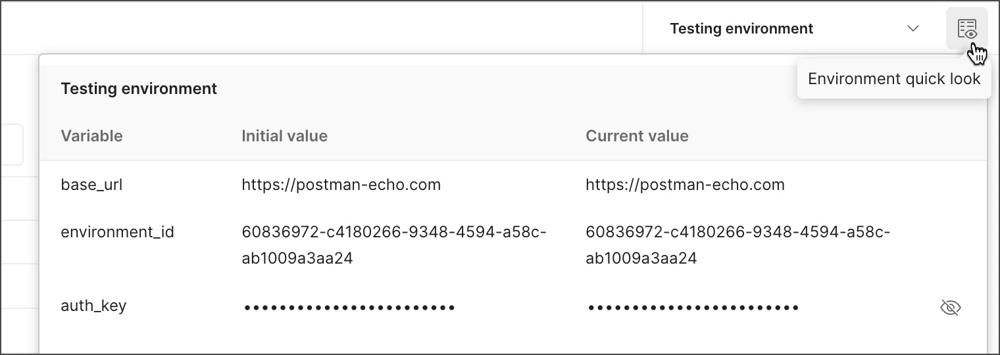

# Postman Environment - Group sets of your variables
## What is Environment
 * Environment is a set of one or more variables that you can reference when sending requests or writing test scripts. You can create environments for the different types of work you do in Postman. When you switch between environments, all of the variables in your requests and scripts will use the values from the current environment. This is helpful if you need to use different values in your requests depending on the context, for example, if you're sending a request to a test server or a production server.

 ## Why do we use Environment
 * Isolate configurations for different development stages
 * Data reusability & Test efficiency
 * Reducing errors when testing different variables

 ## How to create an Environment
 1. Select Environments in the sidebar (on the left) and select +.
    
 
 2. Enter a name for your new environment.
 
    

 3. Add any variables you want to the environment. You can also add variables later.
 
    

 4. [Important] Save environment variables you added. 
 
     

 5. To use the new environment, select it from the environment selector at the top right of the workbench. This makes it the active environment and sets all variables to the values specified in the environment.

    

### More about adding variables
When you add a variable to an environment, you can specify the Initial value (shared) and the Current value (local) for the variable:
* Initial value (shared) - This value is synced to your account using Postman's cloud servers. It's shared with any collaborators who have access to the environment. It's also made public when publishing an environment along with a collection. If the value includes sensitive data, such as a password or key, you can mask the value by selecting the secret variable type.
    
    

* Current value (local) - This value is used when sending requests in your local instance of Postman. It's never synced to your account or shared with your team unless you choose to persist it.

    

* Don't forget to save!

### Global variables
Global variables are a type of variable, accessible across all environments within Postman. This means that no matter which environment you switch to, global variables remain available.


## Switch between environments
* Postman displays the active environment in the environment selector, located in the top right of the workbench. When you send a request or run a script, Postman uses the current values for all variables in the active environment. To make another environment active, select it from the environment selector.

    

* You can also make an environment active by selecting Environments in the sidebar. Select the set active icon to an environment to make it the active environment.

    
* To check a variable's value at a glance, select the environment quick look icon Environment quick look icon next to the environment selector. The environment quick look lists the initial and current values for all variables in the active environment.

    

## Use variables in requests and scripts
* To use an environment variable in a request, reference it by name surrounded with double curly braces:
    ```javascript
    {{base_url}}
    ```
* You can reference environment variables in request URLs, parameters, headers, and body data. Hover over a variable reference to view its current value.

    

* You can access current environment variable values in your Pre-request Script and Tests code using the pm.environment.get method:
    ```javascript
    pm.environment.get("variable_name");
    ```

## References
[1]. https://learning.postman.com/docs/sending-requests/variables/managing-environments/
