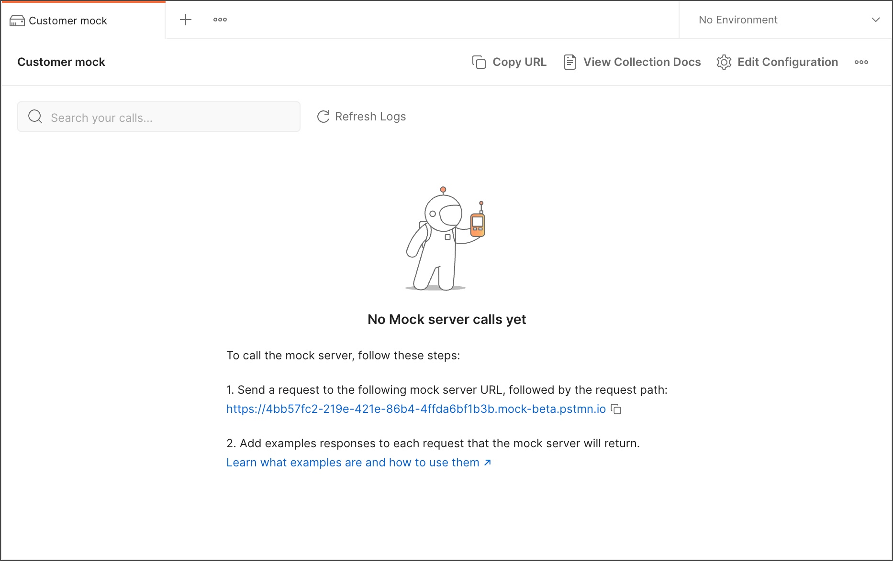

# Postman Mock Server

Postman enables you to create mock servers to assist with API development and testing. 
Mock servers simulate an API by returning predefined data, enabling you to develop or test an API before it's ready for production (or without using production data).
In this Postman mock server overview, 
we will go over how to set up a Postman mock server after you download postman and become familiar with how to use it to test your API endpoints.

## Create a collection with examples
Before you set up a new mock server, create a collection with the API requests you want to mock, then add saved examples to each request. The examples have the data you want the mock server to return in response to each request.

See Postman_Backend_Testing.md for how to install Postman, create workspace and collection, and send request.


## Create a Postman Mock Server
### Create from scratch
Select 'Mock Servers' in the sidebar, then select '+'. If you cannot find Mock Servers in the sidebar, click 'Configure workspace sidebar' at the bottom of the sidebar, then click 'Mock Severs' to make it visible.


Select an existing collection, or create a new collection and add an initial request.


### Create from a collection
Select Collections in the sidebar. Select the more actions icon next to the collection you want to mock and select Mock collection.


### Creating a mock from history
You can build a mock server based on requests from your Postman history. Select History in the sidebar, then select the more actions icon next to a request and select Mock Request. (You can also mock all the requests for particular date.)


## Configuring mock server details
1. Give your mock sever a name
2. You can select an optional environment to have your mock sever use environment variables. See Postman_environment_variables.md for details.
3. You can also configure a delay before the mock server sends responses to simulate network delays.
4. If you choose to make your mock server private, you need to add a [Postman API key](https://learning.postman.com/docs/developer/postman-api/intro-api/) in the request header when sending requests to the mock server: x-api-key:<Your-Postman-API-key>. If you share the collection, others can use their Postman API keys to make calls to the mock server.


After you finish selecting configuration options, select Create Mock Server. Postman displays the details you need to use the mock server. (You can get these details at any time by selecting Mock Servers in the sidebar and selecting the mock server.)



You can change the configuration for a mock server at any time. Select Mock Servers in the sidebar, select a mock server, and select Settings icon Edit Configuration.

Select Copy Mock URL to begin making requests to your mock server.

## Making requests to mock servers

### Send request

1. Use the mock server's URL to make calls to the mock server. Select Mock Servers in the sidebar, select a mock server, and select Copy Mock URL.
2. Make sure the request you want to mock has at least one saved example. You can send a request and save the response as an example. You can also define a custom example. 
3. Open a new request tab (or edit the address in an existing tab) and add the mock URL:

```
https://<mock-id>.mock.pstmn.io/<request-path>

```
For example: 

```
https://4bb57fc2-219e-421e-86b4-4ffda6bf1b3b.mock.pstmn.io/matches

```
Here the mock ULR is the mock ULR you copied from the Mock server details. You can add the request path you want to mock.

When you send a request to the mock server, the mock server sends back a response based on an example with the same path and method. You can provide multiple examples, and Postman will return the one that best matches your request.

### Adding examples to a request

#### Saving a response as an example
When saving a response in Postman, you have the option to save it as an example.

1. Select Collections in the sidebar.

2. Open a request and select Send.

3. In the response pane, select Save icon Save as Example.
   


#### Adding a custom example
With a custom example, you can define how both the request and the response look, including the status code and response body.

1. Select Collections in the sidebar.
2. Select the more actions icon More actions icon next to a request and then select Add example.
3. Enter a name for the example.
4. Edit the request part of the example.
- Add any parameters or headers as needed.
- Enter the request body and select a content type.
5. Edit the response part of the example.
- Enter a Status Code (such as 200 or 404).
- Enter the response body and select a content type.
- Add any headers as needed.
6. Select Save to save the example.
  


## Conclusion
If the APIs to be used in Production are still in development or we want to avoid sending requests on real time data, a mock server can be very useful.
A Postman mock server can simulate real API features with examples, verify APIs with mocking data, and help developer to identify errors and dependencies in API before it is released for actual usage. After reading the instruction, you should be able to set up and use your own Postman mock server.

## Additional resources
See [Postman Learning Center](https://learning.postman.com/) for more Postman resources.

## Citations
1. https://learning.postman.com/docs/designing-and-developing-your-api/mocking-data/mock-an-api/
2. https://learning.postman.com/docs/designing-and-developing-your-api/mocking-data/setting-up-mock/
3. https://learning.postman.com/docs/sending-requests/response-data/examples/#adding-an-example
4. https://www.tutorialspoint.com/postman/postman_mock_server.htm

