# Introduction to ROBLOX Studio

## Table of contents
#### [Introduction](#introduction-section)
#### [Download](#download-section)
#### [Creating a New Project](#creating-a-new-project-section)
#### [ROBLOX Studio HUD Overview](#roblox-studio-hud-overview-section)
#### [Getting Started with Your First ROBLOX Experience](#getting-started-section)
#### [Further Reading](#further-reading-section)
#### [References](#references-section)

## Introduction <a id="introduction-section"></a>
Let's be honest, I'm fairly certain most of you reading this know what ROBLOX is. In certain corners of the internet it's renowned as "the funny lego game" and is the source of many memes and cursed images.

But in case you didn't know, ROBLOX is a multi-billion-dollar platform that lets users create their own games (dubbed "experiences") in their own engine, which can then be uploaded to the ROBLOX website for all to see. Users can also create their own avatars that they can play as in these games.

It's kind of like Scratch (come on, you've gotta know what that is!), but instead of making projects by dragging and dropping code blocks, ROBLOX uses a full-on scripting language they call [Luau](https://luau-lang.org/). It's not as rich in features as something like Unity or Godot, but it's simple and easy to learn.

At first glance a lot of people may dimiss ROBLOX as not being a "real" game engine, mostly due to the blocky style that most games have:

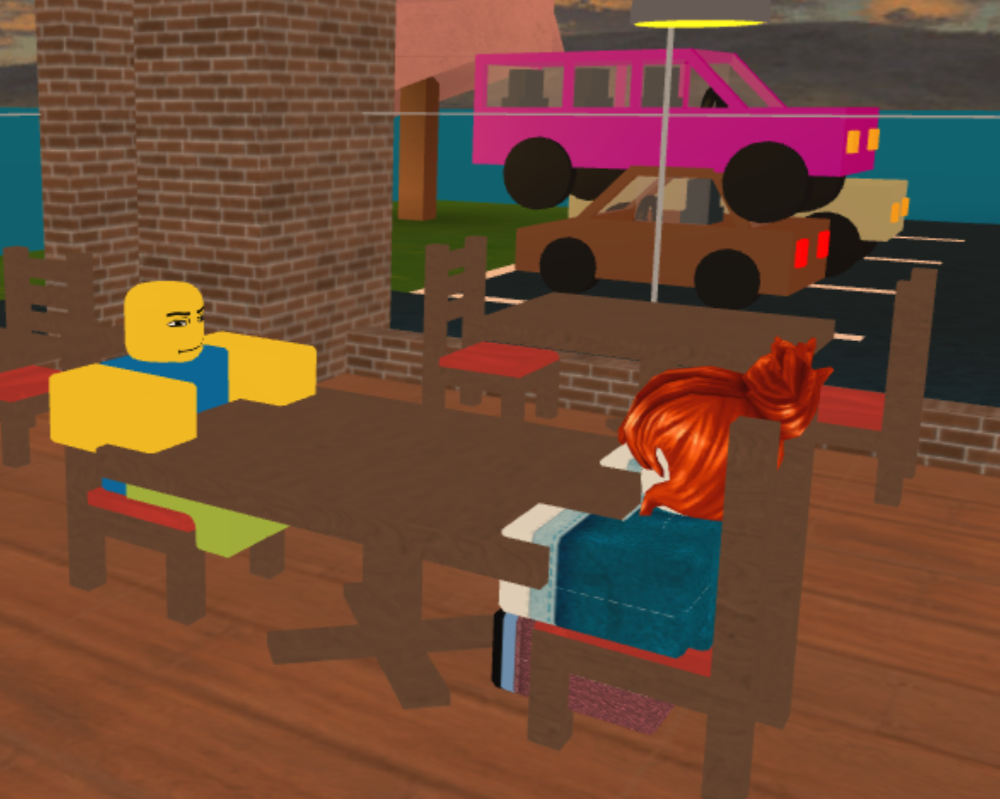
*Me having a chat with an NPC in "Work at a Pizza Place"*

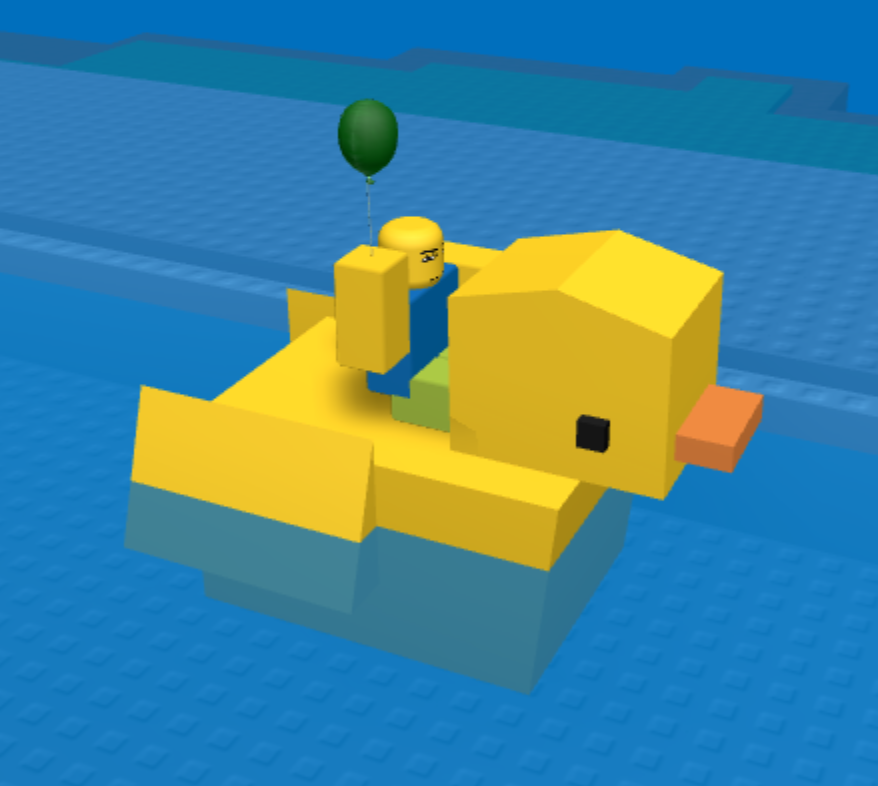
*Me on a rubber duckie in "Natural Disaster Survival"*

But the truth is, ROBLOX really is capable of some awesome things:

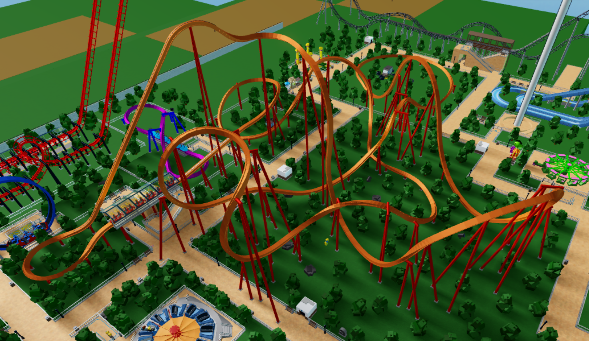
*One of my theme parks in "Theme Park Tycoon 2", which features an advanced coaster builder that can rival that of Planet Coaster (believe me, I've tried both!)*


*RetroStudio, which allows players to create their own games emulating different eras of ROBLOX - an engine made in ROBLOX itself!*

There are a lot more but then the introduction would be too long, so let's just get started.

## Download <a id="download-section"></a>
The first thing you'll need to do is create a ROBLOX account. Once you do that, you just need to head over to [the create page](https://create.roblox.com/landing) and download ROBLOX Studio. Easy!

## Creating a New Project <a id="creating-a-new-project-section"></a>
Upon opening ROBLOX Studio, you'll be greeted with this page:

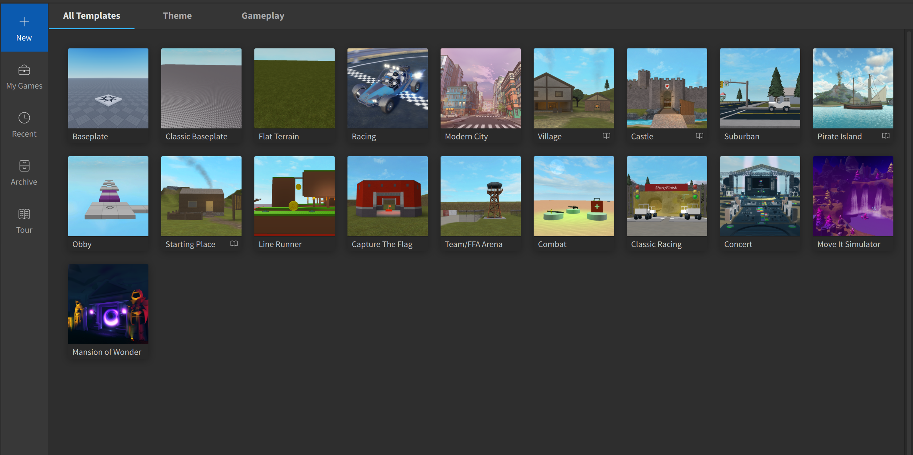

You can see there are many starter templates for you to choose from. Let's start simple and fresh with the second option, "Classic Baseplate."

## ROBLOX Studio HUD Overview <a id="roblox-studio-hud-overview-section"></a>
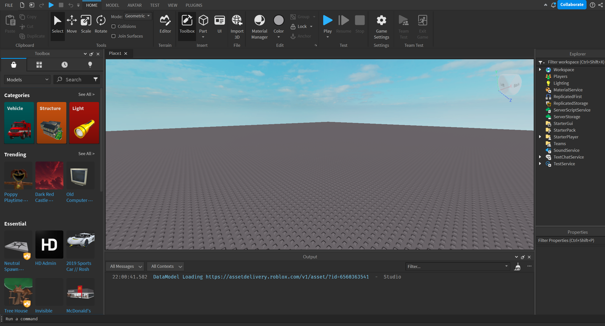

On the left side is the toolbox, this is where you can find lots of free models you can use. If you don't see it, you can enable it by pressing the "Toolbox" button in the top bar.

On the right is the explorer, where you can see the full object hierarchy of your game. At the bottom of it is the properties panel, where you can view the properties of selected objects.

In the middle of the screen is the camera. You can use the WASD keys to move the camera around, and right-click + drag to rotate it. You can hold the Shift key with WASD to move it slowly. You can also click and drag the scroll wheel to pan the camera.

At the bottom of the camera is the console output. If you don't see it, go to the View tab (at the top of the screen) and press the "Output" button. While you're at it, make sure the command bar is enabled by pressing the "Command Bar" button, too.

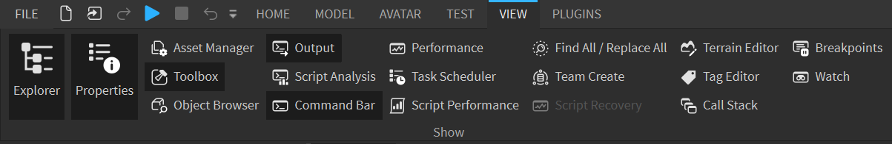

You can also enable the explorer and properties panel if you don't see them, too.

### The Workspace
Open up the workspace in the explorer panel, and you should see this:

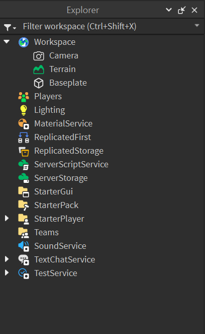

Look familiar? It's just everything currently in the game's playable area! The Camera refers to the main camera used when playing the game, the Baseplate is the giant grey block that forms the ground, and Terrain is the base object for any terrain in your game (we will ignore this for now, head to [Further Reading](#further-reading) if you want to know more).

### The Properties Panel
Select the Baseplate in the explorer and go to its properties.

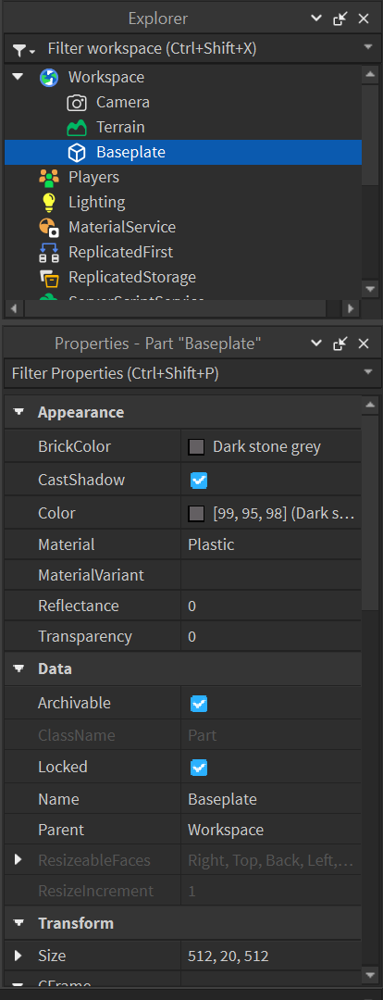

Notice that you can't select the Baseplate in the preview window. This is because of the *Locked* property. I recommend keeping this on as you don't want to accidentally select something so big.

In the Appearance section, you can play around with properties such as color, material, and transparency.

If you scroll down, you'll find a lot more properties such as size and position.

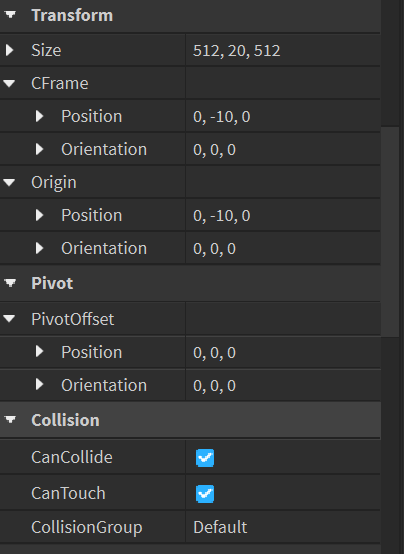

There are a lot more properties you can play around with and I encourage you to explore them!

### The Command Bar
ROBLOX Studio offers a command bar that can execute code while in the editor, instead of during runtime. Since ROBLOX doesn't have prefabs like in Unity, you can use the command line to loop through objects and apply properties en masse.

As an example, type in `print("Hello, World!")` in the command bar, hit enter, and look at what appears in the output window!

Remark: since Luau doesn't care about indentation, you can execute any program in the command bar!

## Getting Started with Your First ROBLOX Experience <a id="getting-started-section"></a>
### Scripting
The command bar is cool and all, but that only works in the editor. How would you go about scripting stuff during actual gameplay? The answer is with script objects!

We will create a simple script that prints `Hello, World!` when you playtest your game. In the explorer panel, right-click on ServerScriptService, click "Insert Object", and insert a new Script.

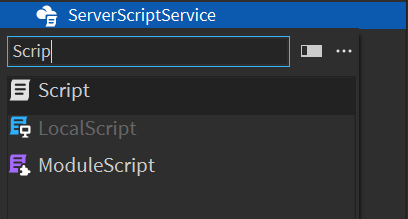

After inserting it, the script editor should automatically open with `print("Hello, World!")` already there. Now you can press the Play button (the blue arrow at the top of the window, or in the Home tab), and `Hello, World!` should appear in the console output.

### Making a Killbrick
For this tutorial we'll make a simple obstacle course, or "obby" as they're known in the ROBLOX community.

Let's start by making a brick that kills you upon touching it. This will serve as our obstacle. In the Home tab, click on Part > Block:

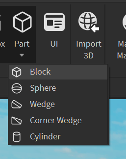

You should see a new block (named "Part") in the workspace! Select it and click again to rename it to "Killbrick" (or right-click > Rename). In the properties panel, change its colour to something red. You can either change its BrickColor or Color property. You should also anchor it by pressing the Anchor button in the Home tab (or check it in the properties window).

Remember the script we just made? In the explorer panel, drag and drop it onto the killbrick to parent it to it.

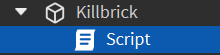

Double click the script to edit it. Let's start by referencing the brick itself:
```lua
local brick = script.Parent
```
`local` is a keyword that declares local variables. It's sort of like `let` in JavaScript. `script` refers to the script itself. The dot operator accesses members, children, and properties, and in this case we want to access the Parent property. The resulting variable `brick` now refers to our killbrick.

We want something to happen when the brick is touched. Luckily, [Part](https://create.roblox.com/docs/reference/engine/classes/Part), the class to which our killbrick belongs, contains a `Touched` event that fires exactly when this happens:
```lua
brick.Touched:Connect()
```
Events in ROBLOX are instances of the [RBXScriptSignal](https://create.roblox.com/docs/reference/engine/datatypes/RBXScriptSignal) data type. What's the difference between a class and a data type? A class is essentially something that can exist in the explorer panel by itself. Data types are other objects that are usually properties of classes.

Anyway, events have a `Connect` method that takes in a function (they are first-class citizens and so can be passed as arguments) to be executed when the event is fired. Some events emit arguments when fired, and the connected function can take them in as parameters. In this case, `Touched` emits the part that touched our killbrick:
```lua
brick.Touched:Connect(function(hitPart)
    -- hitPart refers to the part that touched it!
    print(hitPart)
end)
```
With this code, whatever limb we touch the killbrick with should show up in the console output.

When testing, you can actually see your own character in the workspace in the explorer panel:

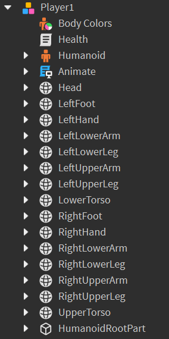

You can see the relation between limbs and your character model here. For example, when `RightFoot` touches the killbrick, `RightFoot` should be printed in the console.

[Humanoid](https://create.roblox.com/docs/en-us/reference/engine/classes/Humanoid) is the central object to any NPC or living thing. It contains information like health and character walk speed. If we want to kill a character, we must set the humanoid's Health property to 0. This is what we'll do:
```lua
brick.Touched:Connect(function(hitPart)
    local character = hitPart.Parent
    local humanoid = character.Humanoid
    humanoid.Health = 0
end)
```
As you could see from the above image, hit parts (limbs in this case) are parented to the player character, so naturally we use the Parent property to access the character itself. From there, we can use the dot operator to access the character's humanoid. Lastly, we set the health property to 0.

This works! When you playtest the game and walk over the killbrick, your character should die. However, there is a big caveat to doing it this way. What if something other than a character touches the killbrick? For example, a stray part controlled by physics parented to the workspace, or some other model without a humanoid child? Then the expression `character.Humanoid` would throw an error!

This is where the method [FindFirstChild](https://create.roblox.com/docs/reference/engine/classes/Instance#FindFirstChild) comes in handy, because it returns `nil` when the child isn't found rather than throwing an error. You can then use an if statement to check its existence before accessing its properties. The final code is:
```lua
local brick = script.Parent

brick.Touched:Connect(function(hitPart)
	local character = hitPart.Parent
	local humanoid = character:FindFirstChild("Humanoid")
	
	if humanoid then
		humanoid.Health = 0
	end
end)
```
Select your killbrick and hit CTRL + D to duplicate it. Do this twice, so you should end up with three in total. Arrange them in a line, and use the scale tool (found in the Home or Model tab) to change their size:

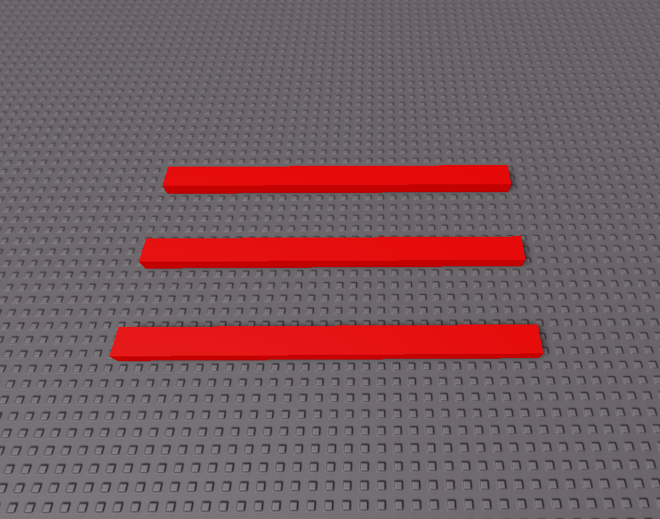

You now have obstacles that you can jump over! How fun!

### A Note on Scalability
Notice that the script is also duplicated for each killbrick. It's not hard to see that if you want to change one script, you'll have to manually change the others. And most obbies have hundreds of killbricks! How do we make this scalable?! If only ROBLOX had prefabs like in Unity!

 To solve this problem, we iterate over every killbrick and connect to each of their `Touched` events. This way we only need one script managing every killbrick. 

We could group all the killbricks into a folder and use [GetChildren](https://create.roblox.com/docs/reference/engine/classes/Instance#GetChildren) to iterate over them, but this limits how you can structure the workspace.

Another option is to tag each killbrick then use [Collection Service](https://create.roblox.com/docs/reference/engine/classes/CollectionService) to iterate over them. This is beyond the scope of this tutorial, however, but I'll leave a link in [Further Reading](#further-reading).

### Customizing the Player's Spawn Point
If you haven't noticed yet, every time you playtest your game your player spawns at the centre of the baseplate. This is because we haven't added our own [SpawnLocation](https://create.roblox.com/docs/reference/engine/classes/SpawnLocation) object yet. A SpawnLocation is essentially a special part that acts as your player's spawn point. It's rather self-explanatory.

In the explorer, right-click on the workspace, then "Insert Object", and search for a SpawnLocation. Then you can drag it to wherever you want - the default size is also rather big, so you can use the scale tool to size it down if you'd like.

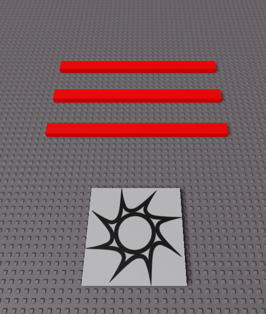

When you playtest, you should now spawn on the SpawnLocation. If you're facing the wrong direction, you can right-click on it and enable "Show Orientation Indicator" - from there you can rotate it so the blue dot, indicating the part's forward axis, is facing where you want it to.

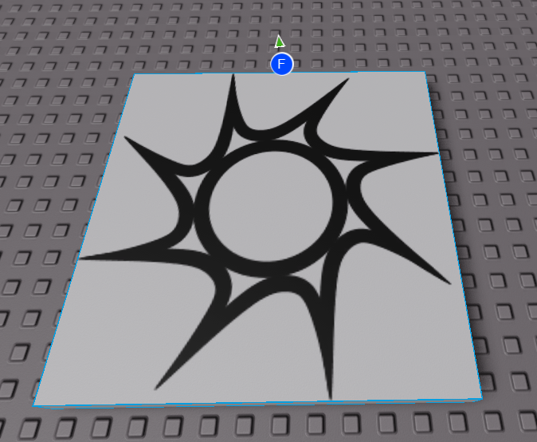

### Win Condition
It's not an obstacle course if there's no reward at the end! We will make the reward one of ROBLOX's classic gears: a Bloxy Cola.

First, we need to get the Bloxy Cola gear from the toolbox. If it isn't open already, open the toolbox from the button in the Home tab. Then, search for "bloxy cola" and select one of the top results. I will be using this one:

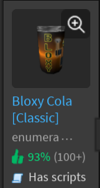

Click on it, and click "No" when it asks if you want to insert it into StarterPack. This will place the Bloxy Cola into the workspace. Move it to the end of your obby. Now when your character model touches the cola, it should be inserted into your inventory!

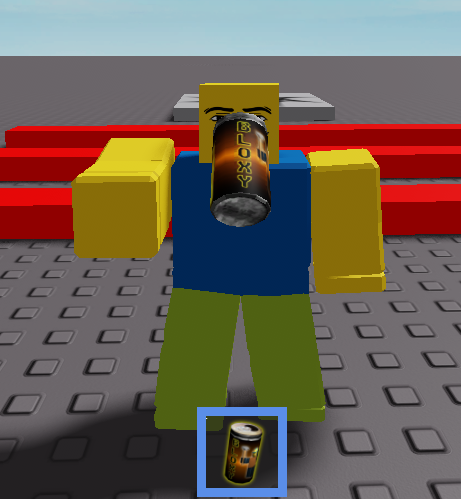

You can left-click with the cola equipped to drink it.

### Customization
The obby doesn't look very impressive right now. Or at least, mine doesn't - yours may vary depending on how much creative liberty you took:

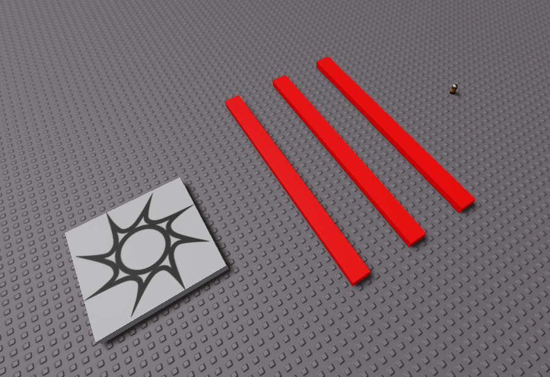

Try inserting new parts and using the Studio building tools (move, scale, rotate) to customize your obby to make it more complex and interesting!

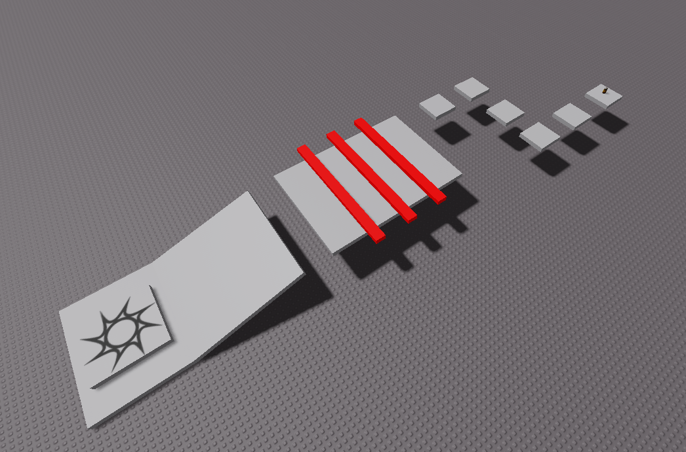

### Conclusion
You learned how to insert and manipulate parts, made a basic script, and learned how to use the toolbox. However, there's still a lot left for you to learn!

Check out the [official tutorial series](https://create.roblox.com/docs/en-us/tutorials) if you want to continue learning.

## Further Reading <a id="further-reading-section"></a>
[Client-Server Model](https://create.roblox.com/docs/projects/client-server)

[Collection Service](https://create.roblox.com/docs/reference/engine/classes/CollectionService)

[Official Tutorials](https://create.roblox.com/docs/en-us/tutorials)

[Scripts](https://create.roblox.com/docs/scripting/scripts)

[Terrain](https://create.roblox.com/docs/parts/terrain)

## References <a id="references-section"></a>
All screenshots were taken by me.

[Class Documentation](https://create.roblox.com/docs/en-us/reference/engine/classes)

[Data Type Documentation](https://create.roblox.com/docs/reference/engine/datatypes/)

[ROBLOX Create Page](https://create.roblox.com/landing)

[Luau](https://luau-lang.org/)

### Games Mentioned
[Natural Disaster Survival](https://www.roblox.com/games/189707/Natural-Disaster-Survival)

[RetroStudio](https://www.roblox.com/games/5846386835/RetroStudio)

[Theme Park Tycoon 2](https://www.roblox.com/games/69184822/Theme-Park-Tycoon-2)

[Work at a Pizza Place](https://www.roblox.com/games/192800/Work-at-a-Pizza-Place)
