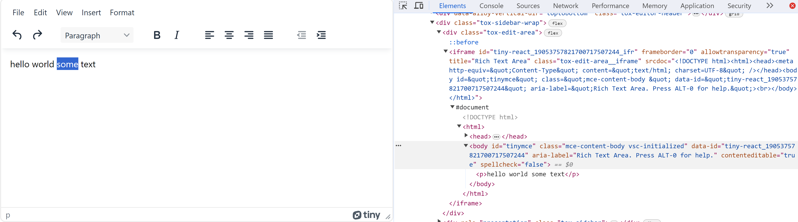
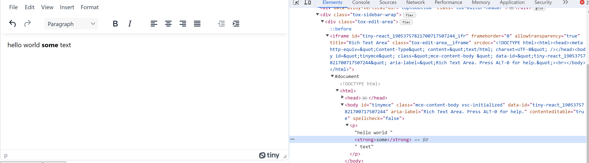

## TinyMCE API with ReactJS

### What is TinyMCE API
TinyMCE API is an free API that allows you to add an [WYSIWYG(what you see is what you get)](https://en.wikipedia.org/wiki/WYCIWYG) HTML editor on your website. WYSIWYG HTML editors are editors that automatically applies the markup code. For example, an user can select some words and ctrl+B to bold it. The bolding would be shown to the user, and the tag "strong" is added to the HTML code. Below is screenshots of before and after bolding. 


This API essentially provides an interactive textbox. For example, users can enter text, image and more in the textbox. This API is especially helpful if your app is heavy on editing or involves a lot of text changes from the user. Examples may be if you develop a online editing assistant tool like Grammerly.

### Relevant links:
Github: https://github.com/tinymce/tinymce
Official website: https://www.tiny.cloud/
Documentation: https://www.tiny.cloud/docs/

### Steps to integrate TinyMCE API to your React app:
* Prerequisites: Node.js and npm
below is an article about getting them if you don't have them installed
https://radixweb.com/blog/installing-npm-and-nodejs-on-windows-and-mac

1) Run the following commands:
- if you already have an React App:
    - cd into your React App
    - run  ```$ npm install --save @tinymce/tinymce-react``` in terminal.
- if you don't have an React App:
    - create app: ```$ npx create-react-app tinymce-react-demo```
    - cd into directory: ```$ cd tinymce-react-demo```
    - install: ```$ npm install --save @tinymce/tinymce-react```

2) Now that you have your App and TinyMCE installed, open App.jsx (or your main file) and add in the editor by importing from tinyMCE and calling it in your main function.
```
import { useRef } from 'react';
import {Editor} from '@tinymce/tinymce-react';
function App(){
    return <>
    <Editor apiKey='yourapikey' onInit={(evt, editor)=>editorRef.current=editor}/>
    </>
}
export default App;
```

3) Lastly, you may notice an yellow warning saying "This domain is not registered with Tiny Cloud. Please see the quick start guide or create an account." on your webpage if you try running it. This is because we still need to get the API key. To get the key, sign up through https://www.tiny.cloud/auth/signup/ and on your homepage, select React (or other if you want to integrate this API with other techstacks like Vue.js). Scroll down to find the API key, and paste it in the apiKey section in your code.

Congratulations! Now you have an interactive textbox on your website, feel free to explore more about this API on their official website at https://www.tiny.cloud/.
Thank you for reading.