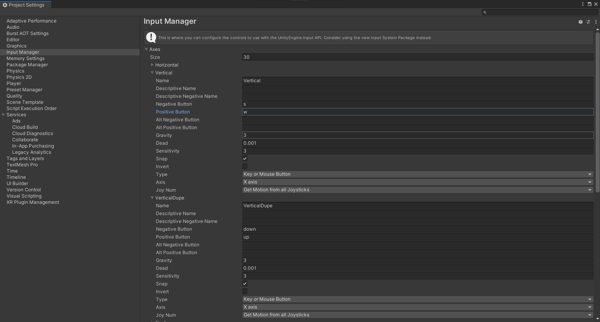

# Unity2D Tutorial: 2D Physics For PONG!

## Table of Contents
1. [Introduction](#introduction)
2. [Setting Up the Scene](#setting-up-the-scene)
3. [Creating Physics Objects](#creating-physics-objects)
4. [Applying Forces](#applying-forces)
5. [Collision Detection](#collision-detection)
6. [Conclusion](#conclusion)

## Introduction
This tutorial will guide you through implementing physics in Unity2D for a PONG! game. You can easily apply concepts learnt here to many other top-down games like Rimworld or even platformer/sandworld games such as Terraria. 

This tutorial assumes you have a basic understanding of how Unity works, and are familiar with Unity's editor UI. Regardless, the tutorial will break the steps down into detail.
If not, then it is highly recommended that you check out the [Unity Basics](https://learning-software-engineering.github.io/Topics/Tech_Stacks/Unity_Intro.html#get-started-with-making-your-first-unity-game) page.  
This tutorial is focused on game mechanics rather than art, so we will be using primitive graphics assets such as squares and circles. Feel free to use your own assets in place of these.
We will use Editor Version 2021.3.4f1 for this, under a Student License.
Unity's primary scripting language is C#, so we will assume a basic understanding of it. Regardless, we will provide all the code for it but not offer explanations.

## Overview
Understanding physics is crucial for creating realistic interactions between game objects. This tutorial will focus on the built-in physics manager in Unity2D, and how we can use that to our advantage when we are making a simple game of PONG! You are more than welcome to program your own physics using scripts, but the built-in physics manager in Unity2D is a good place to start, especially for standard Newtonian physics.

## Setting Up the Scene
Start by creating a new 2D project in Unity. We will use the 2D Core preset, labelling it Pong-Trial.

Once you open the project, you should be greeted with an empty scene. The only thing in your scene should be a gameobject called Main Camera.
The first we will do is set the background color to whatever color you want. For this tutorial, we will use white.
To do so, click on the Main Camera object in your heirarchy. Doing so will bring up the gameobject's inspector. The inspector holds information on the different components attached to a gameobject. All gameobjects have a component called Transform (or RectTransform if it is a UI object). The transform component defines various parameters for the object. Namely, its position in space, its rotation, and its scale relative to its default size. Components are what defines what an object is and does. For example, the main camera additionally has a Camera component and an Audio Listener component. The Camera component is what allows our main camera gameobject to function as a camera. This also means that we can add additional, custom functionalities to our gameobjects by creating scripts and attaching them as components. To change the camera's background to white, in the inspector, we will select the Background property in the Camera component and change it to white.

## Creating Physics Objects
1. **Create a Player Objects:** Next, we will create a player object. Our player will be a rectangle. To make the player, right click on empty space in the heirarchy and nagivate to 2D Object -> Sprites -> Square. This will create a new gameobject with a sprite renderer component attached to it. Name it player (or anything you want).

For the sake of simplicity, I will name this square as Player1. Edit the "Scale" of the square to resemble a rectangle in the right hand pane. Additionally, change the color of the square to be black, in order to contrast the white camera background.

2. **Player 2 Object:** A game of PONG! is not possible without another player. Our lonely paddle needs another friend. And so, we must make space for the aforementioned friend. Move the "Player1" paddle towards the left hand side of the camera. This can be done via drag/drop or simply by editing X-Axis on the "Position" property under the "Transform" tab. Since position is relative to the camera, a negative X-Axis value will transpose the rectangle to the left, and vice vera for a positive X-Axis value.

Given that we already have a paddle working wonderfully, we can simply copy and paste this paddle! Use your desired method (right click, CTRL+C->CTRL+V) and create a copy of "Player1". Here is what you can expect to see:

It is very easy to fix the two overlapped paddles. Remember to always select objects from the heirarchy frame on the left hand side of the screen. Rename the copy to "Player2", or whatever you prefer! Move it to the right hand side of the camera, and now we have two paddles. 

3. **Adding A Ball:** Our paddles need a ball to play with. Simply use the aforementioned "Player1" creation method to create a square as a ball. Place it at the center of the camera, for the sake of symmetry:

(Zoom in your editor if the camera icon covers the ball)

4. **Add Walls:** We add walls to the scene as well, making sure the ball will not fly off screen, never to be seen. This follows the same principles as making a rectangle. Create a TopWall, BottomWall, LeftWall and RightWall. Choose your own scales and positioning for the walls. Here is the end result:

5. **Adding Colliders:** Now this is where the real beauty and the sheer easiness of using the Unity2D physics shines the brightest. Simply highlight all your objects, aside from the camera. 

Then, navigate to the right hand side of the screen and select "Add Component". Search for "collider" and then, select "Box Collider 2D".

From here, you should see your objects highlighted in a different color. This represents the hitbox of your sprites. This means that other sprites with a hitbox will recognize this hitbox, and react accordingly. 

If you ever wonder why Mario does not hit the clouds shown in the sky as he jumps up and down, now you know that it is simply because the cloud sprites have no hitbox (or collider).

6. **RigidBody2D:** It is not enough for all of our objects to simply have hitboxes. Our objects must respond to them to. Select the Player1, Ball and Player2 object, and add the RigidBody2D component to them and set the gravity scale to 0. This prevents the paddle and ball from falling to the bottom of the camera.

The Rigidbody2D component in Unity is a physics component that allows GameObjects to interact with Unity's 2D physics engine. When you attach a Rigidbody2D to a GameObject, it enables that GameObject to respond to physics forces like gravity, velocity, and collisions. 

## Applying Forces
1. **Movement:** First, we setup movement in the Unity editor. Top of your screen, click on "Edit" -> "Project Settings...". Navigate to "Input Manager" and then click on "Axes". From here, on the dropdown, you should see two "Vertical" inputs. Since our game of PONG! does not need horizontal inputs, we do not care about them. Delete one of the vertical input arrays, and duplicate the other one. This signals to Unity that we have a local two player setup, rather than two ways of playing single player.

From here, drop down "Vertical" and "VerticalDupe". Change it so that they have no alternate settings, one of them follows "WASD" convention and the other follows the Arrow key convention. 

2. **Scripting Paddles:** Now that has been done, we will use C# scripts to attach the inputting to the paddles. For the sake of this tutorial, I assume you know how to do that. But for a quick review: 

- Create a paddle script
- Drag and drop it into Player1 and Player2

- Here is what your paddle script should look like:

- Drag and drop rigidbody onto the script component within the Player1 and Player2 object. In our case, tick "isPlayer1" for Player1, and don't tick for Player2. Set speed to "5". 

3. **Scripting Ball:** We need to use one more C# script to make the ball bounce. Create a new script, and here is what it should look like:

Attach this script to the ball. Put a speed of 5 and attach RigidBody2D to the ball. 

And there you go! Click play on the top and the ball should bounce around, and hit the paddles. But oh no, something is still amiss! My ball hit the paddle once and the paddle is lopsided:

4. **Cleanup:** This is where we make tweak our physics to obey game logic. Right click and "Create->2D->Physics Material 2D to create" a new 2D material, set bounciness to 1 and the other property to 0.

Click on our Ball and attach this material to the Ball's RigidBody2D. Under the Constraints tab, select "Freeze Rotation Z".

As for the paddles, we do not need any material. But we will "Freeze Rotation Z" and "Freeze Position X".

And you are done! 

Now click play on the top of your screen and have fun messing around with your fully functional paddles and ball.

## Conclusion
In this tutorial, we explored how to implement physics in Unity2D for a PONG! We covered setting up the scene, creating physics objects, applying forces for movement, and implementing basic collision detection.

By following this tutorial, you should now have a basic understanding of how to use Unity's built-in physics engine to create simple 2D games. You can apply these concepts to other game projects and experiment with different gameplay mechanics.

Remember, game development is a creative process, so feel free to customize and expand upon the ideas presented here to create your own unique games. Happy game development!