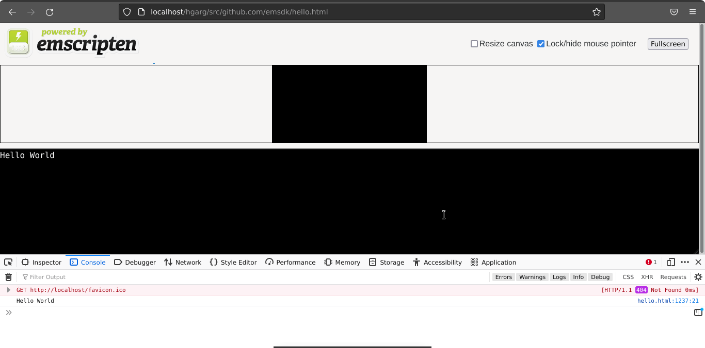

# What is Web Assembly?

## Introduction

Web Assembly (or commonly Wasm) is a binary instruction format designed as a portable compilation target for high-level
programming languages like C, C++, and Rust. It allows these languages to be used for web development while providing
performance close to that of native code. WebAssembly is designed to be executed in a virtual machine that runs in web
browsers, making it a key component of web technologies.

## Key Advantages

* **Efficiency:** Wasm is designed to be low level code that can be efficiently executed on the browser's virtual machine. It aims to provide near native performance, allowing intensive tasks to be carried out in the browser.
* **Portability:** One of the main goals of Wasm is to be platform independent and work across different architectures and devices. This means tha once a program is compiled into WebAssembly it can be executed anywhere that supports the Wasm runtime.
* **Security:** WebAssembly runs in a sandboxed (virtual) environment within web browsers, providing a layer of security. It is designed to be memory-safe and to prevent security vulnerabilities that might arise from running untrusted code on the client side.
* **Compatibility:** WebAssembly is designed to work alongside JavaScript, allowing developers to use both languages within the same web application. This enables incremental adoption, where developers can choose to use WebAssembly for specific performance-critical components while still leveraging the capabilities of JavaScript for other parts of their applications.
* **Development Languages:** While Wasm isn't tied to any particular languages, it is commonly used with languages like C, C++, and Rust due to their ability to compile into efficient and compact binaries.

## Getting Started

To get your feet wet and jump into WebAssembly, we will provide a simple example for running C code on the browser using Wasm.
Once you've written a code module in C, we can use a tool like [Emscripten](https://emscripten.org/) to compile it into WebAssembly.

Setup this prerequisite by following the instructions here: https://emscripten.org/docs/getting_started/downloads.html

Firstly, we'll need an example C file to compile. Create a hello.c file with the following sample code:
```c
#include <stdio.h>

int main() {
    printf("Hello World\n");
    return 0;
}
```

Then, using the terminal window you used to enter the Emscripten compiler environment, navigate to the same directory as your hello.c file and run the following:
```bash
emcc hello.c -o hello.html
```

The -o flag tells emcc to generate a HTML file to run our code in.

## Running Your Example

You need to run your example .html file through a web server, and cannot just open it on your local hard drive.
To do this, follow the instructions on this page: https://developer.mozilla.org/en-US/docs/Learn/Common_questions/Tools_and_setup/set_up_a_local_testing_server

Once you have run your server, if everything works as expected you should see "Hello World" output in your browser's console.



## Sources & Additional Reading

WASM Example: https://developer.mozilla.org/en-US/docs/WebAssembly/C_to_wasm \
WASM Project and Documentation: https://webassembly.org/

