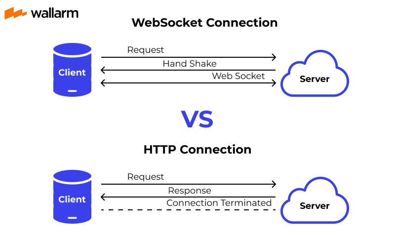

# Building Interactive Web Applications with WebSockets

## Table of Contents
1. [Introduction](#introduction)
2. [Understanding WebSockets](#understanding-websockets)
3. [WebSockets vs HTTP](#websockets-vs-http)
4. [Advantages and Disadvantages](#advantages-and-disadvantages)
5. [Setting Up](#setting-up)
6. [Real-World Use Cases](#real-world-use-cases)
7. [Conclusion](#conclusion)
8. [Further Reading](#further-reading)

## Introduction
In the evolving landscape of web development, the need for real-time, interactive web applications is more prominent than ever. Users expect dynamic experiences with instant updates—be it in chat applications, live sports scores, or stock market feeds. WebSockets represent a significant advancement in web communication, allowing for real-time, full-duplex communication between the client and server. This technology is especially relevant to the CSC301 curriculum as it introduces students to modern web development practices, preparing them for the challenges of developing interactive, user-centric software solutions.

## Understanding WebSockets
WebSockets are a powerful protocol embedded within the familiar web technology stack, enabling a significant leap in communication capabilities over the Internet. They provide a way to overcome the limitations of the traditional HTTP request-response model, especially when it comes to real-time, low-latency communication.

Unlike HTTP, where a new connection is established for each request and response, WebSockets establish a single, persistent connection between the client and the server. This connection is initiated by the client sending a special type of HTTP request, asking the server to upgrade the connection to a WebSocket connection.

### How the WebSocket Connection is Established:
1. **Client Handshake Request:** The client initiates the connection by sending a WebSocket handshake request to the server. This request looks like a standard HTTP request but includes an `Upgrade: websocket` header that signals the desire to establish a WebSocket connection.
   
2. **Server Handshake Response:** If the server supports WebSockets and accepts the connection request, it responds with a handshake of its own, confirming the upgrade from HTTP to WebSockets.
   
3. **Persistent Connection:** With the handshake complete, the connection remains open, and data can now be sent in either direction at any time, allowing for two-way, **real-time communication**.

### WebSocket Communication:
Once established, the WebSocket connection allows messages to be passed back and forth between the client and server with minimal overhead. Each message is framed in a standardized format, which can be quickly parsed and processed by both parties. This efficient messaging system is key to the protocol's ability to support high-frequency, real-time communication scenarios.

WebSockets are particularly adept at handling use cases where the server needs to send data to the client proactively, without the client first making a request. This capability has led to the widespread adoption of WebSockets in various applications that require real-time functionality, such as live notifications, instant messaging, and collaborative editing platforms.

In the context of CSC301, understanding WebSockets is essential for building modern applications where real-time user interaction is a core requirement. With WebSockets, software engineers can create responsive and interactive user experiences that were once difficult to achieve with traditional web technologies.



## WebSockets vs HTTP
HTTP, a foundational technology of the web, is designed around a stateless request-response model. This means that for each piece of data exchanged between the client and server, a new connection is initiated, followed by a request from the client and a response from the server. While effective for many web applications, this approach can introduce latency and inefficiency, especially in scenarios that demand real-time updates.

In contrast, WebSockets offer a more dynamic communication protocol. After completing an initial handshake, WebSockets establish a stateful, two-way communication channel. This persistent connection remains open, allowing for continuous data exchange without the need to establish new connections for each interaction. This fundamental difference in operation between WebSockets and HTTP brings several notable advantages in specific contexts:

- **Reduced Latency:** By eliminating the need for repeated HTTP handshakes, WebSockets significantly decrease latency, making them ideal for time-sensitive applications.
- **Real-time Data Flow:** The open communication channel enables real-time data exchange. This is particularly beneficial for applications requiring immediate updates, such as online gaming, live sports updates, and financial trading platforms.
- **Efficient Resource Utilization:** Operating over a single, persistent connection, WebSockets make more efficient use of server and network resources compared to the HTTP model, which opens and closes connections for each request/response pair.

## Advantages and Disadvantages

### Advantages
- **Real-time Communication:** The essence of WebSockets is the ability to foster live interactions. This real-time capability is a game-changer for applications that require immediate user feedback, such as chat platforms, live sports updates, and multiplayer online games. 
  
- **Lower Overhead:** Traditional HTTP requests carry a hefty payload of headers and handshake protocols, which can bog down communication, especially when you only need to send small amounts of data frequently. WebSockets streamline this process by maintaining an open connection after the initial handshake, thereby cutting down the data overhead significantly.

- **Flexibility:** WebSockets aren't picky about the type of data they carry. Whether you're sending plain text for a chat message, binary data for a complex game move, or custom data structures, WebSockets handle them all with ease. This versatility enables developers to be creative in how they structure the data exchange in their applications, leading to innovative and effective solutions.

### Disadvantages
- **Complexity in Handling Connections:** While WebSockets simplify communication, they introduce complexity in managing these connections. Unlike HTTP, where each request is stateless and independent, a WebSocket connection is a continuous two-way street. Developers need to implement robust systems to manage these connections, handle errors gracefully, and ensure that messages are processed in an orderly fashion.

- **Compatibility and Support Issues:** Despite the widespread adoption of WebSockets, there are still compatibility concerns, especially with older web browsers. As of now, all modern browsers support WebSockets, but if your user base includes individuals using older versions of Internet Explorer or other legacy browsers, you might face compatibility challenges. 

- **Security Considerations:** Keeping a connection open raises the stakes in terms of security. WebSockets are susceptible to similar threats that plague other web technologies, such as cross-site scripting (XSS) and cross-site request forgery (CSRF). Securing these connections with TLS (Transport Layer Security), the same technology that underpins HTTPS, is essential to prevent eavesdropping and ensure that the data integrity is maintained. Implementing WSS (WebSocket Secure) ensures that the communication is encrypted, safeguarding against interception and tampering.

## Setting Up

Creating a WebSocket connection involves two main components: a server that accepts connections and a client that initiates the connection. Below are step-by-step instructions and explanations for setting up a basic WebSocket server using Node.js and a client using JavaScript.

### Server Setup

The server's role is to listen for incoming WebSocket connections and handle them appropriately. The `ws` library for Node.js simplifies the creation of a WebSocket server.

```javascript
// First, you need to import the ws library.
const WebSocket = require('ws');

// Create a WebSocket server by instantiating a new WebSocket.Server object.
// The server listens on port 8080 for incoming connections.
const wss = new WebSocket.Server({ port: 8080 });

// Set up an event listener for 'connection' events.
// This event is emitted whenever a new client connects to the server.
wss.on('connection', function connection(ws) {
  
  // Inside the connection event listener, set up another listener for 'message' events.
  // The 'message' event is emitted when a message is received from a client.
  ws.on('message', function incoming(message) {
    
    // Log the received message to the console.
    console.log('received: %s', message);
  });

  // Send a message back to the client to acknowledge the connection.
  ws.send('Hello, client! Message from the server...');
});
```
In this setup, the server listens on port 8080. When a client connects, the server prints received messages to the console and sends a greeting message back to the client.

### Client Setup
The client initiates the connection to the WebSocket server and defines how to handle different types of events like opening the connection, receiving messages, errors, and closing the connection.

```javascript
// Create a new WebSocket instance, specifying the URL of the WebSocket server.
var ws = new WebSocket('ws://localhost:8080');

// Define the 'onopen' event handler.
// This function is called when the WebSocket connection is successfully established.
ws.onopen = function() {
  
  // Send a greeting message to the server.
  ws.send('Hello! Message from the client...');
};

// Define the 'onmessage' event handler.
// This function is called when a message from the server is received.
ws.onmessage = function(event) {
  
  // Log the message from the server to the console.
  console.log('Message from server:', event.data);
};

// Define the 'onerror' event handler.
// This function is called when an error occurs with the WebSocket connection.
ws.onerror = function(error) {
  
  // Log the error details to the console.
  console.error('WebSocket Error:', error);
};

// Define the 'onclose' event handler.
// This function is called when the WebSocket connection is closed.
ws.onclose = function(event) {
  
  // Log the fact that the WebSocket connection has been closed.
  console.log('WebSocket connection closed:', event);
};
```
In the client code, a WebSocket object is created and connected to ws://localhost:8080. Event handlers are defined for various events. When the connection is opened, a message is sent to the server. Incoming messages are logged to the console, and any errors or connection closures are handled appropriately.

Note: Ensure that the WebSocket server is running before attempting to connect with the client, as the client will not be able to establish a connection if the server is not listening for connections.

## Real-World Use Cases
WebSockets are not just a technical curiosity; they power some of the most interactive and dynamic applications on the web today. Here are a few examples where WebSockets are used to create engaging user experiences:

### Chat Applications
Perhaps the most common use case, real-time chat applications like Slack and WhatsApp Web, rely on WebSockets for instant messaging. By using WebSockets, these platforms can deliver messages between users with minimal latency, making conversations flow as smoothly as they do in person.

### Financial Tick Data
In the world of finance, every second counts. WebSockets are used by platforms like trading websites and stock market monitoring apps to stream live price updates to users. This allows traders to make informed decisions based on the most current data available, without refreshing their browser.

### Collaborative Editing
WebSockets enable multiple users to edit the same document simultaneously, as seen in Google Docs. Changes made by one user are instantly visible to all other users working on the document, with no need for page reloads. This seamless collaboration is made possible through the use of WebSockets.

### Online Gaming
Real-time multiplayer online games use WebSockets to sync game state across clients. This ensures that all players see the game world change in real-time, based on the actions of every player, creating a cohesive and immersive gaming experience.

### Streaming Services
Live video streaming platforms like Twitch use WebSockets to manage chat and interactions in real-time. Viewers can comment and react to the stream as it happens, creating a dynamic community experience around the content.

## Conclusion
WebSockets have significantly changed the landscape of web development, making real-time web applications not just feasible but efficient and scalable. For CSC301 students, understanding how to implement and leverage WebSockets is crucial for building modern web applications that meet user expectations for interactivity and performance. As the web continues to evolve, technologies like WebSockets will play a key role in shaping its future.

## Further Reading
To dive deeper into WebSockets and how they can be used in your projects, consider exploring the following resources:

- [The WebSocket API](https://developer.mozilla.org/en-US/docs/Web/API/WebSockets_API) - A comprehensive guide by MDN Web Docs that covers the basics of using WebSockets in web applications.
- [WebSocket-Node](https://github.com/theturtle32/WebSocket-Node) - A WebSocket server and client library for Node.js, allowing for the development of WebSocket-enabled server-side applications.
- [HTML5 WebSockets Tutorial](https://www.html5rocks.com/en/tutorials/websockets/basics/) - An introductory tutorial on HTML5 Rocks that provides a solid foundation for understanding and using WebSockets.
- [Video](https://www.youtube.com/watch?v=favi7avxIag) - An introductory video, highlighting key differences and why is it used. 

## References
- "A Simple Explanation of What a WebSocket Is." Wallarm, https://www.wallarm.com/what/a-simple-explanation-of-what-a-websocket-is Accessed 17 Mar. 2024.
