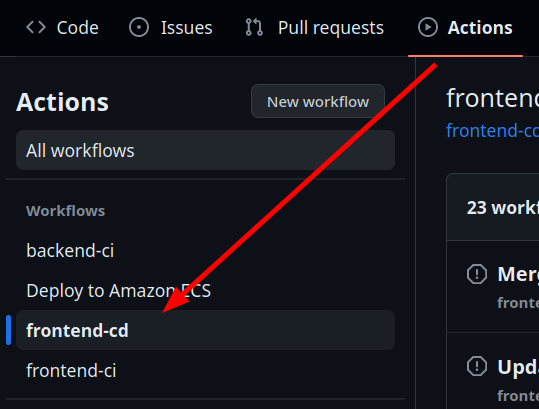
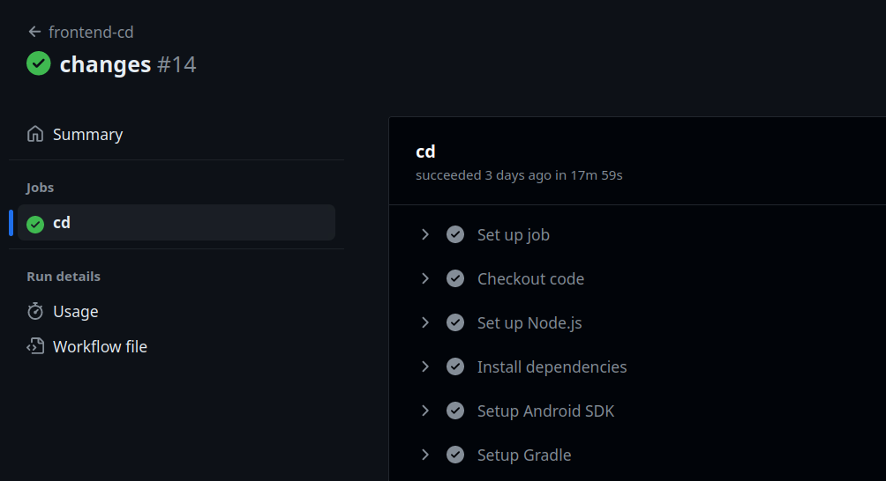
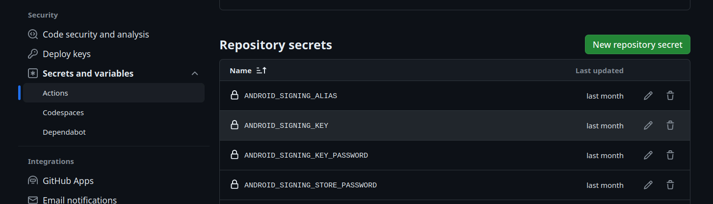
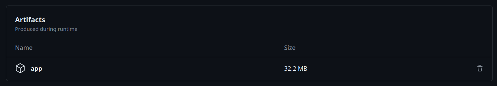

# Build an Android React Native App Using GitHub Actions

So, you want to build an Android React Native app using GitHub Actions? I'm glad
you asked! In this short article we will go over step by step on how to build
your APK directly on GitHub.

## Getting Started

First, we will create a new Github Actions Workflow. A workflow is just a
[YAML](https://yaml.org/) file that contains tiggers for when certain jobs
(scripts) should run. 

Create the file `.github/workflows/build-frontend.yml` to begin specifying the
workflow.

You should also add a name for the workflow at the top which will be visible in
the GitHub Actions tab.

```yml
name: frontend-cd
```



## Workflow Triggers 

Triggers define when your jobs will run. We will setup the workflow to build
whenever there is a push to main:

```yml
on:
  push: 
    paths: [ "Frontend/**" ]
    branches: [ "main" ]
```

Furthermore, notice how I included the filter `paths: [ "Frontend/**" ]`, this
is important because it avoid running our build unescesarily. For example, for
my case, I have both frontend and backend code in the same repo. Thus, having
this filter avoid building the frontend for backend pull requests.

## Defining a Job

### Setup Steps

```yml
jobs:
  cd:
    runs-on: ubuntu-latest

    timeout-minutes: 20

    steps:

    # Clone the repo on the target machine (ubuntu-latest)
    - name: Checkout code
      uses: actions/checkout@v4

    # Installs Node.js
    - name: Set up Node.js
      uses: actions/setup-node@v4

    # Installs your prjects dependencies as defined in your package.json file
    - name: Install dependencies
      working-directory: Frontend/DebrisMine
      run: npm install

    # Install the Android SDK (for building the app)
    - name: Setup Android SDK
      uses: android-actions/setup-android@v2

    # Install the Gradle build tool
    - name: Setup Gradle
      uses: gradle/gradle-build-action@v2
```

The schema here is fairly self explanatory. But for completeness, here we only
define one job (named `cd`). It runs on an Ubuntu machine, and the job times out
after 20 minutes (useful to avoid unexpected long builds). Notice how each step
has a name, this is the name that will be visible when the action is run:



### Build steps

```yml
    # Optional pre-build step
    # Make sure to cd to your android folder though!
    - name: Prebuild Android
      working-directory: Frontend/DebrisMine
      run: |
        npx expo prebuild -p android --no-install
        cd android && chmod +x ./gradlew

    # Building using gradle
    - name: Build Android Release
      working-directory: Frontend/DebrisMine
      run: |
        cd android && ./gradlew clean && ./gradlew app:assembleRelease
```

Since I use [expo](https://expo.dev/), I have a prebuild step before building
which generates the android folder for me. If you are not using expo, then
simply ommit this line `npx expo prebuild -p android --no-install`, and just cd
into the android folder which you should have pushed to your repo.

### Signing steps

All Android apps need to be signed for them to be trusted by your Android device
(and Google Play).

```yml
    # Sets the environment variable BUILD_TOOL_VERSION based on the installed
    # Android SDK version (needed for next step).
    - name: Setup build tool version variable
      shell: bash
      run: |
        BUILD_TOOL_VERSION=$(ls /usr/local/lib/android/sdk/build-tools/ | tail -n 1)
        echo "BUILD_TOOL_VERSION=$BUILD_TOOL_VERSION" >> $GITHUB_ENV
        echo Last build tool version is: $BUILD_TOOL_VERSION

    # Sign the APK
    - name: Sign APK
      id: sign_app
      uses: r0adkll/sign-android-release@v1
      with:
        releaseDirectory: ${{ github.workspace }}/Frontend/DebrisMine/android/app/build/outputs/apk/release
        signingKeyBase64: ${{ secrets.ANDROID_SIGNING_KEY }}
        alias: ${{ secrets.ANDROID_SIGNING_ALIAS }}
        keyStorePassword: ${{ secrets.ANDROID_SIGNING_STORE_PASSWORD }}
        keyPassword: ${{ secrets.ANDROID_SIGNING_KEY_PASSWORD }}
      env:
        BUILD_TOOLS_VERSION: ${{ env.BUILD_TOOL_VERSION }}
```

To sign the APK you will need to add four secrets to your GitHub repo:
`ANDROID_SIGNING_KEY`, `ANDROID_SIGNING_ALIAS`,
`ANDROID_SIGNING_STORE_PASSWORD`, and `ANDROID_SIGNING_KEY_PASSWORD`.

[Keytool](https://docs.oracle.com/javase/7/docs/technotes/tools/solaris/keytool.html)
comes installed with the JDK. You can create a key using Keytool from the
command line: `keytool -genkey -v -keystore my-release-key.keystore -alias
alias_name -keyalg RSA -keysize 2048 -validity 10000`. You can replace
alias_name with anything you'd like, but make sure to remember it, since it will
be the `ANDROID_SIGNING_ALIAS` secret. The command line tool will aslo ask for a
store password and a key password (make sure to remember it or note it down
somewhere). Finally, the `ANDROID_SIGNING_KEY` is simply the contents of the
generated file: `my-release-key.keystore`.


You can add the secrets through the repo settings. 

### Upload step

The app has been build but it's still "stuck" on the machine, we need to upload
it back to GitHub as an
[Artifact](https://docs.github.com/en/actions/using-workflows/storing-workflow-data-as-artifacts).

```yml
    - name: Upload APK Artifact
      id: uploadArtifact
      uses: actions/upload-artifact@v2
      with:
        name: app
        path: ${{steps.sign_app.outputs.signedReleaseFile}}
```

## Ending Notes

Congrats! If all goes well, you should have automatic builds setup and ready!

You should be able to download the signed APK file for every push to main from
the Artifacts sections of a run.


