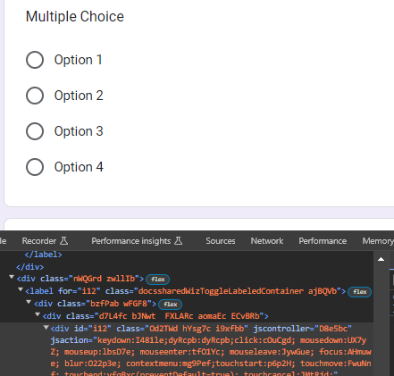
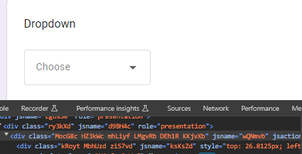

# Webscraping and Automation Using Selenium with Python
## Table of Contents
### [What is Selenium?](#what-is-selenium)
### [What can I do with Selenium?](#what-can-i-do)
### [Getting started](#get-started)
### [Headless drivers](#headless)
### [Automation](#auto)
### [Acknowledgements](#ack)

## <a name="what-is-selenium"></a> What is Selenium?
Selenium is an open-source browser automation framework that can be used within many different programming languages, including Python. From the [official documentation](https://www.selenium.dev/documentation/) this is a list compiled of languages and their support of Selenium. 

| Programming Language | Selenium Support                             |
|----------------------|----------------------------------------------|
| **Java**              | Main language for Selenium. Officially supported with Selenium WebDriver. |
| **Python**            | Widely used for Selenium scripting. Supported with Selenium WebDriver. |
| **C#**                | Supported with Selenium WebDriver. Often used in combination with the .NET framework. |
| **JavaScript**        | Supported for browser automation with Selenium WebDriver. Popular for frontend testing using tools like Protractor. |
| **Ruby**              | Has Selenium support through libraries like Watir and Capybara. |
| **Kotlin**            | Interoperable with Java, can use Java Selenium bindings. |
| **Groovy**            | Compatible with Java, often used with Selenium. |
| **PHP**               | Selenium bindings available for PHP. |
| **Perl**              | Selenium bindings available for Perl. |
| **Swift**             | Selenium bindings available for Swift. |
| **Objective-C**       | Selenium bindings available for Objective-C. |
| **R**                 | Selenium bindings available for R. |
| **C++**               | Limited support through third-party libraries. |
| **Go**                | Limited support through third-party libraries. |

However, for the purposes of this introduction, we will refer to Selenium usage in **Python**.

## <a name="what-can-i-do"></a> What can I do with Selenium?
Selenium has uses within automating browser interactivity, such as extracting information from the web and interacting with elements such as buttons and forms. It is an important tool used in automation to execute a plethora of different test cases you may want to perform on a website you are developing. If you are interested in learning more about using Selenium for testing purposes, you can check out [this guide](https://www.simplilearn.com/tutorials/python-tutorial/selenium-with-python#:~:text=Selenium%20with%20Python%20is%20used,skimming%20the%20entire%20site%2C%20etc.).

## <a name="get-started"></a> Getting started
1. **Install Selenium bindings**

    The easiest way to install Selenium is with the `pip package manager`. With Python and pip installed, simply run the following command to get the latest version.
    
    ```bash
    pip install selenium
    ```
    
    You can then run the following command to see if you successfully installed Selenium.
    
    ```bash
    pip show selenium
    ```
    
    If the installation was successful, the output should be similar to the following.
    
    ```bash
    Name: selenium
    Version: 4.15.2
    Summary: 
    Home-page: https://www.selenium.dev
    Author: 
    Author-email: 
    License: Apache 2.0
    Location: /Users/john/CSC301/venv/lib/python3.11/site-packages
    Requires: certifi, trio, trio-websocket, urllib3
    Required-by: 
    ```
2. **Install Chrome WebDriver**

    Now, download the appropriate Chrome WebDriver version matching your Chrome browser version and place it in the project directory. You can find this in Google Chrome under `settings > about chrome` as shown.
    

    Alternatively, you can download Chrome [here](https://www.google.com/intl/en_ca/chrome/). Or, for Linux users, you can use either _wget_ `wget https://dl.google.com/linux/direct/google-chrome-stable_current_amd64.deb
` or _dpkg_ `sudo dpkg -i google-chrome-stable_current_amd64.deb`.


3. **Start Writing Code**

    At this point, you are ready to start using Selenium. Now you can import the specific functionality you want within Selenium with the import statement `from selenium import [specific module]` to fit your specific use cases.

## <a name="headless"></a> Headless drivers

If you are running your scripts from a headless terminal (with no GUI), or don't want the browser actions to be visible, you can use selenium with a headless WebDriver. This is useful if your testing environment is a server that you are connected to with SSH. 

With Python, you can accomplish this by using `pyvirtualdisplay`. Before your Selenium interaction, initiate your virtual display using:
```python
display = Display(visible=0, size=(800, 600))
display.start()
```

Then, after the interaction runs, close your virtual display.
```python
display.close()
```
Typically, you would use a _try, except, finally_ statement to execute the code, and you would instantiate the display at the top of the `try` block, and close it at the end of the `finally `block.

## <a name="auto"></a> Automation

The Selenium WebDriver can be used for many purposes, including logging in to websites, filling out forms, and clicking buttons. For example, if there is a particular task that you need to do every day that requires you to log in to a website, and then navigate to a certain page this is a simple task in Selenium. You can then automate this script to run at a given time interval on a Linux server using `cron`. For example, you could include the following line in your _crontab_ to schedule the script to run at midnight every day:

```bash
0 0 * * * python3 /path/to/selenium/script.py
```

You can learn more about what the numbers and wildcards mean [here](https://crontab.guru/once-a-day), or you can check out the [linux man page](https://man7.org/linux/man-pages/man5/crontab.5.html) to learn more about corn.

[This](https://github.com/jfitzgerald1126/Automated-Web-Intereaction) is a small program I made to log in to a website and click a certain button. 

```python
from login_utils import login
from config_utils import load_config
from selenium.webdriver.common.by import By
from selenium.webdriver.support.ui import WebDriverWait
from selenium.webdriver.support import expected_conditions as EC

driver = login()
    config = load_config()

    # Wait for the button element to be clickable
    button_to_click = WebDriverWait(driver, 10).until(
        EC.element_to_be_clickable((By.XPATH, config['button_to_click_xpath']))
    )

button_to_click.click()

driver.quit()
```

In this code, `login_utils` inputs a specified username and password combination, and then returns the driver after logging in, and  `config_utils` serves to load the _xpath_ to the button to click. _Xpath_ is a part of the _XML Path Language_ and it is used to identify elements in an XML document and also works with HTML documents. The `WebDriverWait` function waits until the element is loaded and clickable, with a timeout of 10 seconds. Once the desired button is selected, you can just call the `.click()` method on it to simulate a user click. Once you are finished, simply close the WebDriver with `driver.quit()`.

## A Comprehensive Selenium UI Example: Automating a Google Form
Now that you have selenium installed and ready to go, we will dive into a more comprehensive example of using Selenium by automating an online Google Form on Google Chrome. We will use this example form I have created to submit a response - https://forms.gle/rbxs4fNCbBSzfPW1A. 

Below is a screenshot of the form that will be used in this tutorial. 
In this tutorial we will first **(1) set up our project**, then use Selenium to **(2) populate text fields, (3) choose multiple choice options, (4) choose dropdown values and (5) submit the form**.

1.  **Setting up the project**

    Since we are working with a small project we can use one file to accomplish what we need. However, in larger projects we typically need to split the various components such as the css selectors/xpaths, location of chromedriver executable, URLs to navigate to etc. into different files.

    Ensure that your chromedriver version installed matches the Chrome browser you are on. This is vital or else your Chrome browser will not open properly. You can find the chromedriver.exe here: https://googlechromelabs.github.io/chrome-for-testing/

    Below I have provided the commented starter code which we will work with today.
    
    ```python
    from selenium import webdriver
    from selenium.webdriver.chrome.service import Service
    from selenium.webdriver.common.by import By
    from selenium.webdriver.support.ui import WebDriverWait
    from selenium.webdriver.support import expected_conditions as EC
    import time

    # The Google Form we are working with
    browserURL = "https://forms.gle/rbxs4fNCbBSzfPW1A"

    # Make sure the driver version matches your Chrome browser
    # Can be found at https://googlechromelabs.github.io/chrome-for-testing/
    pathToChromeDriver = "C:\\Users\\edwar\\Downloads\\chromedriver.exe"


    def fill_form(browser):
        pass


    if __name__ == '__main__':
    # Set up ChromeDriver service
    options = Service(executable_path=pathToChromeDriver)

    # Initialize WebDriver with ChromeDriver service
    driver = webdriver.Chrome(service=options)
    driver.get(browserURL)

    # Call function to populate the form
    fill_form(driver)

    # Stop the webdriver after form has been submitted
    driver.quit()

    ```
    The function ```fill_form``` is what we will be focused on working on. If you were to execute the current file, you would see Chrome opening up, it navigating to the Google form followed by it closing.

2.  **Selenium: Populating Text Fields**

    To accomplish this, we will need to do the following - **(a) locate the element which we want to populate, (b) wait for it to be visible, (c) populate the field**. This is the general structure to be followed when doing UI Automation and we will follow this for all the fields we will populate.

    To locate the element we will use css selectors which is essentially the same as how we style css elements by locating them on css files. Inspecting the Text Field element we see the following:

    

    We see that the text field element has ```class = "whsOnd zHQkBf"``` so we will use this as the css selector for this element.

    After locating the css selector we will need to wait for that element to be visible and then we need to populate it with some text. We will do this in our ```fill_form``` function and below is an example of how we can achieve this.

    ```python
    # Text Field
    textField = WebDriverWait(driver, 5).until(
        EC.visibility_of_element_located((By.CLASS_NAME, "whsOnd.zHQkBf"))
    )
    textField.click()
    textField.send_keys("Hello")
    ```
3.  **Selenium: Selecting Multiple Choice**
    
    Let's say we wanted to select 'Option 2'. Following similar steps as above we will first locate the css selectors. Inspecting the multiple choice option for 'Option 2' we see the following:

    

    We see there is a unique id field ```id = "i12"```which we can use for our css selector. We want to ensure that our css selectors are unique so that we choose only the item we want to select. As such below is the example code as how we could go about doing this.

    ```python
    # Multiple Choice
    option2 = WebDriverWait(driver, 5).until(
        EC.element_to_be_clickable((By.ID, "i12"))
    )
    option2.click()
    ```

4.  **Selenium: Selecting Dropdown**

    Selecting dropdowns are a bit tricker as we would need to first click the dropdown to view the options, wait for the options to load, and finally click on the option we want. As such we would need 2 css selectors for this step - one for the dropdown and another for the dropdown selection.

    Inspecting first the dropdown we see the following:

    

    We will use the class name similar to the text field we did earlier ```class = "MocG8c HZ3kWc mhLiyf LMgvRb DEh1R KKjvXb"``` to click to open the dropdown. 
    
    Once we open up the dropdown options we see the following:

    

    In this case let's choose 'Option 2'. We see that both 'Option 1' and 'Option 2' have the same class name so we need another way to select only 'Option 2'. Looking closer we see that there is a unique identifier for each of the options and in this case it is ```data-value="Option 2"```. However, when we check on the inspect tab (CTRL+F and enter the selector to test it out) we see that there are multiple elements with that selector.

    

    Since we cannot select just individual css selectors for the dropdown option, we can combine css selectors (following a parent-child hierarchical structure - **"[parent selector] [child selector]"**) together to form a unique selector, similar to how you would do it styling css elements as well. 

    After trial and error, the unique selector that selects 'Option 2' is ```'[class="OA0qNb ncFHed QXL7Te"] [data-value="Option 2"]'```.

    Combining all of this together we get the following code:

    ```python
    # Dropdown
    dropdown = WebDriverWait(driver, 5).until(
        EC.element_to_be_clickable((By.CLASS_NAME, "MocG8c.HZ3kWc.mhLiyf.LMgvRb.DEh1R.KKjvXb"))
    )
    dropdown.click()

    # Dropdown Options
    dropdownOption2 = WebDriverWait(driver, 5).until(
        EC.element_to_be_clickable((By.CSS_SELECTOR, '[class="OA0qNb ncFHed QXL7Te"] [data-value="Option 2"]'))
    )
    dropdownOption2.click()
    ```

5.  **Selenium: Submit**

    Lastly, all we need to do now is to click the submit button and our form will be sent. After doing all these steps you are probably quite knowledgeable in automation and expect this last button click to be easy as well. However, sometimes Selenium is unable to click on elements with certain tags and the tags that are clickable are not unique even if we try to combine selectors like we did previously. 

    As such, we need to approach this problem a different way. From trial and error we notice that the css selector ```[role="button"]``` is clickable but is not unique. 

    

    In Selenium, we can use the ```find_elements()``` to get all elements that have a certain selector. After retrieving this list, we can then index the list and click on the Submit button. Notice in the image above the Submit button is '3 of 5'. This means we would need to index the 2nd element in the python list to retrieve it.

    As such, the code will be as follows:
    ```python
    # Submit 
    submit = driver.find_elements(By.CSS_SELECTOR, "[role='button']")
    submit[2].click()
    ```
    

## <a name="ack"></a> Acknowledgements:
- **Selenium**: Selenium is an open-source framework for automating browser interactions. To learn more about Selenium and its capabilities, please visit the official Selenium website: [Selenium Documentation](https://www.selenium.dev/documentation/en/)
- **Chrome WebDriver**: The Chrome WebDriver is a tool provided by Selenium for automating interactions with the Chrome browser. For detailed documentation and instructions on using Chrome WebDriver, please refer to the official ChromeDriver documentation: [ChromeDriver Documentation](https://sites.google.com/a/chromium.org/chromedriver/)

