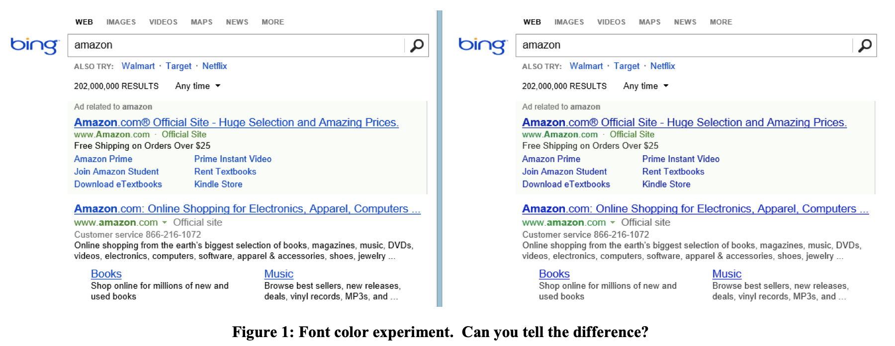

# A/B Testing

## **Introduction:**
A/B testing is a research method used to compare two versions of a web page or mobile app to determine which variation of the UI results in better performance. It is a popular method that allows individuals and companies to optimize user experience and make improvements to their application. 

## **Steps/How To:**
**Identify Changes:** Identify any potential problem areas within the UI and create a hypothesis of how to fix it  

**Create Variation:** Create two versions of the applications UI to run the experiment on, create the new design based on the hypothesis, whether it be changing the font, colors, or re-designing the whole page.  
_Note:_ These changes can be determined through website analytics tools to identify areas with the most engagement vs the least, as well as heatmap tools to identify any areas in need of improvement. Create a hypothesis or an idea that you think will help improve the UI, this will be your second version. 
- The original page is known as the control.
- The altered page is known as the variation. 

**Running The Experiment:** Randomly filter the traffic of the application where one group (Group A) sees the original, or controlled version, and the other group (Group B) sees the modified version.  

**Collect Data:** Record and measure different metrics such as user session duration or other performance metrics related to the application.  

**Analyze Results:** Based on the results, determine which version improves performance and deploy the winning variation. The experiment can be repeated to make further improvements.  
- Determining which version results in an improvement involves a combination of statistical analysis and pre-defined success metrics defined by the company.
  - The defined success metrics are goals that align with the purpose of your website (i.e. user engagement, session duration, etc.)
  - The statistical analysis is used to determine if the data observed is statistically significant. This involves calculating p-values, Bayesian statistics, or using other statistical models to determine if the results are reliable. 

## **Types of A/B Testing:**
**Split URL Testing:** 
- Split URL testing is a variation of A/B testing where two different web page urls are used, rather than running the experiment on the same url. It is typically used for testing completely new page designs.  
 - _Cons:_ Managing and maintaining different URLs and variations can be resource-intensive, especially for websites with extensive content.

**Multivariate Testing:**
- Multivariate testing tests various changes to different page elements simultaneously to analyze which combinations perform the best. Can be used to save time rather than performing multiple A/B experiments.  
  - _Cons:_ Testing multiple combinations requires larger sample sizes to achieve statistical significance, which might be challenging for smaller websites with limited traffic.

**Multi-Page Testing:**
- Multi-Page testing tests changes to an element on the web page over multiple pages within the website. Allows for a consistent set of pages when testing variation with control.  
  - _Cons:_ Complex implementation that may make it difficult to set up and manage multi-page tests.

## **Benefits of A/B Testing:**
A/B Testing is useful in helping identify any potential issues with the webpage design before releasing it to the public which can mitigate risks in practice. It also, 
- Optimizes user experience which allows you to create a more effective application.
- Can provide insights into user behavior which can help with product development.
- Is a quick and efficient way to test UI changes.

### Seven Rules of Thumb for Website Experimenters
## **1. Small Changes can have a Big Impact to Key Metrics**
- Keep a portfolio of small changes that might bring high Return-On-Investment
- Effect can be short-lived when users get used to the change. It is recommended to run experiments for over 2 weeks to notice such effects.
**Font Colors**

- In 2013, Bing ran a set of experiments on font colors. Results showed that users complete tasks more often, which lead to an increase in monetary gains of over $10M.
**Right Offer at the Right Time**
- At Amazon, the home page was split into slots. Amazon's credit card offer was tested and won the top slot, which is unexpected as it had a low clickthrough-rate. However, the offer was very profitable; thus, even if not a lot of people clicked on the link, there is a potential for high return value.
- In an experiment, the offer was moved to the shopping cart slot after ones adding an item with bolded phrases emphasizing how much users save relative to their cart. Since users have a clear purchase intent with items in their cart, the offer felt personal and come at the right time.
- This change led to tens of millions of dollars in profit annually.
**Anti-malware**
- "Freeware" installed by users often contains malware that pollutes pages with ads. User often do not realize that ads showing up overwhelmingly on sites were due to malware they installed, not because of the current site they are visiting. The experiment blocked 3rd party from modifying the page for users in the Treatment group. 
- The results showed improvements to all of Bing's key metrics. Users were able to reach search results more successfully and page load time also increased significantly.

## **2. Changes Rarely have a Big Positive Impact to Key Metrics**
- Notes on key metrics:
  - Key metrics should be an all-organizational metric, such as Sessions/user and Time-to-success. A lot of times, changes in feature design shift clicks around and cannibalize other areas of the page, not improving the overall clickthrough-rate.
  - Metrics should be diluted by their segment size. It is easier to improve metrics of a small metrics. The 10% improvement to a 1% segment has an overall impact of approximately 0.1%. 
- Distinguish false positives:
  - When thousands of experiments are run per year, a false positive rate of 0.05 implies hundreds of false positive results for a given metric, and this is exacerbated if multiple uncorrelated metrics are used.
  - False positives that are due to bugs, bad design, data anomalies.
**Office Online Surrogate Metric**
  - Microsoft Office Online experimented with a redesign with a strong call-to-action button. The key testing metrics is purchases-per-user. However, the team decided to track "clicks on revenue generating links", because tracking the actual purchases required hooking to the billing system.
  - To the surprise of the team, there was a 64% reduction in clicks per user. It turned out that the assumption that a stable conversion rate from click to purchase was flawed.
**More Clicks from a Slower Page**
  - When JavaScript code was added to Bing's search result page and can slow things, the team expected to see a small negative impact on clicks-per-user. 
  - However, there were more clicks per user. Click tracking is based on web beacons and some browsers eliminate the call when the user is navigating away from the page. In fact, the additional JavaScript had a side effect of improving click tracking fidelity, not actual clicks. 
**MSN Searches to Bing**
  - Bing wanted to improve auto-suggest feature when users are searching with a new algorithm.
  - The results show huge increase in the number of searches on Bing. It turned out that the new code issued 2 searches when users selected one of the auto-suggested options.

## **3. Your Mileage will Vary**
- The quality of A/B experiments vary. Was it peer-reviewed? Were there outliers? Was it properly run? Was the p-value low enough — statistically significant?
- What works in one domain might not work for another.
- There can be Novelty and Primacy effects. You should look for sustained improvements, and many experiments were not run long enough to check for such effects.
- There can be misinterpreted results. Effects are often attributed to a specific factor, or the underlying reason is not understood.

## **4. Speed Matters a lot**
- The slowdown quantifies the impact on the metric of interest at the point today, shown by the dotted vertical line in the below figure.

**Performance of the right pane is less critical**
- At Bing, some elements of the right pane are loaded late. 
- Some metrics that are commonly measured:
  - Page Load Time (PLT): measure performance using the `window.onload` to mark the end of the useful browser activity
  - Perceived performance: users start to interpret the page once enough of it is showing. This concept is abstract, so these are some way to measure this:
    - Above the Fold Time (AFT): the time until pixels above the fold have been painted
    - Speed Index: average the time at which visible elements on the page are displayed
    - Page Phase Time and User-Ready Time: identify which rendering phase satisfies perceived performance, and phases are determined by pixel changing velocity. User-Ready time measures the time until essential elements of the page (defined for each context) are ready to use.

## **5. Reducing Abandonment is Hard, Shifting Clicks is Easy**
- Abandonment rate on the SERP (Search Engine Results Page): the percentage of users who never click on any link. Increasing user engagement, or reducing abandonment can be difficult. Often times, shifting clicks from one area to another within a page can be misunderstood as increased user engagement.
- In other words, local improvements are easy; global improvements are much harder.

**Related Searches in right column**
- Some related searches are removed from the right column on Bing's SERP. These suggestions can help users improve their search query. In the experiment, clicks shifted to other areas of the page and abandonment rate did not change statistically significant.
**Ad background color**
- Many major search engines have been experimenting with changing background color of ads, yet abandonment rate did not improve.

## **6. Avoid Complex Designs**
- It is advised to focus on building minimum viable products (MVPs) and run an experiment as soon as a key feature is ready. While there are many research done on Multi-Variable Testing, it is more beneficial to conduct simple uni-variable or bi-variable experiments.
- There is always a learning curve for users when new features are introduce, so unexpected moves in key metrics are normal. It is important to look for bugs and get verbatim feedback.

**LinkedIn Unified Search**
- In 2013, LinkedIn introduced unified search across different product categories, that could pick up your query intent, whether it is "People", "Jobs", "Companies". Almost every single component on the search landing-page was touched, from the left rail navigation to snippets to the action buttons.
- The first experiment was run with all changes and many key metrics tanked. When individual metric is brought back, the team realized that it was the removal of some past components that led to the drop of the metric, not the unified search. After restoring those metrics, unified search was proved to improve user experience.

## **7. Have Enough Users**
- The Central Limit Theorem shows that the mean of a variable has an approximately normal distribution if the sample size is large enough. On the assumption of normal distribution, formulas for minimum sample size given the metric's variance and sensitivity provide one lower bound. However, many metrics of interest are skewed and can require a higher lower bound.
- When a metric has a large skewness, it might be possible to transform the metric or cap the values to reduce the skewness, so that average converges to normality faster. When capping Revenue/User to $10 per user per week, skewness drops from 18 to 5.3 and sensitivity increased. 
- If the control and treatment group is expected to be equally sized, the distribution of delta will be approximately symmetric with zero skewness under the Null hypothesis. When skewness is higher than 1, this does not apply.

Source: Ron Kohavi, Alex Deng, Roger Longbotham, and Ya Xu.  2014. Seven Rules of Thumb for Web Site Experimenters. In Proceedings of the 20th ACM SIGKDD international conference on Knowledge discovery and data mining (KDD '14), pp. 1857-1866.  DOI: 10.1145/2623330.2623341. http://bit.ly/expRulesOfThumb

## **Alternatives to A/B Testing:**
There are some situations in which A/B testing is not very useful. For example, when you don’t have enough users on your website, the sample size of the experiment may be too small to see significant or reliable results. Or another case is if the changes to the UI are minor, it may not be worth the resources to run the whole experiment. Instead A/B testing should be used on changing features that are a vital part of your web page or features that are a main part of the flow of your website.

### Some alternatives to A/B testing:
**Private Beta Testing:** Private betas for users offer a pre-released version to a selected group of people for testing and feedback purposes. Instead of making changes to the website solely based on data collected from an experiment, Beta testing uses feedback directly from users. Feedback can include feature requests, suggestions on improvements, or overall user experience. After improvements are made the changes are launched to the public.

**User Surveys:** User surveys are a refined set of question used to gather feedback and insights from users regarding user experience. These surveys offer a direct way to gain insights on user preferences and allows you to find any problem areas. This offers a user centric approach when making changes to UI.

## **Additional Resources:** 
More Information: https://vwo.com/ab-testing/  
Examples: https://vwo.com/blog/ab-testing-examples/
