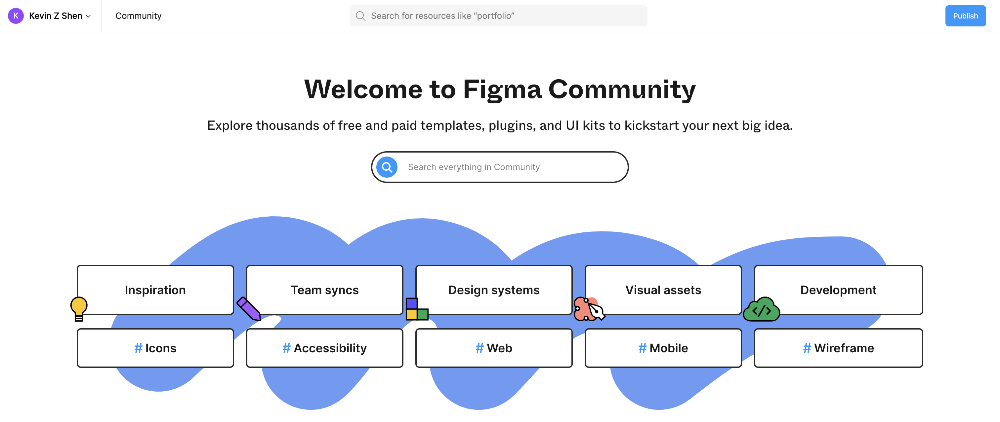
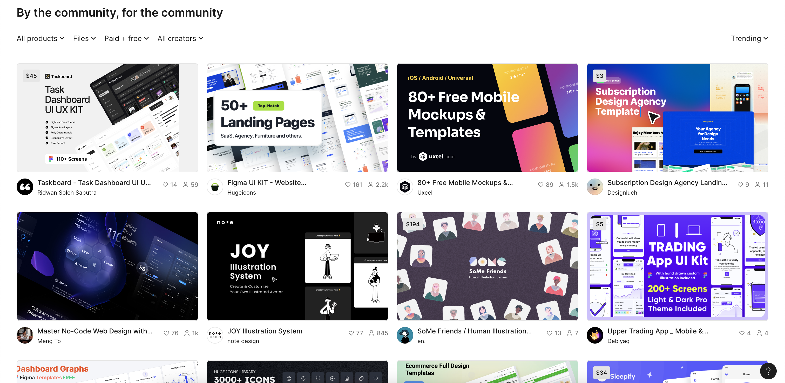
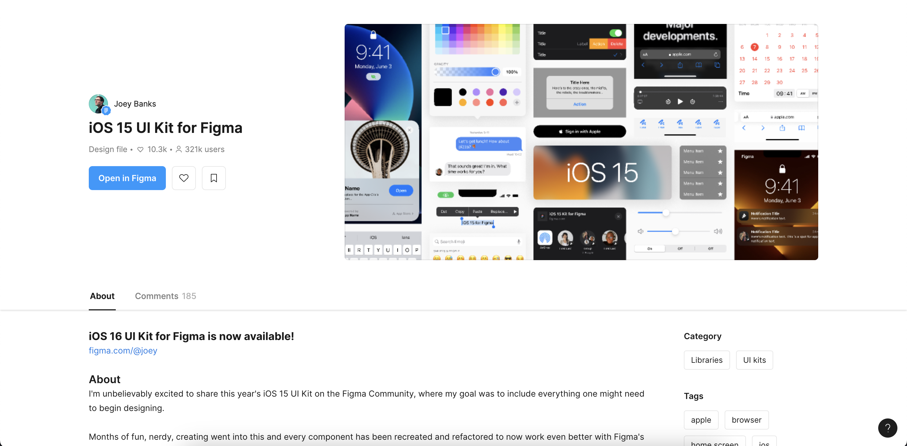
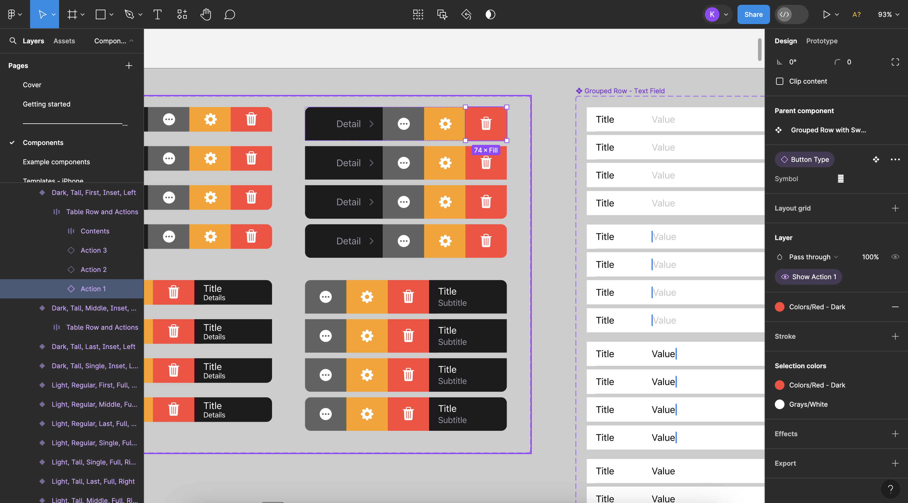

Utilizing pre-built UI kits from the Figma community involves several steps to effectively integrate them into your design workflow. Here's a guide on how to do it:

1. **Find and Choose a UI Kit:**

   - Visit the Figma Community website or access the community section within the Figma app.
   - Browse through the available UI kits based on your project requirements. You can use filters to narrow down your search by categories such as platform (web, mobile), design style (material design, iOS, etc.), and features.
   - Once you find a UI kit that fits your needs, click on it to view details such as the components included, previews, and any additional information provided by the creator.

   

   

2. **Duplicate the UI Kit:**

   - Before making any changes, duplicate the UI kit file in Figma. This ensures that you have a backup of the original kit and can make modifications without affecting the original design.
   - To duplicate a file, open the UI kit in Figma by pressing the blue "Open in Figma" button

   

3. **Explore Components and Styles:**

   - Once you have opened the UI Kit in Figma, explore the various components, styles, and templates provided by the UI kit by looking through the available pages. The list of pages can be found on the sidebar on the left side of your screen. In these page you may find various components such as buttons, navigation bars, form elements, icons, typography styles, and more.
   - Familiarize yourself with the organization of components, such as how they are grouped in frames or components, and how styles are applied.

   

4. **Customize and Modify:**

   - Customize the UI kit to match your project requirements. You can modify colors, typography, spacing, and other design elements using Figma's editing tools.
   - Replace placeholder content with your own text, images, or icons. Make sure to maintain consistency and follow design best practices as you customize the UI kit.
   - In order to modify an element, click on the element of interest and modify the values in the property sidebar displayed.

   

5. **Create New Designs:**

   - Start creating new designs using the customized UI kit components and styles. You can drag and drop components from the UI kit onto your design canvas, rearrange them, and adjust properties as needed.
   - Use the pre-built templates from the UI kit as a starting point for different screens or pages of your digital product.

6. **Iterate and Refine:**

   - Iterate on your designs based on feedback, usability testing, or your own evaluations. Make refinements to the UI elements, layouts, and interactions as necessary.
   - Continuously refer back to the UI kit for new components or styles that you may need during the design process.

7. **Collaborate and Share:**
   - If you're working with a team, leverage Figma's collaboration features to collaborate on designs using the UI kit. Team members can access the same file, make edits, leave comments, and track changes in real time.
   - Share prototypes or design specs with stakeholders or developers to gather feedback and ensure alignment with project goals.

By following these steps, you can effectively utilize pre-built UI kits from the Figma community to streamline your design process, maintain consistency, and create visually appealing and functional user interfaces for your digital projects.
