# **Figma Prototype Building Tutorial Given Client Description**

# Table of Contents

### [Client Communication](#client-communication)

### [Description](#description)

### [Motivation](#motivation)

### [Work/Design Process](#process)

### [Additional Resources](#additional-resources)

## **Client Communication**

Client Meeting Notes:

User-Friendly App Design:

- Client emphasizes the importance of a user-friendly app interface that is intuitive and easy to navigate.

- Preference for a green-themed design to align with their branding and eco-conscious values.

AI-Generated Bot for Recipe Generation:

- Client requests integration of an AI-generated bot using GPT tokens for recipe generation.
The bot should be capable of understanding user input, such as a list of ingredients, and generating personalized recipes accordingly.

User Interaction Features:

1. Account Creation

- Users should have the option to create accounts to personalize their experience and access additional features.

2. Blog Post Creation

- Users should be able to make blog posts, sharing their own recipes and culinary experiences with the community.

3. Recipe Rating

- Users should have the ability to rate and provide feedback on existing recipes to help others make informed decisions.

4. Social Features

- Users should be able to interact with each other, including the ability to friend other users through the app.

5. Search Functionality

- Accuracy: The search function must be accurate and efficient, delivering relevant results based on user queries.

6. Display

- Search results should be displayed in a clear and organized manner, ensuring ease of access for users.

Client stresses the importance of a seamless user experience across all features and functionalities.

Emphasis on building a vibrant and engaging community within the app to foster collaboration and sharing among users.

Client seeks ongoing communication and collaboration throughout the development process to ensure the app aligns with their vision and requirements.

## **Description**

Cook It Yourself is a revolutionary cooking app that empowers users to unleash their culinary creativity with ease. With our innovative chatbot feature powered by AI technology similar to ChatGPT, users can effortlessly generate delicious recipes based on the ingredients they have on hand. Whether you're a seasoned chef or a novice in the kitchen, Cook It Yourself provides the perfect solution to your cooking dilemmas.

Our app boasts a user-friendly interface that simplifies the recipe creation process. Users can simply input the ingredients they have available, and our AI-powered chatbot will generate personalized recipes tailored to their preferences and dietary restrictions. Say goodbye to the frustration of not knowing what to cook – Cook It Yourself has you covered with endless recipe possibilities.

Additionally, Cook It Yourself offers a dynamic homepage featuring the most viewed recipes, allowing users to discover popular dishes and trends in the culinary world. Users can also explore recipes by browsing different categories such as cuisine type, meal category, dietary preferences, and more. Furthermore, our app keeps users engaged with regularly updated content, showcasing the latest recipes added by our community of passionate cooks.

Whether you're looking to impress your guests with a gourmet meal or simply craving a quick and delicious dish for yourself, Cook It Yourself is your ultimate cooking companion. With our innovative features and vast recipe database, cooking has never been more enjoyable or accessible.

## **Motivation**

At Cook It Yourself, our inspiration comes from the everyday struggles and joys of home cooking. We understand the frustration of staring into the fridge, wondering what on earth to make with the ingredients you have. We've been there, feeling overwhelmed by the endless recipe options online, unsure of where to start.

But we believe cooking should be a source of joy, not stress. That's why we created Cook It Yourself – to make cooking at home easier, more enjoyable, and more rewarding for everyone. We wanted to build something that feels like having a helpful friend in the kitchen with you, guiding you through the recipe creation process with ease.

Our motivation is simple: we want to empower you to cook with confidence and creativity, regardless of your skill level or experience. Whether you're a busy parent trying to feed your family nutritious meals, a college student cooking on a budget, or a passionate foodie looking to expand your culinary horizons, Cook It Yourself is here to support you.

We believe in the power of community and connection, too. That's why Cook It Yourself isn't just about recipes – it's about bringing people together around the shared love of food. It's a place where you can discover new recipes, share your own creations, and connect with fellow food enthusiasts from around the world.

So join us on this delicious journey. Let's cook up something amazing together with Cook It Yourself!

## **Work/Design Process**

Before you begin the design process, add your collaborator using their email.

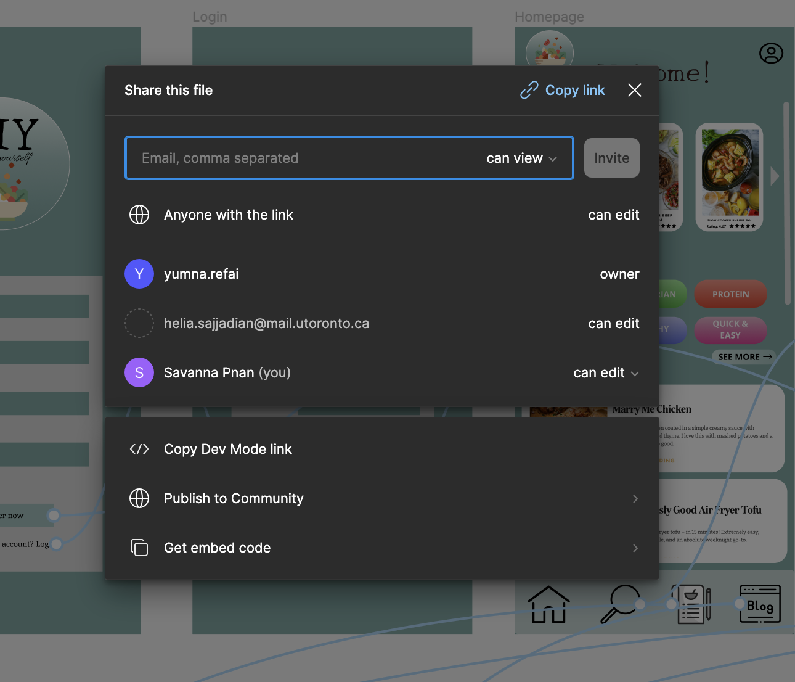

Choose your layout by selecting the right size of the screen, for this example, the client wants a mobile application, and an iphone would be the appropriate sizing for this situation.

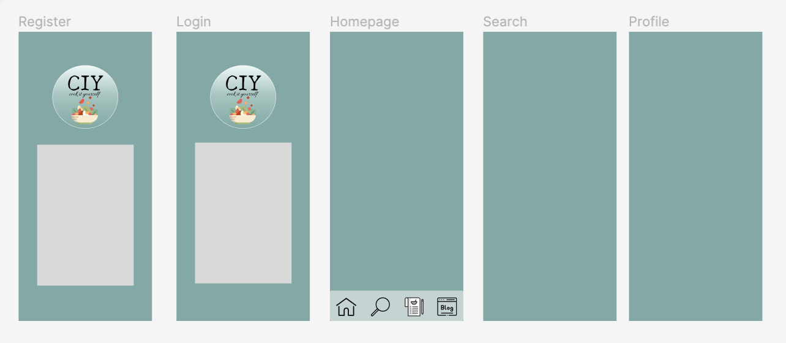

Since the client requested a green theme design, we should pick a colour using the colour palette we found online.

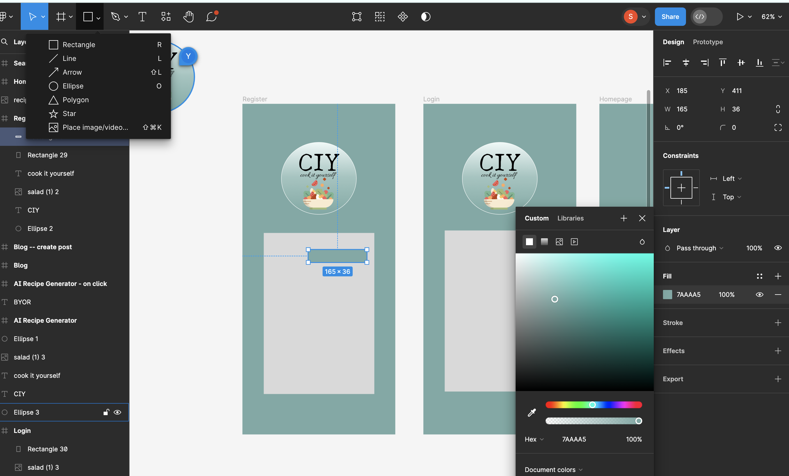

In the top left corner, select the text function to enter text.

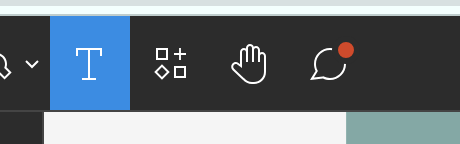

Add a text.

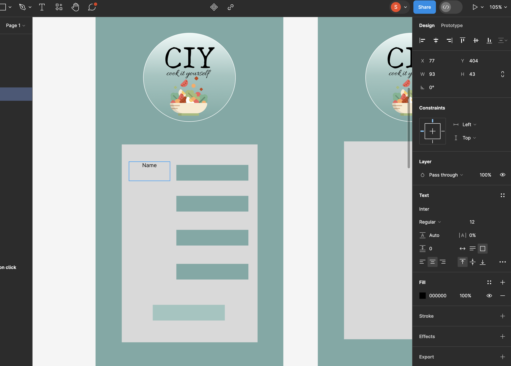

Once the page for register has been created, select the top right corner to select "prototype", select interaction and choose "on tap" -> "designated page".

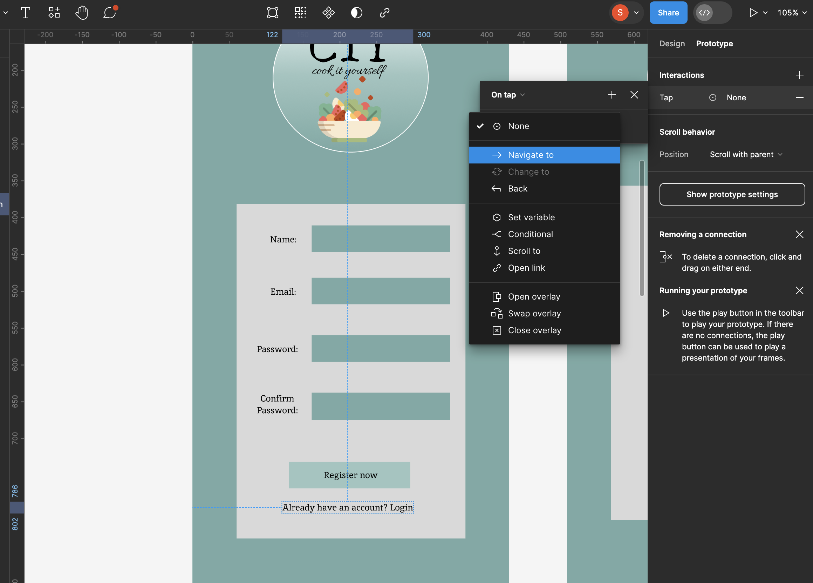

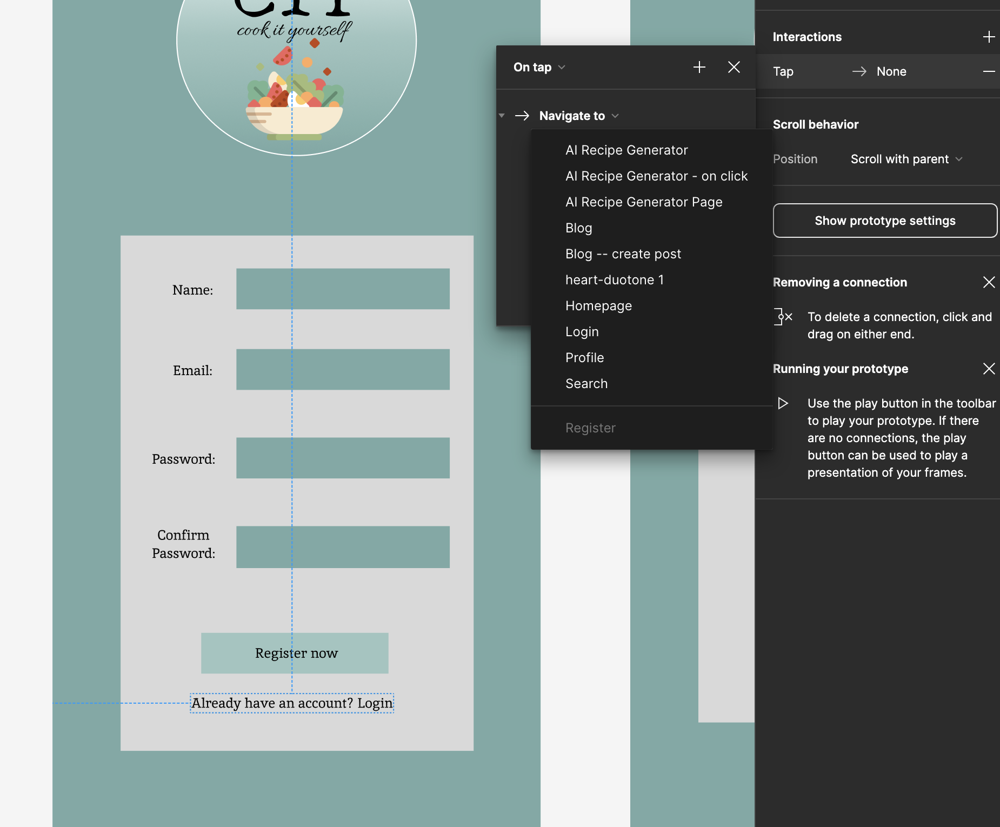

Here is the completed register and login page with the linking viewed in the "prototype" mode.

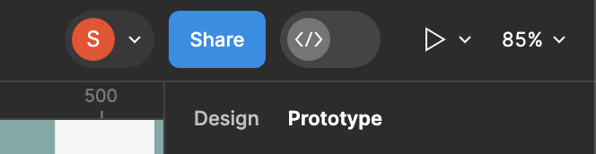

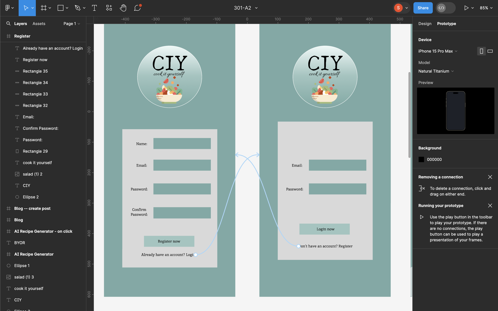

Here is the screen viewed when the play button click.

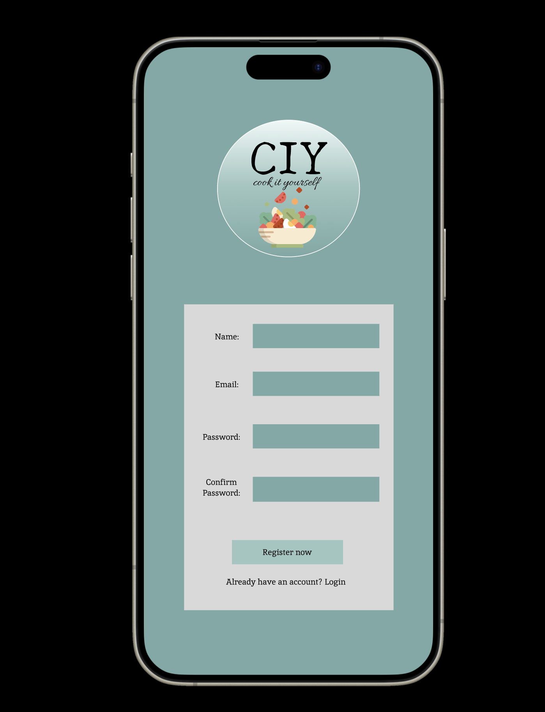

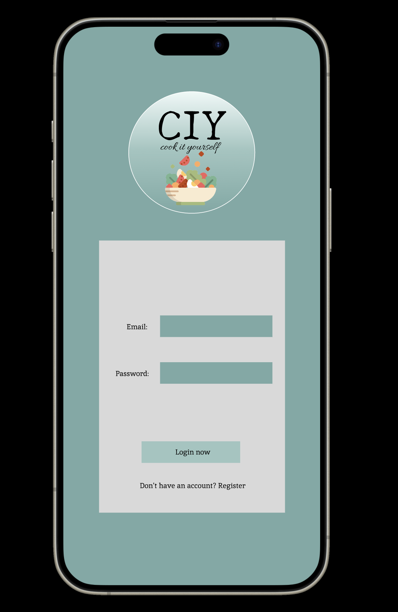

Add am image into the figma page.

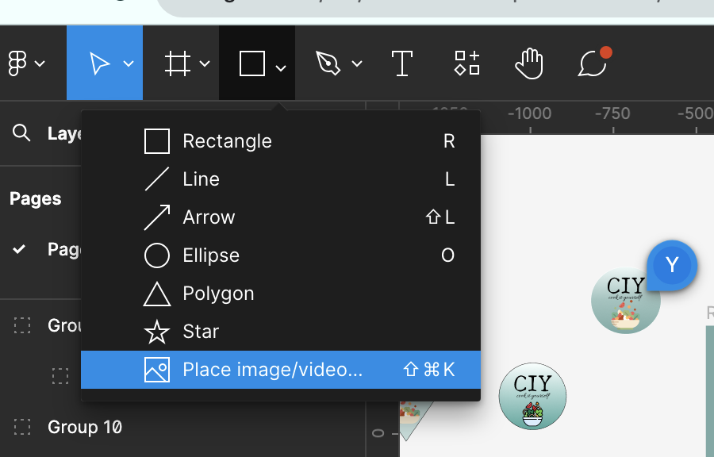

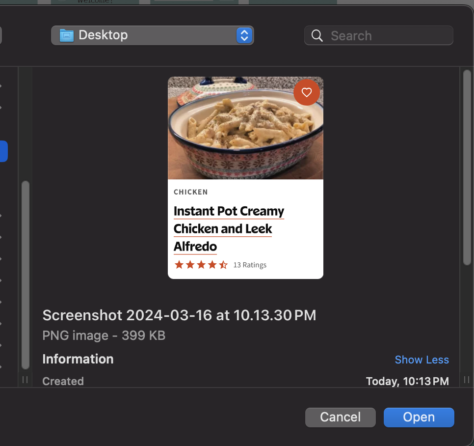

This is how we can bring the images to the right layer to make the logo.

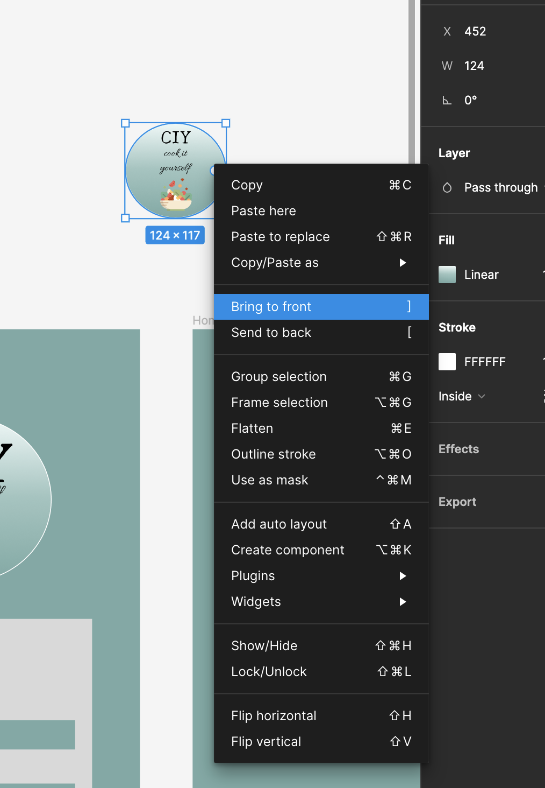

When the prototype is completed, use the top right corner to select "present".

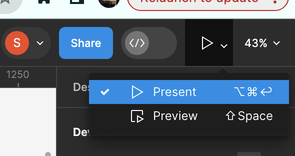

This the completed figma prototype according to the client's instructions.

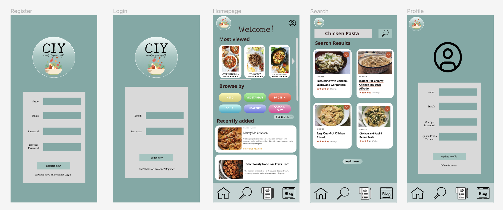

## **Additional Resources**

Link to our figma page: https://www.figma.com/file/wUPbKaitPezq9d3KKTFwuv/301-A2?type=design&node-id=3%3A6&mode=design&t=Hgssi13xrSmifAEH-1

